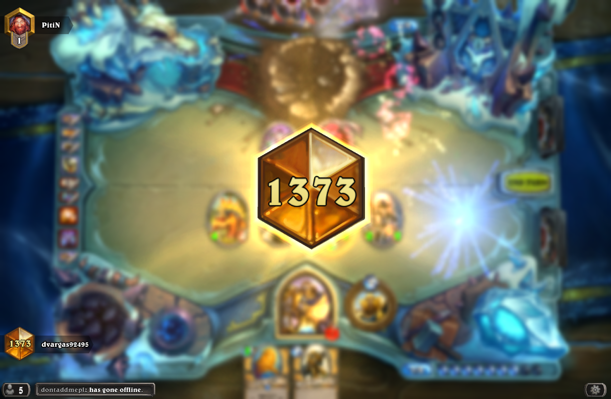
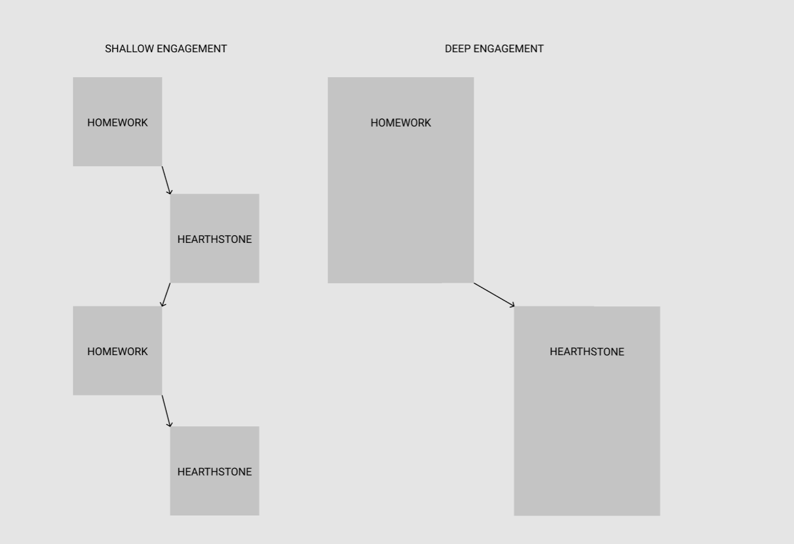

For 4 years of my life, I spent an average of 20 hours per week playing [Hearthstone](https://playhearthstone.com/). This amounts to about **4000** hours. I do not regret playing the game. The game is beautifully designed, with a very intuitive interface and a deep strategy that becomes incredibly rewarding the more you understand it. My regret is that I chose to spend the time playing the game **shallowly**.

I used Hearthstone as a mechanism to distract myself from other activities instead of an activity to find fulfillment in of itself. As Nir Eyal put it in his book **Indistractable**, I was "driven by the desire to free [myself] from the pain of" the responsibilities assigned to me in college. Even more absurd than distraction, I would try to multitask playing the game with problem sets to **excuse** myself for slacking off, making both experiences worse off! Because playing the game wouldn't be something that I would plan to do with intention, I was too embarrassed to learn from or engage in the game more fully. I call this approach **shallow engagement**.

I missed out on the approach that would have had me fully engaged with an interest I spent 4000 hours playing. Learning optimal strategies. Reaching out to other members in the community. Signing up for opportunities that could have pushed the limits on my ability to play. Or even simply devoting a session to just playing the game instead of always needing something else to be going on in the background to justify why I was even bothering with this game. I call this approach **deep engagement**. The opportunity cost of not treating my interest with deep engagement, even in a hobby as seemingly menial as playing a video game, was immeasurably large.

Video games often get a ton of criticism for being a waste of time. It's viewed as an activity that produces no value to the rest of the world. Reflecting back on my time spent with this game, this couldn't be farther from the truth.

Video games are **microworlds**. Independent, simulated environments under unique constraints that allow communities of people to interact, learn, and grow within said environment in unique ways. They attract people with a similar mindset and a similar desire to improve the set of skills the game optimizes for. The microworld that surrounds a video game, especially one as well executed as Hearthstone, is not confined to just the app on your phone. Your friends play and talk about it. [Subreddits](https://www.reddit.com/r/hearthstone/) are formed surrounding it. Prominent individuals and experts emerge, competing at the highest levels of play and sharing their knowledge so that the rest of us could fine tune how we engage with the game. The lessons you learn from this microworld can have unbelievable impacts on your **macroworld** - the world we all experience in our day to day lives. There are three examples that did this exceptionally well when I look back.

Andrey Yanyuk (Reynad) played Hearthstone competitively for years before launching his Twitch channel and building a following. After building his audience and developing his own intuition for game design, he is now building [his own game](https://playthebazaar.com/) that rocketed past every fundraising goal he had on the backs of his incredible audience.

David Caero (Dog) and Rumay Wang (itsHafu) are two of the best and smartest Hearthstone players in the community. Their constant engagement with their twitch channels and the community at large eventually led them to finding each other. [They are now engaged](https://twitter.com/itshafu/status/1212033262446620672?s=20).

Tobi Lutke is the CEO of Shopify. In his interview on [The Knowledge Project](https://fs.blog/knowledge-project/tobi-lutke/#:~:text=Today%2C%20I%20interview%20fellow%20Ottawan,from%20jewelry%20to%20surfing%20lessons.), Tobi attributed his success in building his multi-billion dollar juggernaut to the lessons he learned while playing video games. He referenced his time playing Starcraft, a game that asks players to constantly be making decisions about how to allocate resources, as a distilled environment where he could repeatedly hone that very skill. It's a skill that is essential for scaling a company. To say that actively engaging in a video game community cannot bring tremendous personal and social value to you and those around you, is to be incredibly close minded to the serendipitous possibilities.

I consider every example above as incidents of people taking an active approach with playing video games. They were not embarrassed by their hobby. They embraced it by fully immersing themselves in the microworld leading to profound benefits in their macroworlds. By taking a shallow approach to this hobby, I severely handicapped the possibility of me having a similar experience.

I wished that I engaged more with the Hearthstone community. I wished I spent a more concentrated effort honing my craft and improving at the game. I wished I would have shared what I was doing more with the world as I was doing so. The only thing stopping me from all three, was this ridiculous perception that doubling down on my interests was "lame" and that it was "not worth my time". The only thing that ended up not being worth my time, was participating in an interest that I didn't want to fully immerse myself in.

I don't play Hearthstone anymore, as there are now other interests that have taken priority in my life. It's a period of time I look back on fondly and have at the very least taken many lessons from my lack of deep engagement in it going forward. One of these lessons is very clear. You could be damn sure that I'll be doubling down on my current interests.
