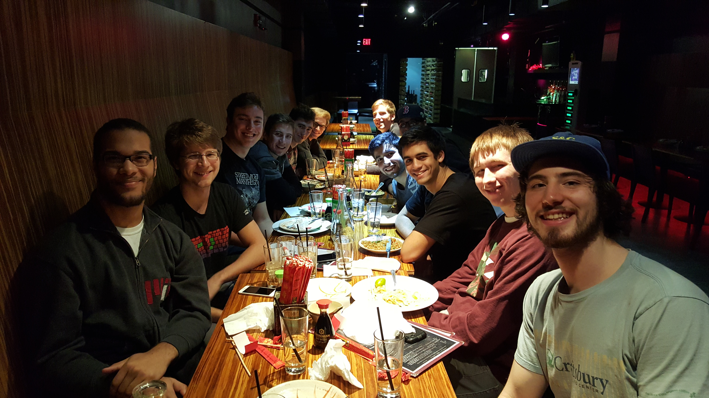
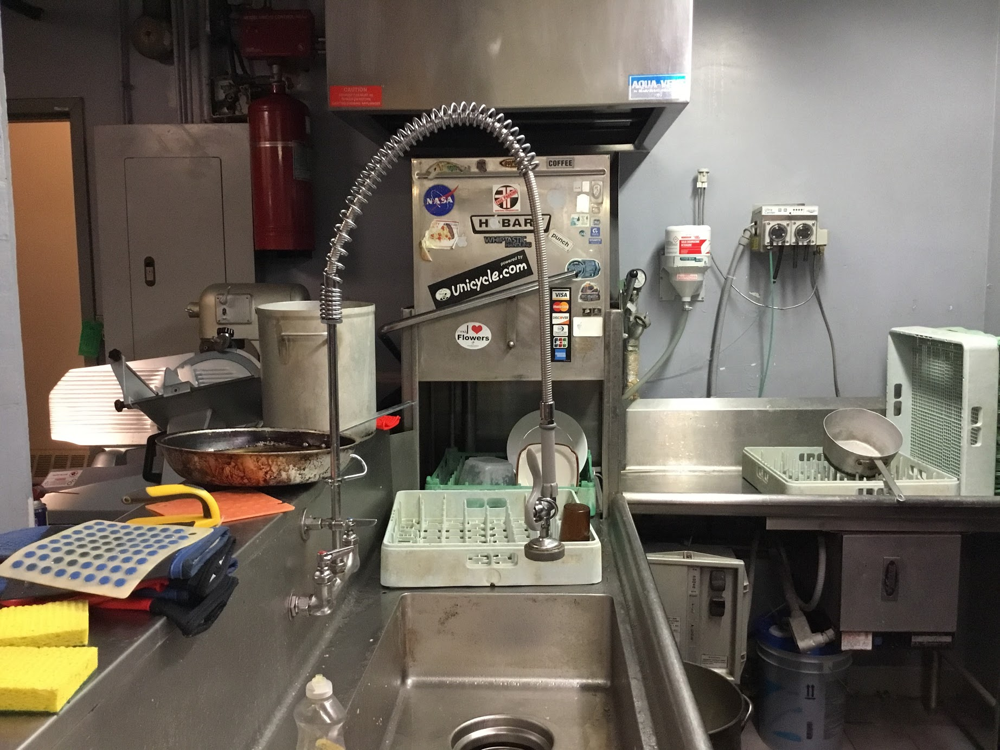
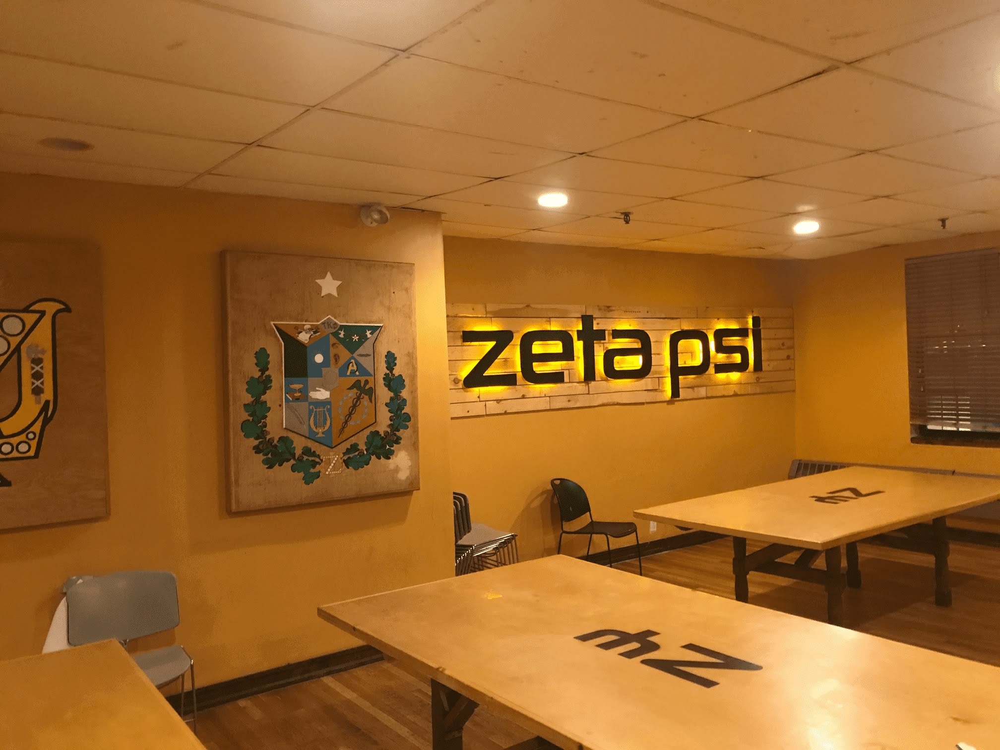
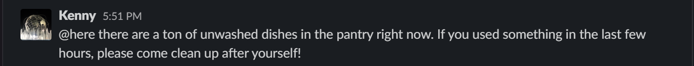
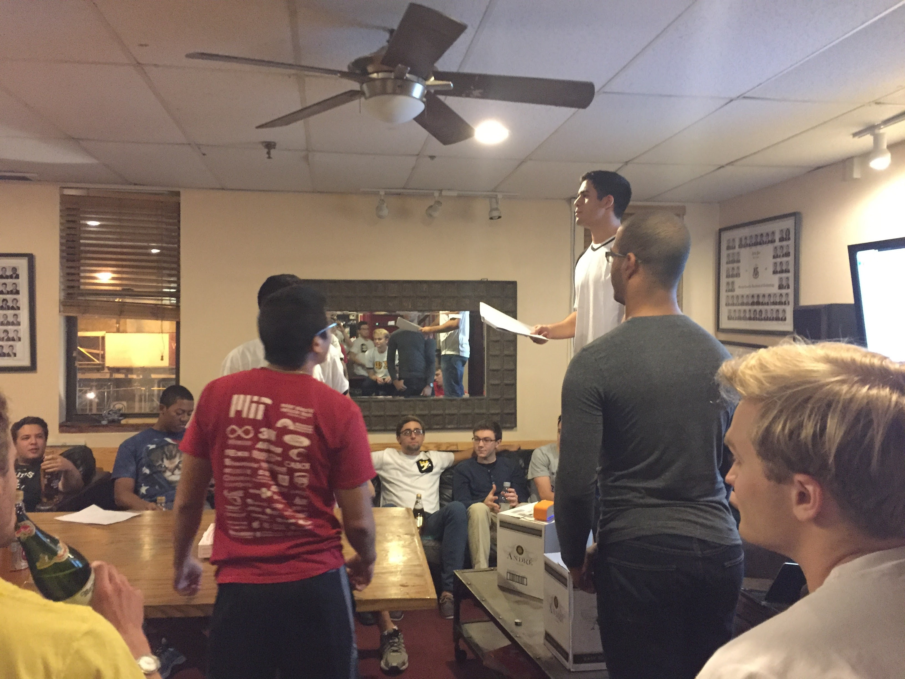
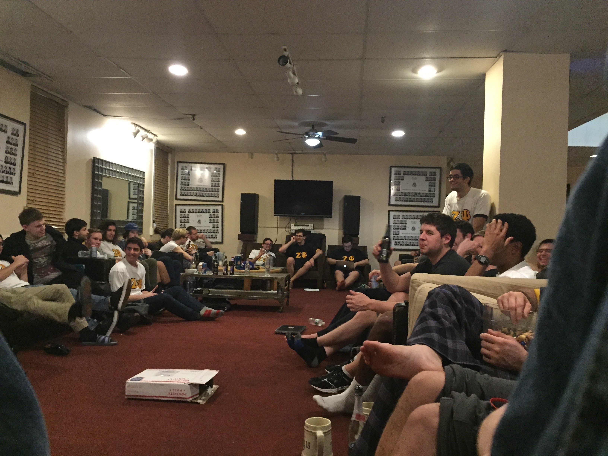

I consider myself extremely fortunate to have been able to attend MIT. It's filled with brilliant professors and experts conducting some of the most innovative research in their fields. The courses are the most challenging any student will encounter in their life. But it’s not why I feel fortunate.

Many professors struggle to relate their material to students whose focus is to discover their career. This struggle meant that most of my classes were useless. There are only a handful that I would consider applicable to my life today. But there's one learning experience that blew all the others out of the water: Zeta Psi.

Zeta Psi is not a secret math symbol in an advanced course. It's not an engineering lab breaking ground on new research. It was the fraternity I joined freshman year.

Described by others on campus as a "merry band of misfits", the people I met through Zeta Psi remain to be some of my closest friends today. The lessons learned through this living community are hugely impactful - I attribute a large part of who I am today due to those related experiences. You might be thinking "yea okay, like what, how to play beer pong?" While there was definitely some of that, the applications I'm able to draw to my life today may surprise you.

# Taking Ownership

I am a spoiled Long Island boy. I had the luxury of living with a housekeeper and mother who worked to the bone to make sure I lived a comfortable life. My laundry was done for me. My meals were cooked for me. My room always cleaned up after I left it a mess. At Zeta Psi, there was no housekeeper.

Dishes piling up in the kitchen that stopped me from eating. The bathroom smelling like shit that prevented me from getting ready in the morning. My room at times being in a state of total disarray, making it so none of my friends would want to hang out there. I learned that I had to **deal with the consequences** of my irresponsibility. Or worse, one of my brothers would have to clean up after me, cutting into their already limited free time.

I use this lesson to take ownership at work today. If I get sloppy with how I build a certain feature, bugs will slip into the app. These bugs affect other people, mount distrust with our clients, and require that my coworkers clean up after me. Dealing with the consequences of my irresponsibility results in time lost that could have been avoided by taking ownership in my work in the first place.

# Working With Brothers

In the real world, everything we do is a group project. You have to work with and be respectful of other people's schedules. Expectations of each other need to be set and clear, preferably with deadlines. We rarely get to practice these skills in traditional classes, and when we do the relationships with those team members end soon after the class is over.

Zeta Psi provided me with an abundance of opportunities to improve these skills:

- Nightly cook crews that would make dinner for the rest of the house, with a cleaning crew team afterward
- Setting up, running, and cleaning up after parties were huge logistical challenges. We needed to find people who were willing and available, delegate laundry list of tasks, and make sure they followed through with them
- Organizing rush events often involved coordinating with third-party vendors and dealing with disaster recovery when an entire food order would cancel on us last minute

In each example, I had to check in with people and make sure they were free to help out. I had to learn to respect their time if they weren't. I had to make expectations clear with them if I wanted to ensure that we were aligned. Fast forward to today. I'm checking in with team members to see if they have time on their sprint for a feature I need. I have to respect someone else's out of office schedule even if production has a high priority bug that needs resolving. I need to meet with designers and product managers to make sure we're on the same page about what I need from them and what they're asking of me. When it comes to working with others, the parallels between Zeta Psi and my day-to-day job are endless.

# Resolving Conflict

When you stick 50 different personalities under one roof, disagreement is an understatement for what unfolds every day. Learning how to deal with disagreement and resolve conflict in Zeta Psi has influenced how I try to resolve conflict at work.

I already mentioned that our kitchen would frequently get in a debilitating mess. This would often result in the following slack message:

Guess what would happen after that went out to everyone? Nothing. Nothing would happen. Because this is an incredibly poor method of handling conflict. By tagging `@here`, everyone has the opportunity to deflect blame and say it's not their fault. The person sending the message saw a chance to improve the state of the community, and instead opted to complain. General slack sentiment would deteriorate as a result.

A year after graduating, I remember one morning where I was catching up on my slack messages at work. I couldn't believe my eyes when I saw the following message:

It was an incredible moment of deja vu. And of course nothing happened, the pantry stayed a mess until the building's clean up crew arrived.

Good conflict resolution involves systemic solutions, not reactive complaining. What could we put in place to make the kitchen cleaner? It involves empathizing with and reaching out to each other on an individual basis. "Hey, I saw you leave the kitchen dirty, would you mind cleaning up?" It involves taking the initiative to set the example of what you want the state of your community to look like, so that others could be inspired to follow suit. It’s saying “I could take your party job shift so that you could study tonight” just like it’s saying “I could take your production support shift so that you could go to the wedding this weekend”.

# Value In, Value Out

I got a ton of value from my experience at Zeta Psi. There were other members in the community that would not say the same. One of the biggest patterns I recognized about those that did from those that didn't was the amount of time and effort they put in towards the community itself.

One night I organized the "Pledge Class Olympics" - a series of silly, minute-to-win it style games where each graduating class competed with each other for points and eternal glory. I spent weeks planning it, blew past my budget dipping into my own bank account, and spent the entire Saturday meticulously organizing. Doubt crept in. Would people enjoy playing these silly games? Do I have enough food and drinks? Will anyone show up?

The night went phenomenally. The excitement in the room was contagious, the competition fierce. People were cheering on their teammates, distracting those from the other teams. They waited with Christmas-morning suspense as I announced the scores at the end. The winning team celebrated by jumping on our wooden tables. I sat back in my chair after everyone dispersed into various common spaces chatting about the night in utter disbelief and exhaustion. A surge of pride and satisfaction I've never felt before kept me going for weeks. One of the freshmen at the time came up to me at the end of the night to say "Thank you for organizing this." It's a tradition that carried on for at least the rest of my time there.

Everyone loved this event, but there is no doubt I benefited more. Investing into the community rewarded me more simply by being in it. I now see this in the real world.

The engineer who spent the weekend rebuilding the login flow now has the opportunity to be the lead engineer on a new team. The product manager who is spending all of her time flying and interfacing with different clients is the one who gets promoted to be the head of product. What we put into our communities, is what we get out of it.

# My Opinion is Not the Only One

If there is one lesson of self growth that was most impactful from my time at Zeta Psi, this is it. The statement seems obvious on its face, but it's antonym could be pervasively subtle if you're not mindful of it. Especially for a Long Island high school senior who just got into MIT.

When I stepped onto campus, my ego was through the roof. I was convinced that the way I experienced moments was the way that everyone should too.

- Because I liked drinking, everyone else must also like drinking, or else they didn’t know how to hang out
- Because I liked pledge period, everyone else must also like how pledge period is currently organized, or else they weren’t being tough enough to appreciate it
- Because I loved Zeta Psi, everyone else must too

This ego blinded me. It prevented me from connecting with some members who shared very different perceptions than I did. I was blind to the struggles other people were facing not just with Zeta Psi, but with MIT in general. It drove them away from ever wanting to build a connection with me.

We had an end of every semester event, called "Pass the Gavel". The premise was simple: every brother would get a turn with the gavel to talk about whatever they want, for however long they want. No interruptions. Nothing's off limits. I look back on it as my favorite nights in college, as they often ran until 4 or 5 am in the morning.

It took many semesters for this idea to get through to my head. How the house felt too exclusive for friends outside of it to feel welcomed. How the drinking culture made them feel uncomfortable. How some people felt they were purposely excluded from certain events. People never called me out directly. But, I saw how I was directly responsible for contributing to many parts of said culture. I started to understand other people's perspectives, that they were even _allowed_ to have different perspectives. I started dating someone from another living group, and saw how their community got along contrary to many of my strongly held beliefs. My perspective started to be challenged. My opinion is not the only one that matters, and in the real world, it is unbelievably important to understand the perspectives of others if you hope to work with them and make progress. It’s not about optimizing for my personal vision of how the fraternity or company should be. It’s about optimizing for the community’s collective vision.

College is an incredible experience. What made it so for me and for so many people I knew were the communities that we were a part of. I was overjoyed when I handed in my last paper. But as I drove away after packing up my bags from Zeta Psi, an unexpected flood of tears started to roll down my face. Not because I wouldn't see any one of my brothers again; we get to hang out pretty regularly. But because I knew that the most incredible learning experience I've had in my life to that point was over.

It won’t be my last one though. I will always seek out communities in choosing my next learning opportunities.
