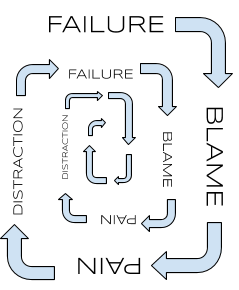
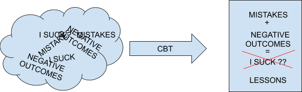

Imagine you see your friend having a bad day. They talked about all of the failures they had to face. A job interview didn’t go as well as expected. Homework that needed to be punted another day. Basketball team losing due to a key error made in the final seconds. Your natural reaction is to comfort them, because they are your friend and you know how special of a person they really are to let these events determine otherwise. Now, imagine that this friend who's having a bad day is you.

I met a bunch of brilliant people at MIT. One of the biggest factors holding some of them back was the lack of forgiveness they had for themselves. There was an arms race of self-loathing between students. One's cry of "I haven't started my one problem set!" would often be matched with "well, I haven't started my two problem sets or studying for my test tomorrow!" But, this loathing never projected outwards. They were able to comfort each other with "it's okay, it won't matter in the long run, you're still smart". Somehow, they couldn't say the same for themselves.

Lacking self-compassion is quicksand. Jonathan Haidt called it **personalizing** in his book _The Coddling of the American Mind_. It is attributing a disproportionate amount of blame to yourself for negative events. These types of emotional reasoning allow us to make connections in our heads that would sound ridiculous if said out loud. Succumbing ourselves to these connections then leads us to find devices that could help us feel otherwise. These distractions then increase the chance for more events that we perceive as failures, sinking further into the quicksand.

Ego could be a nefarious part of ourselves to manage. When we identify too closely with the outcomes occurring in our lives, the ego is tempted to place itself as the center of attention. It wants to put ourselves as the sole responsibility of what went wrong, often taking blame for factors for which we couldn't control. In an extreme ownership sense, this could be helpful for knowing how to act next. But when it comes to how we feel about the situations we're in, it could lead to downward spirals of irrational thought.

Two common antidotes to ego gaining popularity: psychedelics and Cognitive Behavioral Therapy. Psychedelics have been shown to disassociate oneself from their own ego, bringing to light what does and doesn't matter to them in their world. It has allowed them to accept their current situation as out of their control. Certain addictions that acted as crutches for distraction like alcohol and smoking were alleviated at higher rates with psychedelic assisted therapies than other comparable solutions. CBT beats the same ego disassociation drum, by forcing yourself to write down everything you're feeling. The exercise of being more mindful of the logical associations you're making in your head will allow you to recognize them in the third person. You will then see the irrationality in your thinking as you get on the path towards being more self-empathetic.

The common theme between these solutions is disassociating from your ego. Recognize that you are not the start and end of all the problems you face, and only then could you start thinking more clearly about the solution. Think about how we reacted when confronted with the hypothetical close friend. You would demonstrate **compassion** towards them. This reaction should not change when the subject of the negative consequences is now ourselves instead of a close friend. As Nir Eyal concluded in his book _Indistractable_ when talking about mastering internal triggers, "a good rule of thumb is to talk to yourself the way you might talk to a friend".

[Ian Reynolds](https://twitter.com/idreyn), a friend of mine, shared a journal with me in April. He wrote that "'forgive yourself' has always come off to me as a meaningless self-care platitude." He's since found that using the language of forgiveness as it occurs **between** people has given him a framework to do it with himself. Self-forgiveness starts with the understanding that an apology, rather than self-resentment or an attempt at rationalization, is in order. This is helping him not only feel better about his past mistakes, but to learn from them too in order to make progress.

I love to refer to myself as "Vargas" in the third person. I not only do this in moments of self reflection, but I also vocalize it in front of my friends. Past Vargas didn’t complete all the tickets he had scheduled for this sprint. Last night Vargas didn't get enough sleep. By no longer identifying with negative outcomes, I could view them holistically to both determine what is true and what I could do to improve going forward.

I could view previous moments in time as being lived by a friend so that I could help my friend learn.
