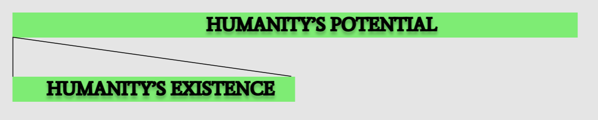

Climate Change. Nuclear War. Artificial Intelligence. These existential risks are growing as topics in public conversation, with two sides of the argument forming. On the one hand, these risks seem too impossibly large to be likely to happen or worth worrying about. I'll call people with this view Skeptics. On the other hand, we should drop all current priorities to devote all of our resources to tackling these risks. I'll call people with this view Alarmists. They’re both misguided.

If the world was without risk of human extinction, how many humans are there left to live? The answer at first glance would appear to be infinite, since humans are finite and time would have to be infinite. This makes existential risks hard to prioritize during current decision making. With the view of it being infinite, the slightest probability of risk results in infinite cost. This compels Alarmists to call for emergency when confronted with each risk and compels Skeptics to neglect them since we're powerless to handle infinite anyway. [Peter Singer](https://youtu.be/llh-2pqSGrs?t=2901) presents a compelling alternative, that the rest of humanity is actually finite. This finite property implies that our current decision making could rationally prioritize with the future in mind. Any solution could compare the cost today to implement versus the cost in the future by not implementing. This makes the problem deeply familiar with personal finance, where we compare the cost of spending today versus investing for the future.

Using a few first order approximations about the total energy in the universe, he argues that the total number of lives that can ever exist is around 10^56. The total number of humans to have ever lived is about 107 billion (10^11). Which means we are absurdly young and at the very beginning of the lifespan of humanity. Using these properties we could argue against the views presented by the Skeptics and Alarmists. Instead, a third path emerges as not only one that we should embark on, but one that we have been currently implementing for all of human history. I'll call people with this view, the one that could finitely compare the costs of the present with the future to prioritize accordingly, Rational Optimists. 

## Countering the Skeptics

Most skeptics would argue that the probability of any given existential risk to be significantly small, but slightly greater than 0. If you assume an absurdly low probability, the expected cost would still be high enough to make the risk worth considering. The percent chance of an event leading to humanity's premature end (say 1% of 1%, 10^-3) multiplied the number of humans still to live (more than 10^55), would effectively mean that ignoring the risk outright is costing the lives of about 10^52 people. 

Decisions made today that shortcuts our future is effectively preventing those lives from ever existing. This could be compared to the lives we affect with our decisions today. Skeptics could devise their own strategies for calculating lives left to live versus the chance we prematurely end their existence. It doesn't change the idea that they are inherently incentivized to consider the future implications of their actions, as the cost will end up being comparable to the costs that motivate present day priorities. Just as you wouldn't choose to end the life of someone from an unknown place in the world, you shouldn't choose to end the life of someone from an unknown time in the future. 

## Countering the Alarmists

So this clearly means we should all be alarmists correct? 10^52 is a massive number and anything of that magnitude should require our immediate attention.

It's important to recognize how young this number implies humanity is in its development. Scaling down to a single human life, humanity itself is still a toddler. We could use other approximations for humanity's potential lifespan, [such as the average lifespans of mammalian species being about 1 million years](https://www.pbs.org/wgbh/evolution/library/03/2/l_032_04.html). This still nets us being no older than a preadolescent, relatively speaking. 

To argue that we should expend all of our resources towards curbing these risks assumes that we are fully knowledgeable of these risks. It's analogous to arguing that my child self would know what's best for my future. It is also oblivious to all the technologies and discoveries we have yet to learn, that could save us an incredible amount of resources when tackling a risk than if we tackled it too early. Intention alone is not sufficient. The actions we take need to be mindful that they are not impeding our current progress to better technologies and they are not increasing the chances of other, possibly unknown, existential risks  

This leads to society being incentivized towards iterative improvement. We are a young species and still have much to learn. The best way to curb these risks is to make incremental changes and reflect on each one to see what progress we've made towards avoiding these risks.

## Resonating with Rational Optimists

Existential risks are collective action problems, and therefore require combined cooperation to tackle them. It is then usually argued that because these problems are centered around common social good, that no one actor is incentivized to tackle them. For example, the population of the UK is about 1/100 of the world. Why should they put 100% of their effort towards something that they will only receive about 1% of the value? This ethical dilemma is typically referred to as the [Tragedy of the Commons](https://science.sciencemag.org/content/162/3859/1243?__cf_chl_jschl_tk__=dd6fe3386a92628510d7739e31c49b6108a59828-1595811005-0-AenO3o8i92tRudPchZXkZbO_0qG1bICExCgy1gKUTABGanKM1l3QYIJt5Zbz2IRgOaqCZjbWXSudoze3JO_qp3TIzvlWAB0LSrbwalZCT4ilwIBK_vgmNjJ8kZyDOS3A1o531ejRc3AmdSqnGAI7YJaqEdoBmQiRQRz_091vTVyPgCsRKkVs1hp8hNeD6oVOIJmOL6ebM1iL9-t5KKxMZe1if8ilzszOuZtutI7TFN7maJHNCOiUcfSNJZ6XWodsih6uSQE5EQj_rYHJ2jUErjmmIqS1SRSFdFdgLnqtxWmU). 

However, throughout human history we have an abundance of evidence demonstrating humanity making progress on social progress. In _The Precipice_, Toby Ord points out that extreme poverty has fallen from 19 in 20 to 1 in 20 of us, _even_ counting for inflation. In _Enlightenment Now_, Steven Pinker shows us that deaths due to homicide or war in the world have dropped by about 30% in the last two decades. We are now seeing signs of companies and governments taking our current existential risks more seriously. An example of this is the trend of these companies [setting decarbonization targets](https://techcrunch.com/2019/09/19/amazons-climate-pledge-commits-to-net-zero-carbon-emissions-by-2040-and-100-renewables-by-2030/).

We should expect more of these efforts to unfold. Countries like the UK do not receive just 1% of the value. They receive the collective value of the rest of humanity existing, innovating on technology, and providing said value to them. In a positive sum game, this amounts to far more than the 100% of the effort they put in. We should expect more of these efforts to unfold _because_ it serves our self interests.

Humanity's potential is finite, but vast. We could use this fact to continue tackling the threats we face sustainably. It's through this finite nature that we could continue to make exciting progress on problems present and future, hedging our bets against both. Optimism matters, since as Steven Pinker points out:

> "people may be likelier to acknowledge a problem when they have reason to think it is solvable than when they are terrified into numbness and helplessness"
