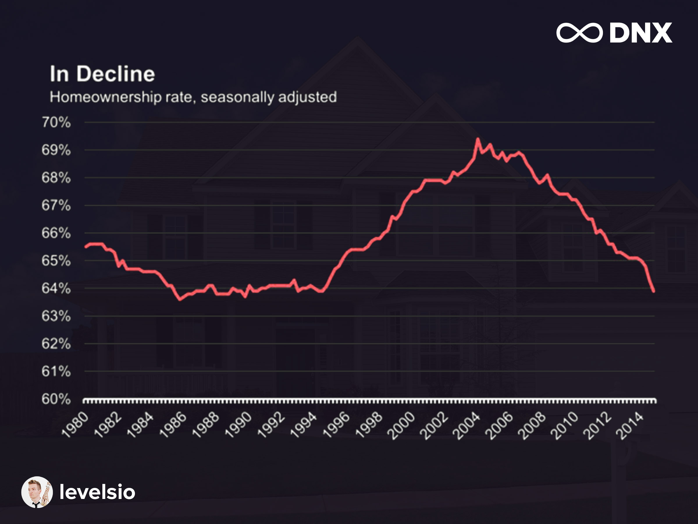

I love having a home. I love my stuff. For the last year, I had been ruthlessly cutting expenses to save money for a down payment on a house by 2021. I was seeking permanence. Then my friend [Nikhil](https://twitter.com/nikhilpunwaney), who was ending his Boston lease with the intention of moving to New York, pitched me this insane idea:

"What if we did what we were doing for Covilla, but.... all the time?"

What's Covilla? My friends and I wanted to take advantage of our "temporary" work from home situations by renting a villa for a month. We searched for a vacation home on Airbnb with a pool and enough bedrooms to house the ten of us. It was an opportunity to relive our college days. We coined the vacation away from home "Covilla", with the mindset that this would only be a one time excursion. We found a place in Orlando, Florida that matched this criteria. Originally the idea was to return to the city at the end of August, and continue our dystopian locked up lifestyles in our congested, overpriced New York City apartments. To do this "all the time" would imply that we would find a new Airbnb to rent every month in a different city for the foreseeable future.

No way. Why would I want to become a digital nomad?

## Rising Trends
A digital nomad is someone who is able to work remotely full time to support a lifestyle of never having a true home. There are many approaches to digital nomading, with people varying the lengths of their stay and the radius of acceptable places to temporarily call home. 

The idea seemed so foreign to me. But as I got up from my childhood bed every morning with the same t-shirt and shorts I'd been wearing all week at my mom's house during quarantine, I was getting curious. In researching whether this was feasible, I discovered that I'm not the only one who has contemplated this lifestyle. It's a trend that has been growing for years now. It wasn't just the buzz around the remote work revolution that has been picking up steam. Each piece of the digital nomad adventure was experiencing positive momentum, long before Coronavirus had even made its way across the Atlantic.

Minimalism has been gaining popularity, exemplified by [The Minimalists podcast](https://www.theminimalists.com/podcast/) having over 70 million downloads. There's a rising economy around renting, with companies that allow you to rent all sorts of clothing and kitchenware. Flexibility around renting has also coincided with the growth of the gig economy. In 2018, [one in three](https://workationing.com/digital-nomad-remote-work-statistics/) workers were freelancers, with more than [90% of US](https://fortunly.com/statistics/gig-economy-statistics#gref) workers considering contract work. In order to compete for the supply available in the workforce, employers have been pressured to provide equally enticing benefits, most notably a rise in people working remotely. Riding the wave of these trends was becoming enticing.

As I saw how frustrating it was for my mom to sell her home, I began to question my desire for permanence. I found several trends pointing to the decreasing desire of settling in a single location. The classical reason for settling down, marriages, are on the decline in the US, [dipping below 50%](https://www.usatoday.com/story/money/2019/03/07/marriage-us-states-highest-percentage-married-people/39043233/). Tech hubs like San Francisco and New York City are becoming impractically expensive to live in. Costs associated with a middle class sedentary lifestyle are also becoming harder to manage, when you combine mortgages, car payments, property taxes, and general home maintenance. I both have no plans of getting married any time soon and hate the cost of living in New York City.

With all of these factors building pressure in the digital nomad rocket, all was needed was for the coronavirus match to set it off. I anticipate that there will be 1 billion digital nomads by 2025, [a full decade earlier than most are already predicting](https://levels.io/future-of-digital-nomads/). I also expect the trend to maintain its growth long after Coronavirus has become an afterthought.

## Secondary Effects

The biggest factor surrounding the longevity of remote work as a trend is productivity. Employers want reassurances that their teams could still produce great services in the face of all the freedoms they are being granted. Digital nomads will need objective metrics to point to justify their value, since the subjective experience of being in the office will be missing.

The rise of communication technology has shifted the way we work to be more asynchronous. The pressure of writing down more and recording more data on progress has made it easier for digital nomads to prove their worth to the rest of their teams. Accommodating remote work won't stop at the digital services we use. We will begin to see more WeWork-type setups spring up throughout the world, building the same accountability communities that offices once provided. Competition for certain roles has become global, allowing recruiting divisions to select from a larger talent pool and select better fits for their organizations. Companies like Basecamp are committing to a location-independent pay strategy. There has already been [research](https://www.forbes.com/sites/jiawertz/2019/06/30/open-plan-work-spaces-lower-productivity-employee-morale/#722cb04161cd) claiming the decline of productivity associated with open office plans when compared to private spaces. All of these factors point to productivity keeping pace with pre-coronavirus levels.

Global labor markets and location independent pays will lead to increased investments in communities across the world that have traditionally been under invested. Those places are starting to devise strategies to take advantage. [Tulsa](https://tulsaremote.com/) is offering $10K to anyone willing to move to and work remotely from the city for at least a year. [Bermuda](https://www.independent.co.uk/travel/news-and-advice/bermuda-travel-remote-working-year-long-stay-tourism-atlantic-a9634096.html) recently announced a similar incentive to entice remote workers. I expect this to be only the beginning of several cities, states, and countries offering similar incentives to digital nomads. The cycle will perpetuate. We end up approaching a world where places have to compete on the **quality of life of their inhabitants**.

## Overcoming Doubts

The research was pointing me towards an exciting trend. Can it really be practical for me? What would I do with my stuff? What would I do about work? Does it make financial sense?

Anticipating how daunting moving once a month would be also helped me realize how freeing it was going to be. I could finally take my minimal-ish nature to the extreme. Living out of a suitcase at my Mom's house for three months proved it was something I could handle. Most of the remaining stuff in my apartment could be sold or thrown out. All I really need with me is two weeks worth of clothing, toiletries, and my laptop

The two hours a day that Coronavirus stole from my commute and gifted to me became harder to let go. My job was remote until the end of 2020, and who knows how much longer after that. It also introduced me to the idea reversing how my lifestyle was dictated. Instead of moving somewhere for my job, my job had to be accommodating to how frequently I would be moving.

Finally, when we broke down the cost of Covilla, my eyes cartooned into dollar signs. The Airbnb we found would only be a third as expensive as the apartment I'm renting today. Cost of travel gets easily offset by no longer having to pay for wifi, electricity, or city bar food that is twice as expensive than it needs to be. All these cost savings, and my living space will be _upgraded_ from a 500 sq ft. apartment to two-story vacation home. Every city I looked, there were an abundance of options that demonstrated similar cost savings and quality of life improvements.

This is almost the perfect time for me to try this lifestyle. I have no external responsibilities or people depending on me. If there was ever a time to make this work, it was now. 

## Looking Forward

Yes. Let's do it! On Friday July 31st, 2020, my two year stint in the big apple will be over. A new chapter of my life will begin. I will become a digital nomad. Every month, choosing a new Airbnb to rent, in a new city across the country. And after a few months under my belt, across the world.

The decision to leave behind the idea of a home began as a practical one. I originally considered only costs. But, the more I reflected, the more I realized that I'm about to ride a new wave. A wave of how people will experience life in their teens, twenties, and thirties. Digital nomading will **become the norm, not the exception**.

The world will begin adapting to this way of life, offering services that we cannot even conceive of. New global communities will form. New conferences will present opportunities to meet new people. Exploring different cultures around the world will vary my perspective. All contributing to one of my new favorite ideas.

Becoming a citizen of the world.
