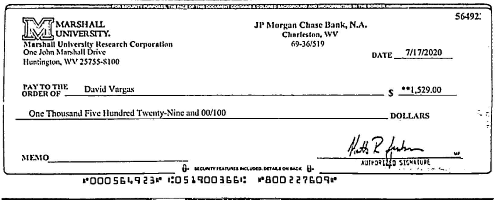
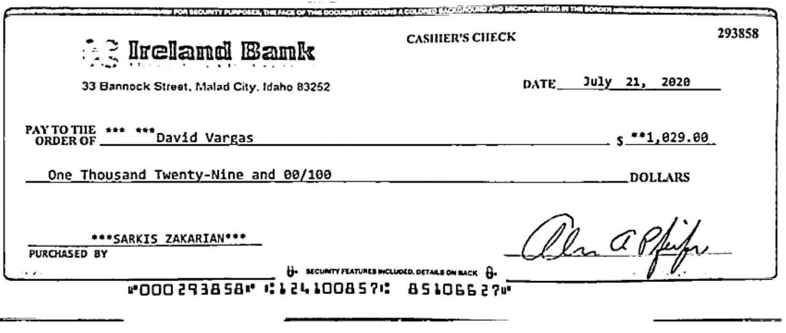
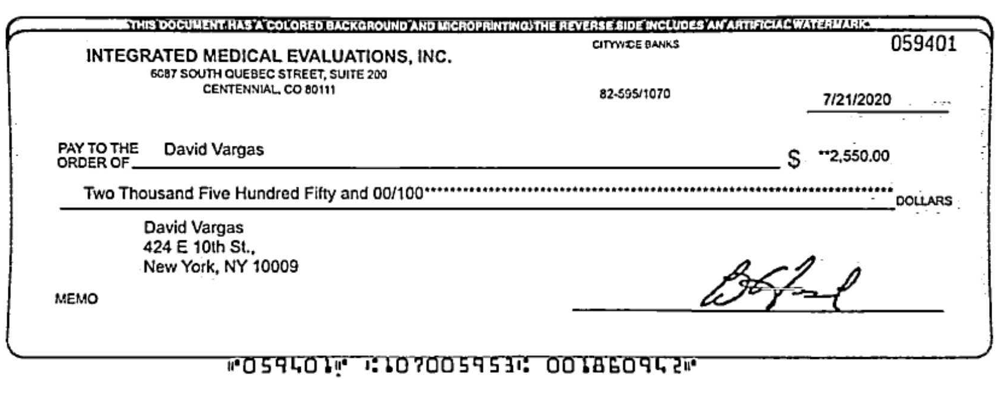
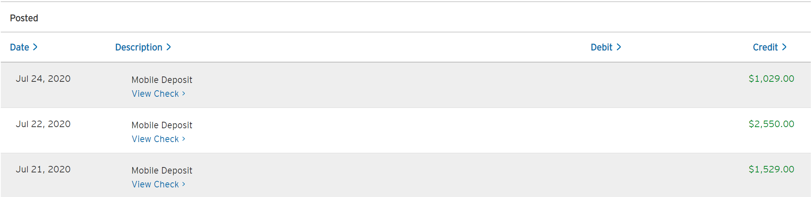
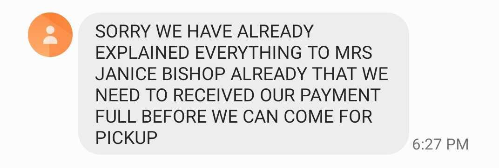

You might feel sympathetic for me after reading the title. I promise that after reading all the mistakes I made, you will come to the conclusion that my dumbass deserved to get scammed.

I was looking to sell a bed and a dresser in an effort to purge my apartment of belongings before moving out of New York City. After reaching out to several groups of people, I was having no luck. I was even willing to give it away for free given that it went to someone I trusted. With my anxiety surrounding the situation increasing and the move out deadline approaching, I decided to heed my coworkers advice to put the items on Craigslist. It was the first and last time I ever will use that janky excuse of a website.

Only a day after posting my items up I got an email from a potential buyer! An immediate sigh of relief left my stomach. Wow, I can't believe people still actually use this site! Though when I opened the email, I became skeptical:

There are a few things wrong with this email:

- That "from" address looks suspicious. I chalked it up to how Craigslist automation works, in line with how shitty the rest of the site looks
- Punctuation is a mess. Noted, stay vigilant
- "Text me at email@address.com" That doesn't make sense

Still, with my desperation to get this bed out the door, I decided to email mister Sebastian anyway and see where it goes. Once I did, I mysteriously got a reply back, from a different email, from a Mrs. Janice Bishop. I reasoned that  Sebastian is some Craigslist scout that scrapes the site for his clients and forwards them the details when a match is found. Whatever.

In the middle of the exchange, I get this mysterious message from Janice:

> I instructed my Financial to mail out the payment including the mover funds. Hope i can also trust you with the mover funds? & you will keep to your words.

Wait. Why am I being responsible for the mover funds? If she's coordinating the move, why didn't she just pay them directly? I start to come to the conclusion to have sympathy for my not very intelligent buyer, and should just be accommodating since getting rid of my bed was top priority.

In parallel, I received another email from Sebastian, this time for the dresser. Given how I was able to quickly connect with Janice, I felt I could trust this guy to get me the second buyer and BOOM, problem solved! Both pieces of furniture will be gone! So I responded and my buyer for the dresser is a Mrs. Wislania Ribeiro. These names just feel like they were cranked from a random name generator on the internet. Anyway, after some back and forth, she sent me this message:

> Once you receive the payment, you are to go ahead and Deposit/Withdraw the movers fund! 

This feels very fishy. Two independent buyers, both asking me to be responsible for the movers fund? I reason that Sebastian handles both the Craigslist scouting and the furniture moving, so this was just how he ran his business. I'm on high alert now. Or so I thought.

Checks for both pieces of furniture arrive in the mail about 24 hours from each other for about $2500. Let me repeat that. $2500!! For a bed and dresser that I'm selling for $300 each! Who the fuck would pay a mover $2200 for a piece of furniture they bought for $300?! The checks also look absurdly fake. Here are the two for the bed:

And the one for the dresser:

Nothing about where these checks came from, the memos, the signatures, or the banks make any sense. However, given how paranoid the buyers were about whether or not _I_ could be trusted, and given that I assumed they weren't very reasonable people, I decided that it wouldn't be worth questioning them on these checks. Instead, I decided to mobile deposit these checks, on the assumption that if they were fake, they wouldn't clear. If they did clear, then worst case scenario, my buyers are getting scammed by the moving company and **I was safe** because it was **their money being lost**. Oh Vargas, how naively incompetent you are.

Ok, so I deposit the checks, and wait for them to be moved from pending from my Citibank account. And they did!

This right here is the biggest incorrect assumption I made that was my downfall. **Just because a check is no longer pending, doesn't mean it's been cleared.** I didn't understand this at the time, but distracted by my excitement to have buyers interested in getting this furniture out of my apartment I didn't bother doing any further research into it. From this point forward, I'm operating under the assumption that their money is safe in my account and I'm dealing with someone else's money.

Once I give Janice Bishop (bed) the heads up that I have the money safe into my account, she gives me the CashApp accounts that I am to forward the moving expenses to. What. If you had the CashApp accounts already, why the hell did you send me the checks? Why didn't you just CashApp them directly? Whatever, I'm dealing with a moron, let me just be accommodating. I CashApp the money to a Sabrina Gudish, again another name that feels like it was generated by robots. I have a similar experience with Wislania Ribeiro (dresser), except she directed me to Zelle the money to a Giselle Marie Mendoza. There's definitely some psychological effect here at play with all of these names being female sounding.

Saturday July 25th hits, and it's pickup day for the bed. Janice Bishop texts me, __on a different number__, asking if I could do her a favor and send the movers an extra $200. She is insistent that the movers refuse to come pick up my bed until they have the $200 and that she will reimburse me with another check once it's picked up. Nothing about this makes sense. I tell her that I will take out cash since I hit my CashApp weekly limit. She offers this brilliant workaround to the CashApp problem: I should go to my local store, buy [Steam gift cards](https://store.steampowered.com/digitalgiftcards/) and send the codes to the movers. WHAT?!

No business I'm comfortable dealing with accepts gift cards as transactions. I tell her no. I have cash for the pickup, I'll give it to the movers when they come. She gets aggressive:

As if now I'm being unaccommodating. I ask her if she could just send them the money or gift cards directly, but "she's at work". I call her, and a Google Voice picks up before going to voicemail. Red flags are parading my mind like a high school marching band. 

I consult my friends, and they tell me not to buy the gift cards. But with the risk of my bed still being in my apartment when the move out time hits, I start to panic. I'm pacing my room not knowing what to do. I finally convince Janice Bishop, after about an hour of incoherent back and forth conversation, to give me the phone number of the moving company. Her phone number was (858) 375-9301 and the mover's number was (858) 375-6028. THE FIRST 6 DIGITS WERE THE SAME! Guess what happened when I called it? Another Google Voice before going to voicemail. Texting the mover, they give me this Trump-esque response:

At this point I've lost all sense of rationality. I figured that I had already sent over $4400 of "their" money, what's another 200? I go to a RiteAid and buy the gift cards. Maybe there's a shot in the dark this move still happens. I grab on to this inspiring glimmer of hope:

My mom calls me that night to see how I'm doing. I decide to go over all of the nonsensical details that have transpired so far. As they leave my mouth for the first time with a third party, I start to recognize how insane the decisions I've made were, stumbling over my words. You know, that moment when you have to explain something to your mom when you know you're in trouble? She even asked me if I've been drinking, a ludicrous question once you know I quit 8 months ago. She became concerned for my safety when I told her that I was sure that the checks cleared and it wasn't my money that I was free wielding. We end the call on the agreement to do some research on the subject and reconnect in a half hour.

I stumble upon [the fifth bullet on this site on fake checks](https://www.thestreet.com/personal-finance/craigslist-scams-14707309) and start sweating profusely. Scrambling over to my bank statements, my jaw lands on my keyboard when I see:

Fuck. This is the first of the three checks bouncing. I let my mom know when we reconnect, and she breathes a sigh of relief that this implies my safety is not in jeopardy and it's just money I lost. I text Janice Bishop about her check bouncing and she of course plays dumb, asking for a screenshot. Probably so that scammy little shit could revel in their victory. Pour salt in the wound.

No one ever comes for the furniture. I don't even bother following up with Wislania Ribeiro for the dresser. In the next week, the other two checks eventually bounce. I contact citibank, Zelle, and Cashapp to see if there's anything I could do to recoup this money, but these were cash transfers that I authorized. They are meant to be sent to trusted parties. I lost the money for good. 

## Takeaways
I'm not too upset about losing the money. My mom wired me the money I lost because she's a wonderful woman and I love her dearly. But even if she didn't, I had enough in my savings to cushion the blow and worst case scenario some of my long term goals get delayed a month or two. To help me feel better, I reasoned that the person who scammed me was in a much less financially secure position than I was, and hoped that the money could make a substantial impact on their life. 

I am extremely upset about two other realizations. One, that I wasted so much time dealing with these scums. Two, and more importantly, that I still had the capacity to be so ignorant and make such negatively consequential mistakes. My only solace in this realization is some of the larger lessons I learned and can share with the world.

**Listen to the alarms.** Throughout this whole process, enough red flags were waving to get even K'naan excited. However, my ego told me that just because I couldn't forecast how these red flags could negatively impact _me_, I was okay to continue. If you are uncomfortable with a situation, especially if you can't draw the connection to how you can be harmed, refuse to proceed.

**Checks not pending does not mean checks cleared.** Quite honestly, I consider this bad user experience on the part of the banks. Just because a bank has moved a check from pending to posted and _says_ that the funds are securely in your account, it does not mean it has been cleared. It simply means they allocated the funds for you. They still have to post the check to the other bank and the other bank needs to confirm that the check is legit. So in this case, when the other bank confirms that the check is fake, your bank will just deduct it from your account. Oh and stack on an extra $12 fee as a slap in the face for being so gullible.

**Never spend money as the seller**. It never made sense even for an honest customer for me to have to pay for the mover's fee. Don't risk your security in an effort to be accommodating.

**Don't let your anxiety rule your decision making.** What makes this lesson so tricky to learn is that it seems so obvious from a third party perspective. Once you're under the influence of your emotions however, it's incredibly difficult to pull your head above water. My anxiety to get rid of my stuff by a certain date took precedence over the logical Vargas that was screaming to stop engaging with these people. The worst case scenario of just throwing away my furniture was much better than the scenario I experienced. But emotional Vargas won this round. 

**Other people keep us sane.** It should be noted that I was by myself in my New York City apartment for the entire two weeks that this happened. As soon as I vocalized what was going on to another party, my mom, the suspicion that the situation warranted became immediately obvious. We are not meant to be lonely creatures. We learn and are grounded by the other people in our life. I now have another substantial data point reaffirming that belief. 

I hope that I and others reading this could grow from this experience. Better that I only lose $5K today instead of something I value significantly more in the future.

So whatever happened to my bed and dresser? Oh, my mom knew a family friend that wanted it the whole time and we got it sold the next day.
