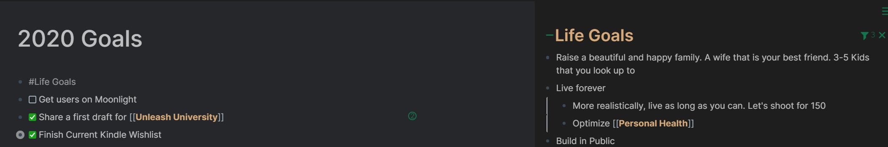
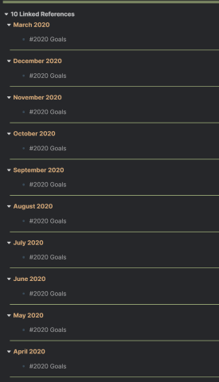
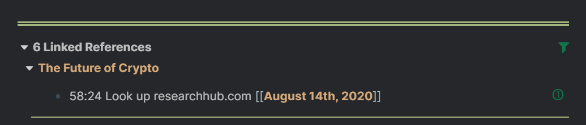
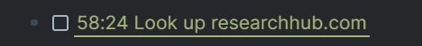
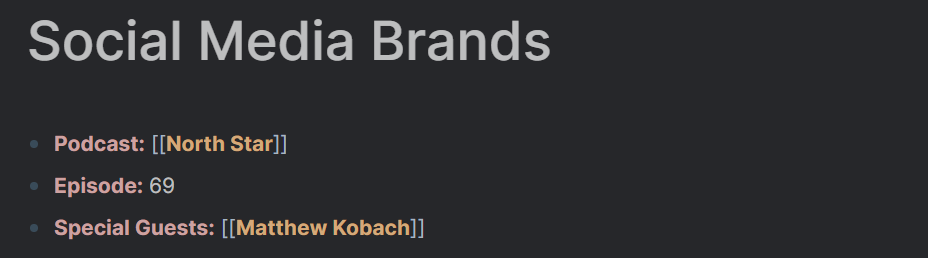
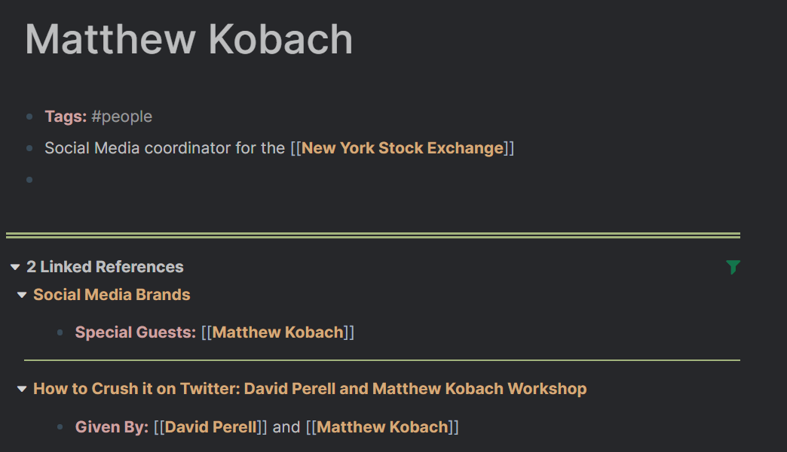
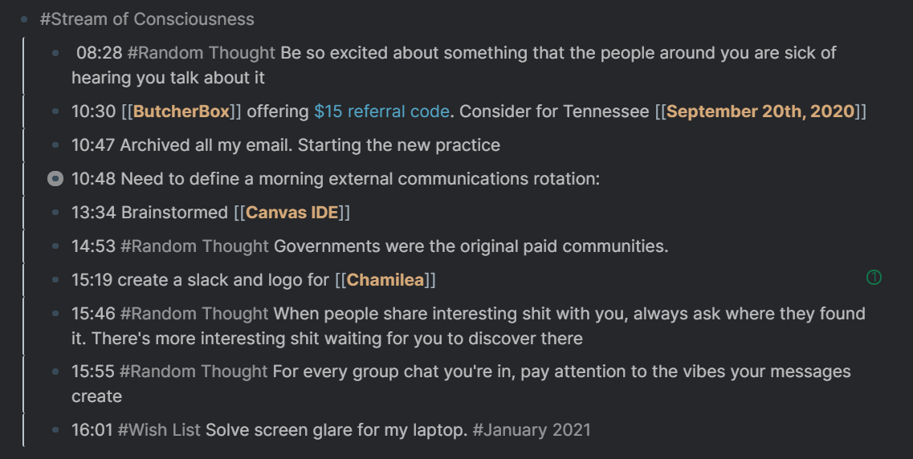
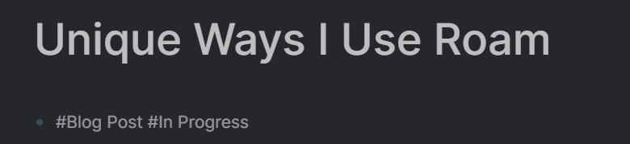
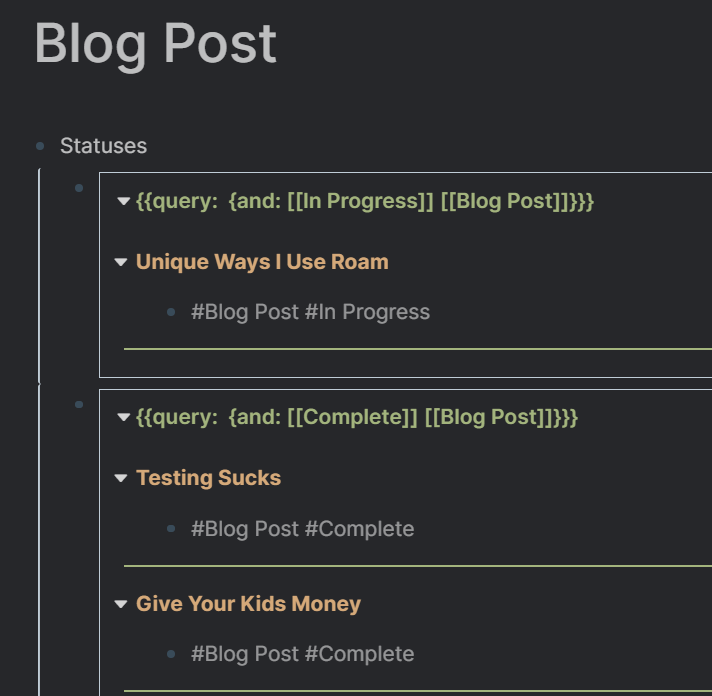

I run my life on [Roam](https://roamresearch.com/).

It's so much more than just a note-taking tool. My personal Roam database _is_ Vargas. It is in far more control of the things that are important right now than my biological, error-prone self. In a world full of distractions, Roam removes the cognitive burden of having to manage these distractions on the fly. It's one of the few tools I've used that continues to show me new ways of taking advantage of its extendable feature set.

Here are 5 ways that show how I am using Roam to empower my life.

# Goal Tracking

I tried several different goal tracking apps that never really stuck before landing on Roam. While intended to be focused on singular objectives, goals are constantly subject to change. Roam was the first tool I found to handle this flexibility, while also encouraging me to be a more goal-oriented person in general.

I first started with a `[[Life Goals]]` page, writing out all the things that seem important for me to achieve in life. These are very high level and vague, like raising a happy family and living for as long as possible. Consequently, they don't need the ridiculous categorization that most goal tracking apps try to impose.

After creating the life goals page, I created a page for `[[2020 Goals]]` . Since I had already [tweeted about this](https://twitter.com/dvargas92495/status/1212135829801451521?s=20), I had a good place to start. Then for each yearly goals page, I include a reference to my life goals so that I could always pull it up on my side bar when I compare the two. This makes it easier to perform the exercise of asking myself "is the goal I'm setting this year helping me achieve one of my life goals?"

Now that I have my goals for the year, at the end of every month I set monthly goals for the next month in their own pages. I have pages for `[[March 2020]]` which is when I started, all the way up to `[[August 2020]]`. Just like above, I include a link at the top to `[[2020 Goals]]` so that I could use the same side by side strategy as above. I ask myself "is the goal I'm setting this month helping me achieve one of my yearly goals?". Moreover, now when I go to the `[[2020 Goals]]` page, I can see the page references for each month of that year!

I use the same approach for month to week and week to day, always including a reference at the top. That allows me to do a side by side comparison and to view all the child pages for a given context. This helps me drill down to what I need to do today. I then have the comfort that what I'm working on has already been deemed most important.

# Do it Later

Tiago Forte has a compelling article on the [power of "Read it Later" apps](https://fortelabs.co/blog/the-secret-power-of-read-it-later-apps/). By putting away articles we stumble upon to read later, we experience two primary benefits. First, we satiate our primal impulse by knowing it will eventually be read, reducing distraction from what we are currently working on. Second, we ensure that the articles survive a test of time filter and are still relevant for us. Roam allows us to extend this idea beyond just read it later - **do it later**.

I often have the experience of working on a single task and seeing a random interruption disrupt my focus, like a slack message. As a result of that slack message, I become inspired by it to do another task. This game of whack-a-mole plays out for a few more iterations until the end of the day hits and the original task that I had originally planned for the day never gets done! Now with Roam, when these inputs come flooding into my brain and excite my dopamine receptors, I use Roam's date picker function to give myself the comfort that I will do that input task, but at a later time.

For example, I was recently listening to a podcast that brought up [ResearchHub](researchhub.com), a community seeking to improve collaboration and funding of scientific research. As someone who's looking to dive into open source work more, I got super excited about this idea. But, I was already in the middle of a sequence of tasks I had scheduled for the day. So instead of falling victim to the rabbit hole this website would induce in me, I put the following in my page for the podcast:

I literally just pick a random date in the future, and assign it to that day. My mind today could now rest at ease, knowing that future Vargas will handle it, when he plans his day for August 14th and sees this:

When I start planning the beginning of this day and am organizing my todos, I could ensure that I actually make time for this activity that past Vargas really wanted to do. Oftentimes, I see an activity that doesn't stand the test of time and just delete it. Past Vargas was just excited in the moment and didn't have the forethought of everything current Vargas has experienced. But for the activities that survive the test the time, I copy the block reference, paste it in my daily note as a `TODO` and remove the date:

This way, it still preserves the context of when or what inspired me to do said activity, while being co located in the appropriate daily page. This strategy has allowed me to have peace for the present. A calmness that every impulse I experience will be satiated one day in the future and I can enjoy what I'm focused on now.

# A Page for Every Noun

One of the biggest mind shifts I had to make when getting started with Roam was letting go of my obsession to organize everything in hierarchies.

Instead, I started embracing the chaotic nature of my network of pages. The best strategy I found to start embracing this was to **make a page often and liberally**. The personal rule I've developed is that every noun I interact with in my day to day becomes a page.

People I meet with? You probably have a page in my Roam database. Articles I read?  They have their own page with my associated notes. Same for books, podcasts, videos, and classes I take. Then by linking the other relevant nouns found in these notes, I see a network of nodes begin to develop, allowing me to _roam_ freely across my database without a care in the world for organizing these notes. This encapsulates what makes Wikipedia so much fun to jump around in.

Recently I listened to a [North Star](https://www.perell.com/podcast/) podcast with Matthew Kobach. For each of these podcasts that I take Otter notes of, I create a page in my notebook since an episode is a noun:

I thought to myself "Matthew Kobach... where did I hear that name before?" I click on the link of this page to take me to Matthew's page:

Holy crap! I have heard of him before! He was in a previous workshop with David Perell on how to crush it on Twitter, another video I had taken notes on.

This is an experience I live through almost daily, with people that I both follow and interact with on a day to day basis. If I'm re-meeting someone either through Zoom or in person, there's a good chance I could look in my Roam notebook to see the context of when we last met and pick up where we left off. If we have interacted in any capacity, I probably have a Roam page on you, so let me know if you're ever curious about checking it out!

# Stream of Consciousness

My daily notes have a well defined template. At the top, I put the weekly goals page that serves as its context. Afterwards, I fill the page with all the TODOs I want to get to in the day based on what the many past Vargases have planned ahead. Then at the bottom of the page I add a tag called `#[[Stream of Consciousness]].`

Throughout the day, any random idea or thought I encounter in my day I immediately record here. I usually record the time with `/Current Time`, followed by the content of the bullet. Come across an activity that excites me? Use the "Do It Later" approach from above to record it here with some random date in the future. An idea I come across that I want to repurpose as a tweet? Record it here with the `#[[Random Thought]]` tag so that when I want to tweet later, I could look through the thoughts I have referenced in this page. Exciting idea for a project? Record it here with the context of what sparked the idea.

The value of this system is always having a reference to exactly when a given thought crossed my stream of consciousness. This is very useful for future Vargas to understand the context of the thought and whether it is still relevant for him. It also serves as a good template for my end of day journal I write on [Longwave](https://longwave.app/). I could usually rely on the combination of my TODOs and my stream of consciousness to serve as a good backdrop for reflecting on my day before I go to bed. Here's an example of what a given day's stream of consciousness could look like:

# Project Planning

Every project I brainstorm has a type and a status. As I refine what I work on, here are the 5 most popular project types in my database:

- `#[[Blog Post]]` - What you're reading right now!
- `#[[Strava Listens]]` - My Sunday morning newsletter
- `#[[Partnerships]]` - Projects I work on with friends, like the previously mentioned [Longwave](https://longwave.app/)
- `#[[Open Source Opportunity]]` - Issues I see with current tools I use that I could help out with
- `#[[Roam JS Extension]]` - Ideas I have for extending Roam

For all of these types of projects, they have one of four statuses:

- `#[[Interested]]` - Thought of the idea and it's in my backlog 
- `#[[In Progress]]` - Currently working on the project 
- `#[[Complete]]` - Finished the project 
- `#[[Archived]]` - Decided that the project is not worth doing

Then, each instantiation of a project will have it's own page and have one of each tag on the top of the page. This is the one for this article:

Finally, for each of the project type pages, I put four queries - one for each status. This gives me an overview of what project of each type I'm currently working on, and more importantly which ones I've already brainstormed and could tackle next:

Queries are still in an early stage for Roam, and could use far more support for counts, formatting, etc. But they are pretty powerful as they are and give me a good high level view that allows me to create from abundance instead of hitting creator's block.

# Learning More About Roam

For those who are unfamiliar with the product and don't have a note-taking system in place, I'd encourage signing up for a free trial. There are a ton of great resources out there from [Roam Brain](https://www.roambrain.com/) to [Roam Hacker's public database](https://roamresearch.com/#/app/roamhacker/page/-1s5kPhyX) that can familiarize yourself with basic concepts and convince you to give it a shot. I took a course that unlocked Roam's potential for me, [given by Nat Eliason](https://learn.nateliason.com/) which I cannot recommend enough. My friend Zachary Fleischmann also wrote up a great article behind [the philosophy of Roam](https://hawthorne.io/getting-to-philosophy-with-roam-research/) which I would recommend checking out.

These resources helped open my eyes to its potential, but only through incorporating the tool into my day-to-day was I able to develop my own strategies. I'm excited to continue growing with the [#roamcult](https://twitter.com/hashtag/roamcult?src=hashtag_click) community to discover how it will further empower my life.
