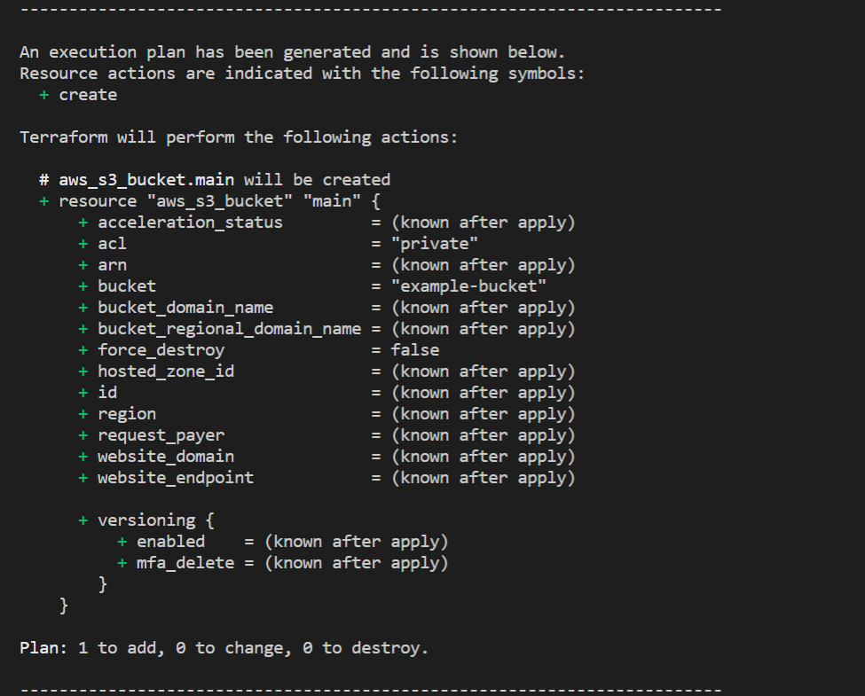
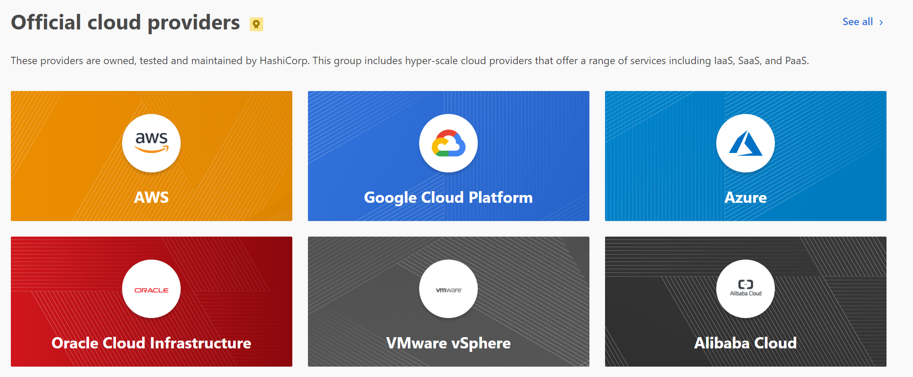

Imagine working on the next big operating system with multiple other developers. Suddenly, this feature for running applications that has been working for weeks broke. Who broke it? What change did it? How easy is it to just roll back to a previous version of the operating system where the feature was no longer broken?
 
These are the many frustrations that Git was created to solve when Linus Torvalds built it in 2005. The tool accelerated the ability for multiple engineers to work on a single software project. By knowing who was responsible for each change and why, engineers moved faster without fear of having to diagnose mysteriously appearing issues. This also allowed open source to catch fire, with GitHub launching in 2008 on top of the tool to allow developers across teams to collaborate and learn from each other's projects.

As teams start to migrate their software projects from self-hosted machines on to cloud services like AWS and Azure, we are seeing the same problems reappear but in a new domain. 

## Managing Infrastructure
I define infrastructure to be all the services and hardware an engineering team needs to develop and host it's application that isn't the application code itself. Cloud computing removed the requirement for companies to manage servers in their own closets. This of course saved companies from having to maintain the hardware, upgrade operating systems when necessary, or even keep their site running in the face of local outages and other human error. 

Cloud computing is starting to support way more use cases than just hosting code. Serverless functions, email services, scheduled jobs, deploy pipelines, and async message queues are only some of the many offerings released over the last decade that have allowed engineers to write less code and use these standardized solutions. Less code written by application engineers means less of the platform is being managed by git. The lack of version control over cloud services have led to several problems that are eerily similar to the frustrations prevalent before `git`.

Here are some of these challenges.
### Configuration Spread Across Different UIs
Most of the cloud providers have consoles for teams to configure what resources they'd like to use. This manual work is proving to not be scalable and hard to manage. With a different dashboard dedicated for each resource, it's hard to get a holistic picture of what are all the resources your organization is using.

### Lack of Context
A poorly configured environment variable or resource setting has the potential to take your entire site down. With no version control over who made what change, when several changes were made, and why, tracking down why the application is not running is getting increasingly difficult. This is especially true as engineering teams rely on these cloud services more than usual.

### Hard to Rollback
Even if you do manage to pin down what change is causing the outage, it sometimes is not intuitive what rolling back the change looks like. Some configuration changes require resources to restart, while others have downstream dependencies that might need to change in parallel with the rollback.

### Devop Teams Were Gatekeepers
Most companies will have a dedicated team or division of teams responsible for maintaining all the non-application code resources. This means that application developers usually don't have access to these resource consoles. To gain insight into where their code is being hosted and how that affects the code they write, they need to go through the devops team, turning the members of that team into gatekeepers of that information.
 
### Infrastructure Design Siloed In Different Teams
A consequence of infrastructure managed in console UIs is that most teams are reinventing the wheel, designing their application hosting needs from scratch. The process of trial and error is experienced over and over again by every company since there's no easy way to share the set of configurations each company uses.

## Enter Terraform
[Terraform](https://www.terraform.io/) was created by HashiCorp in 2014 to introduce a new paradigm known as "Infrastructure as Code". The premise is simple: treat managing infrastructure the same way as managing software. This is done by storing and version controlling the set of configurations in a central repository accessible to all members of the engineering team. This simple idea implemented by their robust [command line tool](https://www.terraform.io/docs/cli-index.html) has made it one of the most essential practices for engineering teams to adopt since git itself.

Using Terraform is straightforward. An engineering team creates a `.tf` file that specifies the resources that the team manages:
```hcl
provider "aws" {
    region = "us-east-1"
}

resource "aws_s3_bucket" "main" {
    bucket = "example-bucket"
}
```

The above file specifies a single S3 bucket on AWS named `"example-bucket"`. You could then preview what resources your configuration would create using the command line tool with `terraform plan`:



The plan outlines to the user exactly what resources Terraform plans to create, change, and destroy to give the user a chance to sanity check for any possible errors. To actually go through with the changes, the user simply has to enter `terraform apply`. The `apply` command will run a `plan` as well, so you typically don't have to run `plan` on its own when looking to apply new changes to your infrastructure.

The documentation on Terraform is excellent, and I would encourage anyone considering getting started to [start with their introduction.](https://www.terraform.io/intro/index.html) I'd recommend anyone who was facing the previously mentioned problems with handling their infrastructure to do so, as Terraform solves for each one.
### Configuration Away From UIs
Instead of having to hunt through various cloud consoles to track exactly how our infrastructure is configured, it is now tracked all in these `.tf` files in a central repository. Terraform officially supports most of the popular cloud providers, while allowing the community to build hundreds more and make available through its [registry](https://registry.terraform.io/).



### Version Control
It is now trivial to have context on every infrastructure change in the organization. Since it's all managed in the `.tf` configuration files in our repository, you could use `git` to manage changes in the same way as you use `git` to manage changes to software. Every infrastructure change now has context to who made the change, when it was made, and why it was made. Any future outage could have a `git` commit to point to.
### Easy to Rollback
Because we are now using `git` to track changes, rolling back a change is as easy as reverting the commit and hitting `terraform apply` again. Terraform has a system for tracking dependencies between its various resources, so it knows that if one resource needs to change all of it's downstream dependencies will change with it. It also provides an escape hatch by allowing users to add a `depends_on` field on to any resource that it doesn't recognize a dependency relationship automatically.
### No More Gatekeepers
Now that the configuration is not stored in various admin consoles and are instead tracked in common git organization repositories, the infrastructure team does not have to guard the information on how it's configured. The `.tf` files will be accessible to all application developers alongside their application code, giving developers any relevant context they need to inform their design decisions.
### Open Source Infrastructure
Terraform was designed to be incredibly extensible by using `modules`. Software teams and developers could create these modules and publish them to the Terraform registry to be used by other teams. Additionally, because configuration is in files managed by git instead of console UIs, infrastructure teams could learn from each other's setups through open source instead of having to reinvent the wheel. Open sourcing infrastructure has made an area of application management that used to be intimidating more readily approachable. Software developers and engineers just getting started in cloud operations will be empowered to make infrastructure level changes.

Terraform is just one of the many "infrastructure as code" tools, with alternatives including [CloudFormation](https://aws.amazon.com/cloudformation/), [Azure Resource Manager](https://docs.microsoft.com/en-us/azure/azure-resource-manager/resource-group-overview), and [Chef](https://www.chef.io/products/effortless-infrastructure/). The paradigm is transforming how we manage infrastructure. What was once a black box handled by only a few senior engineers, is now being made readily accessible through the benefits of open source. Few are as extensible and accessible as Terraform. 

As the ecosystem develops, we will look back on its impact on managing cloud resources with the same affinity as we now view `git`.
