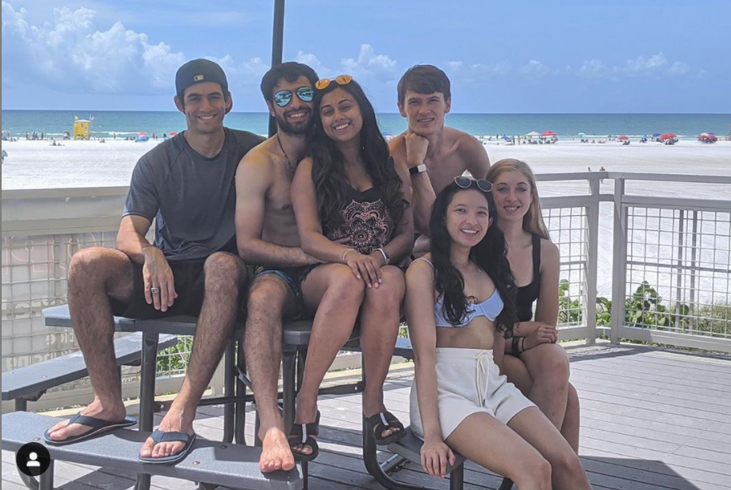
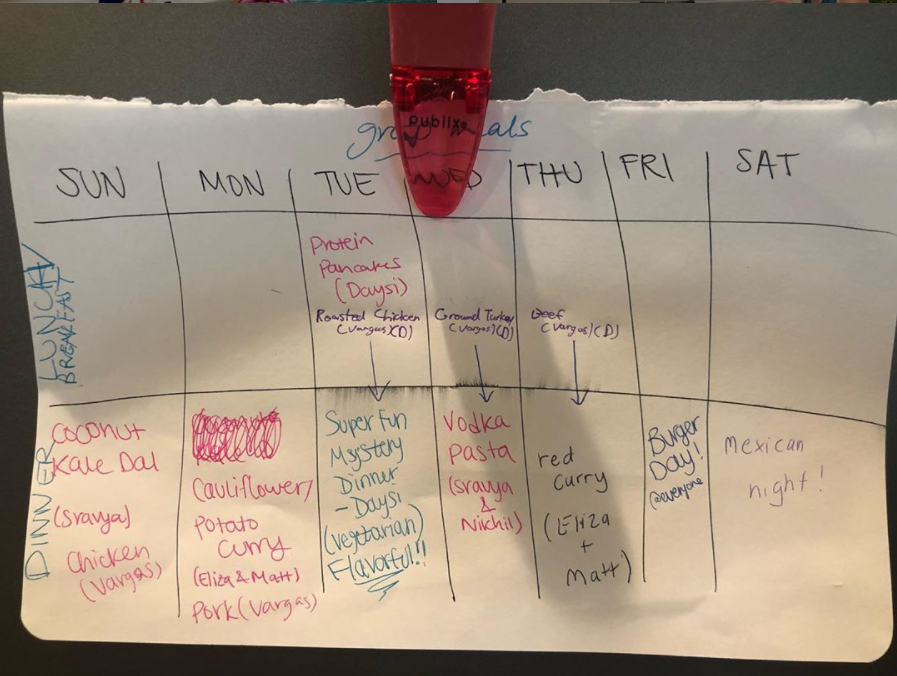

Yesterday I wrapped up my first month on my [digital nomad journey](https://davidvargas.me/blog/rise-of-the-digital-nomads). I can't tell if I'm stuck in a honeymoon phase or if this is actually one of the greatest decisions I've made in my life.

As I travel city to city in the coming months, I'll publish an article at the end of my stay reflecting on the weeks spent at the given location. I am learning a ton. A ton about how to facilitate this lifestyle. About how to live in a community with other people again. But most importantly, I'm learning a ton about what are the things in life that I truly value and what I could actually thrive with being variable. I'm excited to continue existing as someone with a variable address.

I want to first talk about Florida itself, before going into the community living experience and how this stop affected my thoughts on nomading going forward.

## Davenport, Florida
We are still in a precautionary state due to Coronavirus in the U.S. As a result, we did not spend much time exploring Davenport and Orlando, spending most of our month quarantining ourselves in the Airbnb. Luckily, our place had a bunch of sick amenities that included a pool and a hot tub. This was my bedroom, which curiously had a bunch of Despicable Me Minions taped all over the walls:

The best way I could describe Florida is that it feels very copy pasted. Every day had the same exact formula: 90 degrees and sunny all day, followed by a thunderstorm with heavy rain at around dinner time, ending with a nice humid night. The gated community we were staying in looked like someone copied the house we were renting and pasted it across the neighborhood.

We spent most of our weeks and weekends quarantining in, but there were a few times we broke this rule. During the first weekend I got to visit my aunt and grandma who I hadn't seen in a couple of years. I was impressed by how mentally present she was in our conversation at age 87. She also lived in a neighborhood that was very proud to display "Trump 2020" signs, an interesting change of pace coming from a city where that sort of behavior would get you crucified.

I independently took a trip to Tampa to visit my cousins at the same time my mom and brothers were visiting them. Had to relearn the very valuable lesson of not taking my laptop, which was a foolish decision despite the trip being the middle of the week. Either decide that you're too busy to go visit, or leave the work at home. Don't try to do both. I thought it could be a good idea given my cousins and brothers were also working from home, but it only resulted in me sitting in my guilt of no productivity during the car ride home.

On the last full day, we all took the day off to visit Siesta Key beach. The water was perfect, and it was a welcome mental reset for someone who was doing a poor job managing his time, as evidenced above. We also visited this mini donut shop, where I broke diet hard and ate 25 of them. When it comes to food, I have no self control.

The beach day was emblematic of how I'd like to approach future nomadic stays. I want to explore more places I'm unfamiliar with. Try more local food that is out of this world. Have the current pandemic not affect my decision-making as much as it did here, and take an increasingly risk-tolerant approach. While wearing a mask of course.

## Community Coliving

I was one of six people staying at this first stop. We were all either friends from college or part of current romantic relationships. While getting to travel the world and have new experiences was a huge motivator for me in embarking on this journey, the opportunity to re-engage with a community similar to my experience in [Zeta Psi](https://davidvargas.me/blog/the-best-class-i-took-at-mit-was-zeta-psi) was the other big motivator. I was thoroughly reminded of the many incredible benefits that come with living in a community throughout the month.

From the microinteractions I had with people throughout the work day, to sharing ideas I was working through in my head for feedback, I never want to go back to long-term solo living. When I did during the month of July, I sensed myself going insane. After just the first weekend in Florida with an incredible group of friends, I felt myself waking up every day really happy and so full of life. In one of our first family dinners, an activity where we all put away what we were doing to share a meal together every night, I felt compelled to share a toast: "I couldn't sleep last night. Not because our neighbors were blasting music until three in the morning. But because I couldn't shake how excited I was to spend the next month here with all of you."

Coliving with a group of people, no matter how close you were going into the experience, will lead to conflicts. How do we handle ordering food when there are various dietary restrictions that shouldn't charge people disproportionately? Whose responsibility is it to keep the kitchen clean? How do we handle all of us working throughout the day, with different meetings coinciding at the same time?

I find that this all led to incredible growth, not just for me personally but for all of us as a group. We were able to devise systems for how we ordered food and scheduled responsibilities. Certain rooms in the house were designated open spaces, vulnerable to someone (me) walking in yelling "GOOD MORNING EVERYONE!" punishing those who don't mute themselves on Zoom. Other rooms, mostly bedrooms, were marked as private. We also coined a term "Tension Point" where any time someone felt a point of conflict towards the end, we would all just start chanting "TENSION POINT"! This helped make resolving differences a more fun, proactive activity instead of one we resented dealing with.

The most encouraging sign is that this was all done in just our first month. We are still iterating and ideating more on how to improve our coliving experience going forward. Systems that we could refine enough that spread to more people when our group expands in future months.

## Outlook on Nomading
I was pretty excited before starting this path. As I sit on the floor at Orlando International Airport waiting for my flight to Detroit, leaning on a pillar so that I could mooch off the only outlet I could find, I cannot be more confident in the lifestyle I'm pursuing. That WE are pursuing.

Listening to many other digital nomads' experiences, it seems like the allure wanes over time and that you eventually start allocating longer stays. My impression after this stop was that four weeks was the perfect amount of time. Long enough that I didn't feel like we had to move too soon, but short enough that I feel ready for the next city. My friend [Colin](https://twitter.com/vriad), someone who's been nomading for a few years now, made a point that really resonated with me this month. He observed how moving around to different places has made time feel longer, something about changing frequently and needing to adapt your habits to new situations. I definitely felt time slow down. Which is helping me live more in the present.

There were a few personal takeaways I had. As much as I talked about my appreciation for being in the community, my actions would not reflect the sentiment. I was often on my own schedule from the group, preoccupied with my responsibilities, expecting others to empathize with tradeoffs I was experiencing. This is counter to the motives of me leaving my job to become self-employed. I wanted to experience more community, more spontaneity, and more control over my time. While I am achieving this through my macro decisions, I'm falling short in the day to day. With my long term vision of using my experience to facilitate more digital nomading communities, I need to engage more with my own instead of taking it for granted.

Before the month started, I was one of the few in the group who could see themselves doing this long-term. As the month went on, the other members of the house started to come around to the idea as well. Our imagination was running wild based on our experience in Florida. Excited by the other places in the world we want to visit and for more of our close friends to join us in future months.

But for now, on to Detroit!
