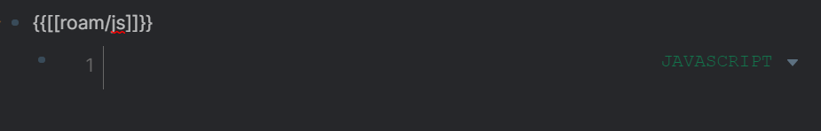
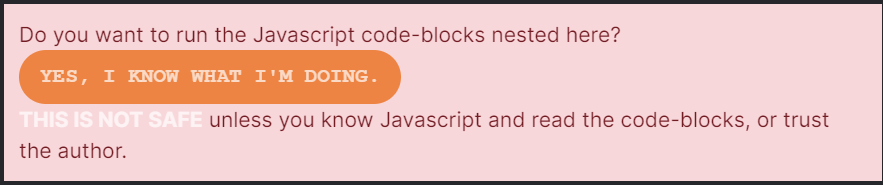
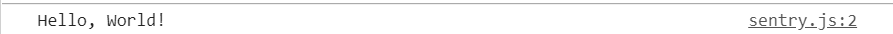

I've spent the last few weeks in my young solopreneur career developing and sharing Roam JavaScript extensions. These tools are meant to extend the Roam core feature set to cover niche workflows that will be useful for the community but are too small of a problem for the company's developers themselves to tackle. You could find the ones I've built so far at https://roam.davidvargas.me.

Today, I'd like to share how you too could start developing your own Roam JavaScript extensions. Roam is evolving from being just a note-taking tool to becoming an operating system for knowledge management. This provides an abundance of opportunities for developers to come in and start building their own unique tools to share with the community. The potential for this form of open source sharing of tooling could match the successes of other common package ecosystems like [npm](https://www.npmjs.com/) and [pip](https://pip.pypa.io/en/stable/).

## Getting Started
First, let's start playing around in our own roam databases with some custom code. The Roam team has designated the `[[roam/js]]` page to be a special page for injecting new functionality into your personal databases. On any page in your database, add a link to that page in braces. As a child of that bullet, add a JavaScript code block by typing three backtick characters and selecting JavaScript as the language:



Roam will give you a warning, since running custom code could be a dangerous operation if you are not aware of the contents of the code or know what you're doing. To confirm that you want to run the contents of the code, simply click the "YES, I KNOW WHAT I'M DOING." button:



Now it's time to run some code! Add a simple `console.log("Hello, World!");` in the code block. To run the code, either refresh the browser or hit the "STOP THIS" button followed by the "YES, I KNOW WHAT I'M DOING." button again. Open up your developer tools, and you should see the following statement printed to your console:



Awesome! Now we know the code is running! From here, we could let our JavaScript imaginations run wild and start customizing our Roam databases to further empower our existing workflows.

## Developing for Roam
Because we are in the very early days of Roam, we don't yet have much in the way of helpful APIs to make common operations easier for developers. But, members of the roamcult are starting to establish some early patterns for achieving these common operations.
First let's talk about what is already available. Roam exposes a `window.roamAlphaAPI` with two methods attached.

The first method is `window.roamAlphaAPI.q` - a query function that takes in a query string and returns a nested array of db ids. For example, if I wanted to query for my daily page on September 5th in my personal database, I'd run 

```javascript
window.roamAlphaAPI.q('[:find ?e :where [?e :node/title "September 5th, 2020"] ]')
``` 

which returns me `[ [ 18688 ] ]`.

The second method is `window.roamAlphaAPI.pull` - a retrieval function that takes in a string specifying what fields what you want to return and a block id. It returns an object with the contents of that block with the id and the fields you specified. For example, if I wanted to pull the children of my daily page for September 5th, I'd run `window.roamAlphaAPI.pull('[:block/children]', 18688)` and I'd get the following object returned:

```javascript
{
  ":block/children": [
    {
      ":db/id": 20848
    },
    {
      ":db/id": 20849
    }
  ]
}
```

You could also combine these operations into one by adding pull clauses in your query. To get the same output as above you would run 

```javascript
window.roamAlphaAPI.q(
    '[:find (pull ?e [:block/children]) :where [?e :node/title "September 5th, 2020"] ]'
);
``` 

The object will be found in a nested array just like the original query call. For more information on the sorts of data you could pull from this API, check out this [article](https://www.putyourleftfoot.in/introduction-to-the-roam-alpha-api) which dives deeper into all the ways it could be used.

One difficult operation right now is pushing data to your Roam database from your custom extension. They don't currently expose an API for doing this at the moment. Additionally, the application is written using React, which means you cannot just manipulate the state directly through the DOM. The best way to push state to your database right now is to simulate user behavior.

I have been using Testing Library's [User Event](https://github.com/testing-library/user-event) package to do this, which provides a bunch of helpful utilities to interact with the DOM as an actual user for testing purposes. Though, there's nothing in the library explicitly preventing us from using it for Roam hacking 😅.

I have also seen [Viktor Tabori](https://twitter.com/ViktorTabori) do this manually for his extensions emitting `KeyboardEvent`s in his [templating extension](https://gist.github.com/thesved/79371d0c1dd34b6750c846368b323113#file-roam-templates-txt-L243-L323). Either approach should work as User Event is just a wrapper that emits `KeyboardEvent`s under the hood. This is the best option we have until the Roam team gives us hackers a `window.roamAlphaAPI.push` method.

Outside of pushing and pulling data, you should feel free to query around the DOM and move elements where you prefer. I often right+click and inspect elements to straight up copy styling and HTML so that elements I create in my extensions could be consistent with the existing Roam UI. One thing to note is that Roam uses the [Blueprint](https://blueprintjs.com/) UI framework on top of React. So if you want to create elements with consistent styling, I would peruse through some of that documentation. The Roam team acknowledges that the user experience is not optimal right now and actually encourages the community to move elements around to build on top of it!

## Loading Scripts
While it's really cool that Roam supports writing code natively within its user interface, it obviously does not yet support the vast array of features modern IDEs like VS Code and IntelliJ do. Nor should it. Ideally we'd like to develop in the environments we are familiar with and have those features imported into our Roam databases.

Copying and pasting updates from our developer environments to Roam could also be cumbersome and prone to human error. Additionally it's not very conducive to sharing. What if I want to use a new feature someone like [RoamHacker](https://github.com/roamhacker/roam42) developed and want to stay up to date with all the features he's pushing out? This is where loading scripts comes into play.
The following code block loads my emoji extension into your database:

```javascript
var s = document.createElement("script");
s.src = "https://roam.davidvargas.me/master/emojis.js";
s.id = "emojis";
s.async = false;
s.type = "text/javascript";
document.getElementsByTagName("head")[0].appendChild(s);
```

You could change the second line to point `s.src` to whatever location you are hosting deployed scripts. This way, when Roam loads it will fetch the script and run it right away importing the feature you developed. Now you could use your standard develop and deploy workflow that we've come accustomed to with regular application development, and your Roam DB will be updated with the changes on reload. 

Because I'm in the process of developing multiple extensions, I've extended this code block to look like the following:

```javascript
const addScript = (name) => {
  var old = document.getElementById(name);
  if (old) {
    old.remove();
  }

  var s = document.createElement("script");
  s.src = `https://roam.davidvargas.me/master/${name}.js`;
  s.id = name;
  s.async = false;
  s.type = "text/javascript";
  document.getElementsByTagName("head")[0].appendChild(s);
};

addScript("google-calendar");
addScript("emojis");
```

Now, every new extension I want to add is simply adding a single line to the bottom of this code block with an invocation to `addScript`!
## Looking Ahead
One could imagine taking this extension framework above and building out a full package manager-like solution to allow developers to continue building and sharing new features on top of Roam. Think of it as a "NPM for Roam". It seems like this idea is in progress internally already, coined as "RoamDepot"

https://twitter.com/RoamResearch/status/1287482732755353601?s=20

This is exciting news for hackers as it will empower us to build and share new features in a more accessible way.
In the meantime, I plan to focus on building out just extensions in anticipation of migrating them to this depot in the future. I've been utilizing the `npm` ecosystem with webpack to bundle and minify extensions so that they could run dependency-less in people's databases. To see what I'm up to or even contribute to what I'm working on, be sure to check out [my GitHub repository!](https://github.com/dvargas92495/roam-js-extensions)
