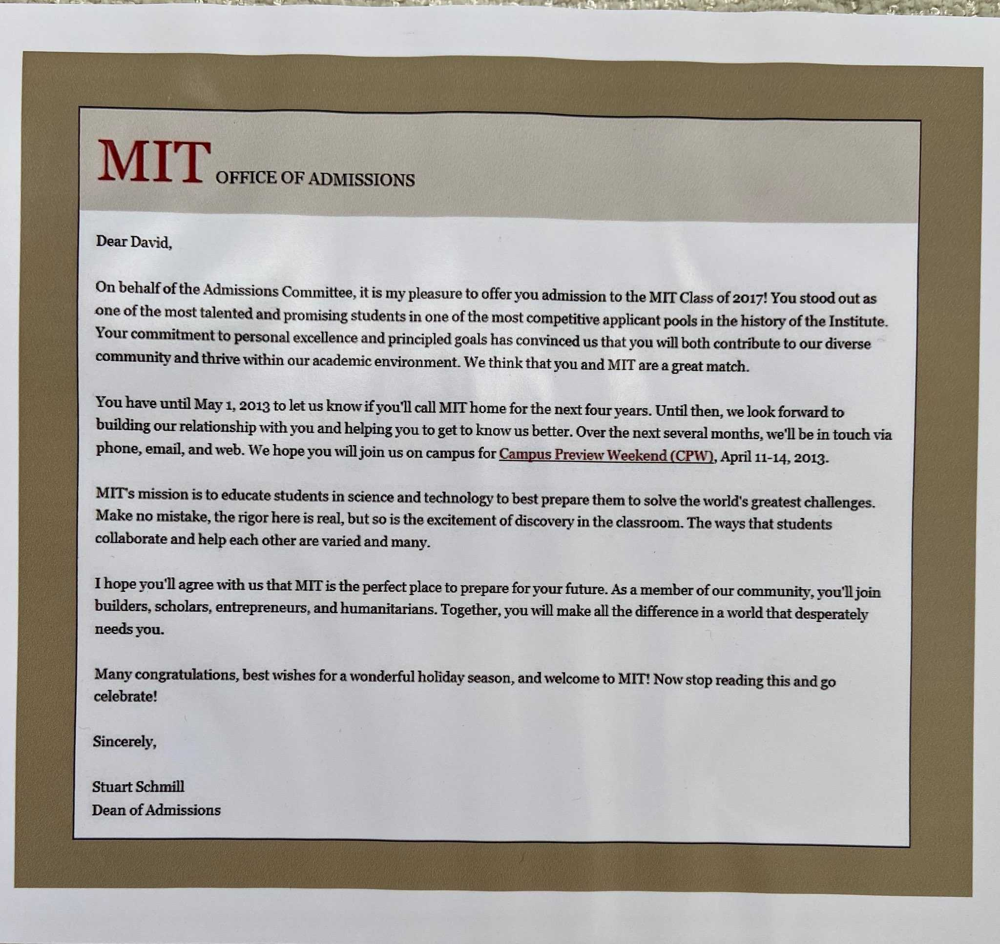

I was the punching bag.

Before becoming the overconfident writer that I am today, I was someone who grew up with very low self esteem. I hung out with a consistent group of friends throughout middle and high school. But I had a very specific role. The default answer to "who would be the worst player in this new game we're playing". The only person who we paid attention to how quiet he's being, particularly around new people. The kid who was clearly emo, despite having difficulty processing some unexpected changes in his life. Changes that included a parent's divorce and the death of an influential baseball coach.

I don't necessarily blame any of my friends. At the time, they didn't know any better. Group dynamics are tricky in that they often necessitate demonstrating to others in said group how valuable you are. Often by putting someone else down. And of all my friends, one was far more nefarious to me than all the others. A person who day in and day out was taking every opportunity to put me down. He made sure to destroy any confidence I could possibly be building. 

That "friend" was me.

At the time I viewed it as being "humble". I saw kids in high school that were really obnoxious and naturally thought that I had to be the opposite. It started off as humble, but slowly this attitude evolved into self-deprecation. In a twisted way, I was convinced that making fun of myself in front of my friends would raise the amount of respect they had for me. In the same way that making fun of me seemed to do for them.

If there was one piece of advice I could give to young Vargas, it's this: **no one will respect you until you learn to respect yourself.** 

I learned this lesson not just from reflecting on my younger days, but from others I met at school too. I had friends suffering from the same fallacy that I did. That if _they_ were the ones cracking the jokes on themselves, the respect from the humor would supersede the disrespect from their comment. It has made self-deprecating humor particularly distasteful for me. I rarely laugh at jokes of this type unless I know the author is someone who’s already self-confident.

But when did this reflection start? Is there a single turning point that I look back on as the defining moment where the Vargas devoid of any self-respect discovered its value?

December 15th, 2012 at 12:15 P.M.

The day I was admitted into MIT.

In my freshman year of high school, I was told that we should start planning out our 4 years with college in mind. I went into Google and typed in "best math college". The first three search results made the decision for me: MIT was the school I wanted to go to. I focused on maintaining a high GPA and getting involved with some technically related extracurriculars.

But I still felt guilty doing them, because caring too much about these things made me feel like a “try hard”. I didn't attend our school's math club for fear of how uncool it would make me look. My friend started a robotics club, but I didn't join because I thought I would look lame.

I couldn't sleep the night of the 14th. I had several hallucinations of random delivery mechanisms bringing my rejection letter from the mailman to a stork. I decided to wake up at 6 am running on four hours of sleep, pacing my room thinking of ways to occupy myself until decisions were available. Five minutes before, my hands were shaking so much that I just told my brother what my password was so that he could log in for me. Then the letter opened and I read the first line.

I jumped back falling off my chair. Scurrying back to the screen, I had to reread it several times ensuring that there wasn't a typo. I yelled in euphoria. My mom and brother who were there with me were also yelling. I ran outside and did more victory laps around my house than any Nascar racer would dream of driving. A giant weight had been lifted off my shoulders. I felt free.

Sure, some of that freedom was the relief of no longer having to apply to more schools and knowing my big decision had been made. But that didn't fully explain my sense of relief. The weight of cynicism and worthlessness hanging over me the past seven years, was gone. Everything I'd done in my life up to that point became validated. I was on the right path. I was someone worthy of MIT's respect. I am _allowed_ to have self-respect.

My ego has been on an exponential climb that continues to this day. It's hard for me to even wrap my head around the version of Vargas that existed before that decision day. I wear my MIT brass rat every day. A reminder to me. A reminder of where I came from and all the mental progress I've made to be who I am today. A reminder of my growth.

The powerful insight I've realized about self-confidence is that it doesn't need to be objectively "true". You don't have to actually be a smart engineer, or a good writer, or good at whatever your group of friends decide as the next activity. You just have to convince yourself that you can be. 

Whether that's in the traditional "fake it 'til you make it" way or by highlighting some actual personal achievements to yourself. The only way that you could prove yourself right or wrong at that point is through action. By simply being self-confident, you can turn that aspirational vision of yourself into a reality.

It pains me to see anyone in a place that remotely resembles where I was in middle and high school. We are all awesome in our own unique ways. But we are the toughest person to convince. We have to first convince ourselves before we can convince others. 

I now hope to help others see it before they do. That they are capable of creating incredible things as soon as they gain the confidence that they can. If young timid Vargas could gain it, so can they.
