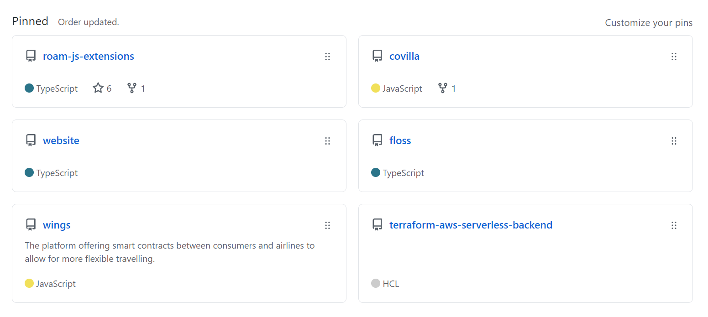
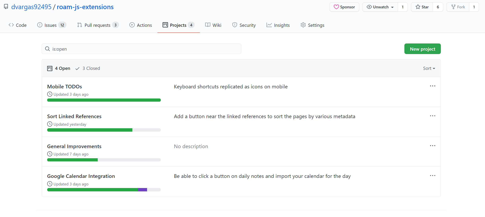
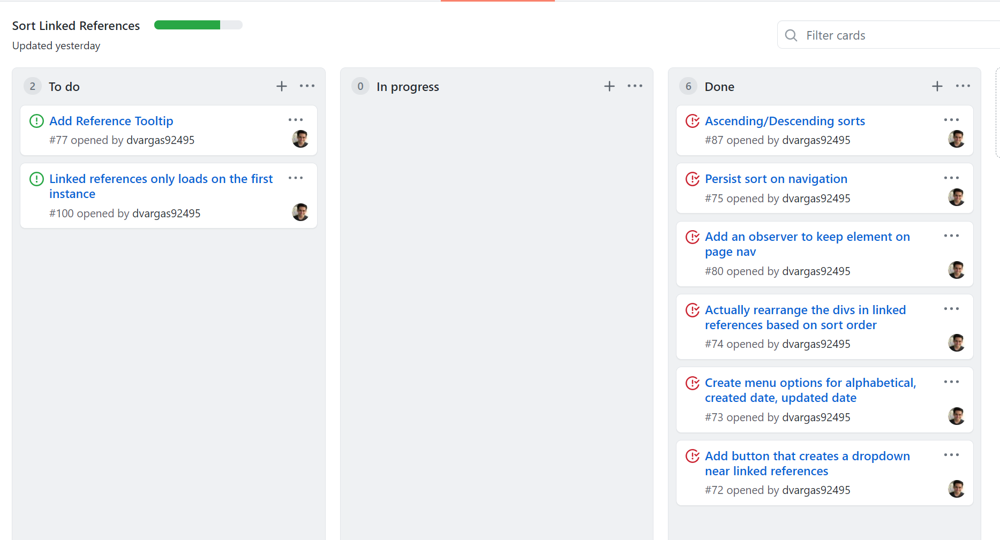
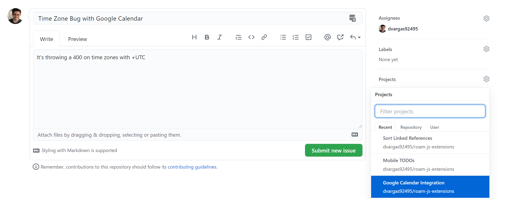
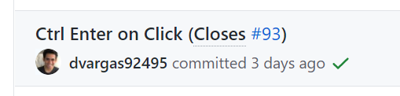
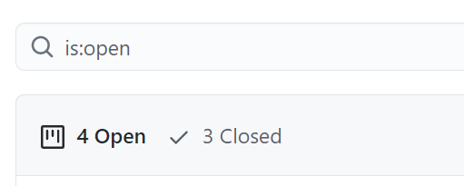
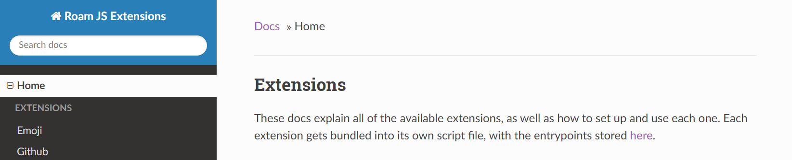

Throughout the many engineering organizations I've been a part of, I've seen all sorts of tools used for delegating work. JIRA is one of the most popular ones. I've used Asana for a few projects with friends. There's also Basecamp, Trello, Monday.com, the list goes on and on. There's usually one key set of features that will make or break it for all of these products.

Integration with GitHub.

GitHub is the primary workflow tool engineers use to host, share, and collaborate on software projects. Because of this, any project management tool needs to work nicely with it in order to gain traction. This led me to using one project management tool over all the others. GitHub itself.

Once GitHub added its [new Projects feature](https://github.blog/2016-09-14-a-whole-new-github-universe-announcing-new-tools-forums-and-features/), I was immediately intrigued. Combined with learning a new way of organizing work through PARA, I've come up with a workflow for organizing my work that has superseded the previous options.

What follows are the philosophy and implementation of this GitHub workflow.

## The PARA Method
Productivity expert Tiago Forte has a [system for organizing digital information](https://fortelabs.co/blog/para/) which he encompasses in the acronym PARA: Projects, Areas, Resources, Archives. Every bit of information we consume and manage could be thrown into one of these four categories. It also helps us think about what we need to do today to make progress.

Projects are a finite collection of tasks. To call something a project, it must have a start and end date. A definitive point in time when we say it's done.

Areas are infinite in the sense that we are always responsible for them. They have no end date. Every project we create must map back onto an area or else it's not a project, it's a hobby.

Resources are information we consume. They could be used to inform our decisions and help brainstorm future projects. They may also lead us into taking on new areas of responsibility. But, they are not actionable.

Archives are our trash bin. Every project or area we no longer want to be responsible for, we throw it in our archives so that they are out of sight and out of mind. But, because they are in archives, they can still be retrievable in some future point in time if we ever change our mind on said piece of work.

Reading about this mental model helped me apply it to how I organize my engineering work on GitHub.

## GitHub Projects Through PARA
First we start with areas. Areas map one to one with repositories. A GitHub repository usually does not have an end date and are constantly needing maintenance. GitHub has the ability to pin repositories on your profile. I use this as my way of determining what are the six most important areas of responsibility in my life right now. If it's not pinned, then either work in that repository is not important enough to be doing, or I need to remove one pin of lesser importance.

Next, let's discuss projects. PARA projects map one to one conceptually with GitHub Projects. Just like every project in PARA needs to fall under an area of responsibility, every GitHub Project needs to fall under a repository. As an example, my Roam JavaScript Extensions repository will usually have 4 ongoing projects, each with usually a two week life span. This also pushes me to release two extensions per week to the wider Roam community.

When I create a new project for a repository, I set it up with GitHub's Automation template. This allows GitHub Issues created to automatically be assigned to the "To do" column and then migrate to the Done column when it's finished.

After creating a project, I fill it up with as many tasks as I could brainstorm in the moment. Every task I create for a repository is created as an issue and assigned to a GitHub Project. In the New Issue page, they have a field for Project that you could fill. The automation template will use the field to automatically add the issue to the "To do" column.

When I merge code intended to complete the task, I make sure I add in the commit message `(Closes #issue)`. This automatically closes the issue for me and moves the task into the "Done" column. Tasks moving to the "Done" column then begins to fill up the green bar shown above in each of my projects, giving me the endorphin hit that motivates me to start the next task.

This brings us to the Archives section of PARA. Once GitHub issues are closed, they are by default filtered out of most of your dashboards. Likewise, when you're done with a GitHub Project, you could hit 'Close Project' to get the project out of view. This achieves both of the essential features of archiving: filtering the work out of view but still being searchable for any possible point in time when you might need it.

The final element of PARA are resources. I facilitate resources most through README docs that get displayed right in the repository's main page. When I have extensive resources that I want non-technical people to view, I use [MkDocs](https://www.mkdocs.org/) in a [GitHub Action](https://github.com/features/actions) to deploy documentation to a static site. The most prominent example I have of this is https://roamjs.com.

## A Cut Above The Rest

I have found centralizing all of my software management through GitHub to be really effective. 

In some cases like JIRA, they provide too many options through epics, stories, tasks, and subtasks that you often spend more time with work bureaucracy than you do making progress. GitHub solves this by providing the minimum abstractions necessary for organizing tasks and projects. The tree is only three levels: infinite repositories at the top, many finite projects map back to a repository, many actionable issues map back to a project. 

In other cases like Basecamp, integration with existing software tools seem to be lacking leading to a bunch of redundancy in your management. GitHub solves this by providing several out of the box automations. For any use case that GitHub doesn't cover by default, you have the ability to fill in the gap by using GitHub actions.

As with most systems, this process is still a work in progress. But I'm very happy with how GitHub has been able to supplement a PARA philosophy. I feel confident in its ability to cover future use cases.
