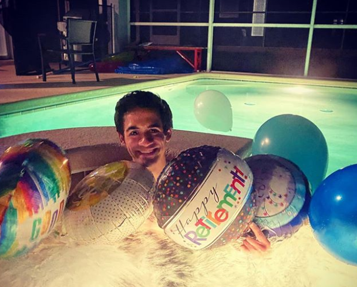

Over a month ago, I decided to [leave my job and pursue a new career path](https://davidvargas.me/blog/taking-a-gap-year-on-life/). A change that I was simultaneously nervous and excited about. I've learned a ton in these 5 weeks. My hope is that this article will encourage others who are considering a similar move.

## Initial Support

The outpour of support I got was overwhelming.

My parents both stood behind my decision. While my Dad initially sounded hesitant about me leaving a secure job, he was on board once he heard how excited I was. My mom from the start encouraged me to make the leap. She pointed out how at 24 with no dependents, this is the perfect time for me to take a huge risk.

My friends, ex-coworkers, and other family members were also fully supportive. There was even a mini celebration they threw for my "retirement".

All this support only made me more fired up to start this journey. There was this awesome sense of accountability that started to build the more I talked through my decision making with those that cared about me. Almost as if I couldn't let them down. Without their support, I'm not sure if I would have been confident enough to start living as a solopreneur.

## Dealing with Bureaucracies

Once I had decided I was leaving my job, I started talking to my friends and family about how I wanted to build my brand. I got recurring feedback from them that the best way to operate was to incorporate an LLC.

As much as I wanted to blend my work and personal life into one, the systems in society today incentivize us to operate under the veil of a business entity. There are two main reasons for this. One, it separates myself from liability such that my non-creative assets would be protected in the case someone wanted to sue me for my work. Two, all expenses related to creative work could be tax deducted if made through a business account. Personally, I don't see why both of these characteristics can't be true for us as just individuals.

I decided to register my LLC through [Stripe Atlas](https://stripe.com/atlas). It took only a few minutes to apply, and they registered the corporation as a Delaware LLC for a one-time fee of $500. There’s a recurring subscription fee of $100 thereafter, but I also received $5,000 of AWS credit and $10,000 in Digital Ocean credit. Because I was looking to use AWS and Digital Ocean anyway, Stripe Atlas essentially paid for itself.

In just a few days, Vargas Arts LLC was formed! But in order to set up any business bank accounts, I needed an EIN to come in. Stripe requests this from the IRS for you, but they apply over fax. Which apparently takes the IRS _45_ business days to process. Anxious to get my business accounts set up, I decided to just [request it myself online](https://www.irs.gov/businesses/small-businesses-self-employed/apply-for-an-employer-identification-number-ein-online). This took 10 minutes.

Finally on September 14, I was able to set up my business account with [Azlo](https://www.azlo.com/)! Now it was time to start creating.

## Initial Plan

The catalyst that pushed me to start creating full time was a \$20K [fellowship](https://www.cooperative-capital.com/fellowship) I secured from an investor, [Jonathan Hillis](https://jonhillis.com/). I met Jon through taking [Write of Passage](https://writeofpassage.school/) together. He was inspired by the prospect of investing in people to create online full-time, in line with much of the philosophy from the course. When he announced that he was planning on starting this fellowship, I eagerly jumped on the opportunity, knowing that I didn't need much financial support to get going. We hit it off immediately. After a couple of calls, he accepted my application, and together we started what we hope to be a model for future creatives to get started.

I left my job with $20K in the bank and another $20K coming in as income over the course of the next year. I figured that with the cost savings associated with my [new nomad lifestyle](https://davidvargas.me/blog/rise-of-the-digital-nomads/), I should be able to live comfortably enough at a lower income.

I started by seeding my business account with \$5K from my savings to cover costs for things that I could argue as "work related":

- A new mobile hotspot through [SkyRoam](https://www.skyroam.com/)
- Enterprise accounts on [Zoom](https://zoom.us/), [ExpressVPN](https://www.expressvpn.com/), and [ConvertKit](https://convertkit.com/).
- The initial Stripe Atlas cost
- A cushion for any future business expenditure

The plan is to then not pay myself at all from the business account from now until the end of 2021. The fellowship will pay me $1666/month through the end of September 2021. I'll then use another $5K in savings to cover the last three months of that year. With this new monthly salary, I have broken down my monthly budget as follows:

- Rent & Travel - $800
- Food - $500
- Entertainment & Personal Care - $210
- Charity - $90
- Total - $1600

Creatively, my plan is to focus on two outlets: Writing and Engineering.

To start, I want to just be putting out to the world as much content as possible. For writing, this includes articles and a newsletter. For engineering, this includes getting heavily involved with various communities and building open source tools accordingly.

I would say my overall creation strategy is community driven. My plan was to associate myself with a few communities that could hold me accountable and give me insight as to what I could create that is of high value. In a sense, this is what a traditional job is. A traditional office is a community of people all within one company and asking its employees to do whatever will bring that community value. The advantage that I see in my new approach is being in _multiple_ communities, each dictating what they view as valuable. This will result in me actually having _more_ job security long term.

## Current Flow

It's been fun operating under these new constraints. Ian Bogost, a professor of interactive computing at the Georgia Institute of Technology, and many others famously argue that constraints are the key to creativity. Constraints encourage a creator to focus on what's most important. Many of the world's most successful CEOs had challenging living conditions when starting their first companies. While I won't say I have it tough, the lack of initial job security has definitely motivated me to stay focused.

After taking Write of Passage in July, I've been able to consistently publish two articles and one newsletter per week. I'm in a writing accountability group that allows me to focus on writing for 90 minutes every morning. I've also recently joined a [writing group called Compound Writing](https://www.compoundwriting.com/). The group connects me with several other writers who are dedicated to honing their craft. I'm nowhere near where I want to be as a writer yet. But, I am a consistent and prolific one. I know that with these accountability groups in place and with my consistent practice, I will get better.

My initial engineering approach has been to focus on pumping out as many [Roam JavaScript Extensions](https://roamjs.com/) as possible. It was an easy way to find a very passionate community where I could provide a ton of value. I have been releasing two a week and plan to continue doing so as a way to get my name out there. On the side, I'm also exploring this concept I'm coining as _Freelance Open Source Software_. The idea is that many companies rely on and run into issues with open source libraries. I'm working on a way to basically work as a freelancer with companies, while setting as a hard requirement that all related work remains open source.

To accommodate this work, I needed to set a strict schedule for myself. But it's a schedule that _I_ have full control over. If there's anything that happens to me, I have the freedom to shift gears. I view the following schedule as the default if nothing major comes up:

- 10pm - 6am sleep
- 6am - 8:30am morning routine
- 8:30am - 10am writing
- 10am - 6pm engineering
- 6pm - 7pm family dinner
- 7pm - 10pm miscellaneous

I would say my first month has gone well but not great. I've sacrificed some of my in-person relationships through my personal schedule obsession. I also feel very spread out over a bunch of ventures. But both of these hard won lessons are teaching me to narrow my focus more every week, prioritizing only the tasks that bring me the most joy and others the most value.

Because of this, I feel incredibly optimistic about the road ahead.

## Outlook for the Rest of the Year

The dominant question that is always circling my mind is: "How could I be more public about what I'm doing right now?" This has led to ideas that include starting a [Youtube Channel](https://www.youtube.com/channel/UC6UVFCK1BcIMnT0XY4iUS_g?view_as=subscriber) where I simply upload the conversations I have over Zoom. In the future, I want to start a [Twitch](https://www.twitch.tv/) channel of me doing my engineering work. I'm hoping to convey a pair programming experience with my audience. This was inspired by my days watching Hearthstone streamers.

I'm looking to double down on the idea of combining freelancing and open source. There are several services that are offering platforms that try to tackle this. The problem developers face in these open platforms is having to unsustainably work on issues that are not of interest to them. They are not in the driver's seat. Open source developers in general also get hung up in brainstorming on their own what will be the next big open source tool to build. By creating client relationships, I'm hoping it acts as a forcing function to get out of my own head and simply build solutions that bring value to others. This in turn will act as a funnel to work on issues that are of more interest to me since they are for clients I care about.

I have had a great start with Jon. As part of the fellowship, he is not only my investor, but also my mentor. He seems to be as committed to ensuring I reach creative and financial success as I am. Our weekly meetings have been extremely valuable for helping me focus my work and get advice. I'm excited to continue this relationship.

Finally, I aspire to join him as an investor one day. This journey has already taught me a ton in just the 5 weeks. I'm beyond excited about the prospect of helping others reach similar aspirations. I want to invest in the dreams of others and teach them about the various mistakes I will undoubtedly make over the next year.

All of this, in an effort to build towards a future of more solopreneurs.
