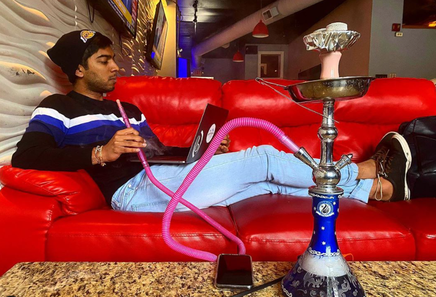
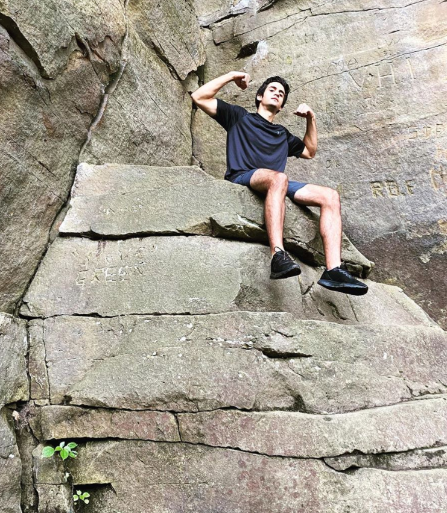

As my friend Nikhil and I landed in Detroit Metropolitan Airport, there was a feeling that started to settle in. I'm _actually_ doing it now. I'm living a nomadic lifestyle. It was a realization that gave me a ton of excitement as we greeted our three new roommates picking us up.

Within just a couple of days I felt comfortable considering Ben, Parth, Danny, and I as friends. It reminded me of one of my motivations for doing this. To increase the randomness in my life by meeting more people.

But before talking more about the communal living experience with them, let's first go into where we were staying.

## Detroit, Michigan

When members of my family found out I was going to be spending a month in Detroit, there was an instant horror in their response. Why _Detroit_? Please be careful, my mom would constantly warn me. I somewhat understood the concern. Googling “Detroit” turns up news stories of shootings while googling another city (in this example, Austin) showed me an article about a new indoor waterpark.
 
After being here for four weeks, I could safely say that I made it out alive. There was never any cause for such concern. Detroit had a very neighborhood aura to it that never made me feel that my safety was in question. Irrespective to the current pandemic, no part of Detroit truly felt like a city. Restaurants were cozy, parks were buzzing with people barbecuing, and coffee shops were packed with other remote workers. I got the sense that the "dangers" of Detroit was something that could have been perpetuated by news organizations. Or maybe the city is actually on the upswing.

Our Airbnb was technically in Ferndale, twenty minutes North of midtown. It was _small_. Unlike in Florida where everyone had their own bedroom and bathroom, this stop required the five of us to share two bedrooms and one bathroom. The living room was small enough that to work throughout the day, we were motivated to leave the house and explore various spots in the city. While these were mostly coffee shops, we did find a vibrant lounge called Hookah Joe that was incredibly comfortable.

During our first week we went bouldering in Oak Park. Bouldering is basically rock climbing natural walls in a way that uses obscure cracks and wedges to get to the top of the ledge, typically about 10 feet tall. It was my first time and I was terrible. It’s definitely a skill set that would take multiple trips to cultivate. Though I did find one staircase-esque ledge to conquer.

Most of the month was spent cooking at home, but there were a couple of local spots that really stood out. My friend [Zachary Fleischmann](https://www.hawthorne.io) recommended [Slows Bar BQ](https://slowsbarbq.com/) to us, which had some absolutely mouth watering brisket and ribs. We also visited a tiny fast food joint called [The Turkey Grill](http://theturkeygrill.com/). Think of a fried chicken grill, but with delicious turkey instead.

On our last weekend we took two trips outside of Detroit. We first went to Ann Arbor, walking around the college town and visited the arboretum. There were a bunch of restaurants, bars, and places to work outdoors within the University of Michigan campus. It was an environment that I wished MIT resembled. The next day, we took a trip out to [Cedar Point](https://www.cedarpoint.com/), an amusement park that felt very much like the six flags near my home town. We planned our day pretty poorly in the first half, only hitting up one roller coaster in five hours. But we finished strong by being able to hit four coasters in the final two.

## Community Coliving
Ben, Parth, and Danny are part of their own startup [Polimorphic](https://www.polimorphic.com/), a platform with the mission of increasing engagement between politicians and their constituents. They had been travelling the country months before we had, looking to sign on clients. Nikhil had spent the days leading up to the New Hampshire primaries with them. When we found out they were launching their first client near Detroit, we took that as an opportunity to take our journey to Michigan.

Since we were all working on our own early ventures, we had pretty comparable work schedules. This meant we were all flexible to work in different parts of Detroit. Being in similar fields, it was also really common to share insight on problems we were all working on. I was able to learn a lot from them as I started to guide my open source engineering work to have a more freelance nature to it.

The five of us were divided into three cooks and two cleaners. Each set cycled every night who was responsible for dinner and cleaning up after. Family dinners was a tradition we were able to maintain from Florida and remains the highlight of my day each time. It's when I feel the most value out of this communal nomad experiment I'm partaking in. It has also felt healthy to pull myself away from my laptop for an hour to interact with physical humans instead of the Twitter, Slack, and Zoom caricatures.

In the beginning of the month, we added a bunch of "controversial topics" to a red solo cup and would pull one out to discuss some nights for dinner. We had interesting conversations that spanned the usefulness of patents, whether guys had a place to discuss abortions, replacing all taxes with land value tax, and more! I loved this idea. In fact, I used it to test some of the article ideas I had in my notebook. It allowed me to clear some from my backlog while [publishing others](https://davidvargas.me/blog/what-if-world-eliminated-patents/).

I was surprised by how easy it was to live in a resource constrained house with the five of us. Yes my closet was a small space on the floor next to my bed and yes we only had one bathroom to share among five people. But there was very little to no conflict surrounding using these resources, mostly due to having unique enough daily routines that didn't intersect.

I would look forward to the Polimorphic guys joining us again in a future month. This experience confirmed a hypothesis I had - living with new people each month would help me grow as a person too. I hope that our [Covilla](https://covilla.life/) network could continue to grow to maximize the cross pollination of friends living with each other.

## Outlook on Nomading
Compared to Florida, we were able to go out way more and actually experience parts of Detroit. Coronavirus still made it such that it wasn't the full experience. Streets were mostly empty, restaurants had mandatory empty tables, and we were always wearing masks. But, this month inspired me to want to go out to see as much of each city I visit as possible.

I often struggled juxtaposing this desire with the time constraints I've self imposed. I'm operating under a strict schedule so that I could produce online as much as I could, but this often had the consequence of resisting the serendipity of leaving the Airbnb to go somewhere new. I need to do a better job reframing this mindset. Experiencing the culture in different cities with a community of travelers will do as much to further my life-career as staying home and being on a computer all day. Possibly even more.

We had been cooking most of our meals these two months. But I realized that one of the best ways to experience the culture of a new city is to go out for dinner. Search for the iconic local spots like Slows Bar BQ or The Turkey Grill. This comes at the tradeoff of being more expensive and harder to follow a diet. So I think for now it's a goal I want to shoot for. To be able to get to a place financially where I could comfortably go out for dinner each night at our new city of residence.

Two months in and I'm still on cloud nine about this lifestyle. I mentioned before how time has felt slower during this experience. It remains true. Even while not personally taking the fullest advantage, I feel more present than ever before. Four weeks continues to be the perfect sweet spot between too short to be comfortable and too long to desperately want change.

This length of time will be changing next month. I will be staying with 10 other friends for 6 weeks in a cabin in the woods, in Gatlinburg, Tennessee!
