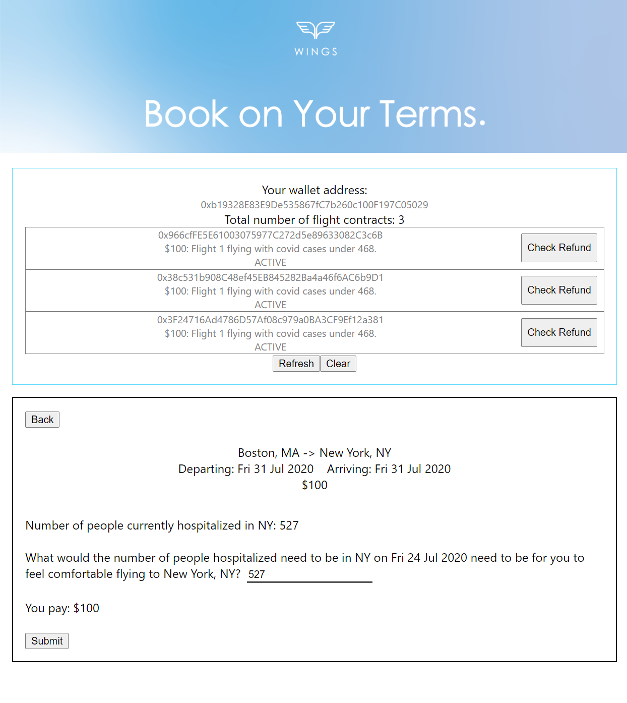
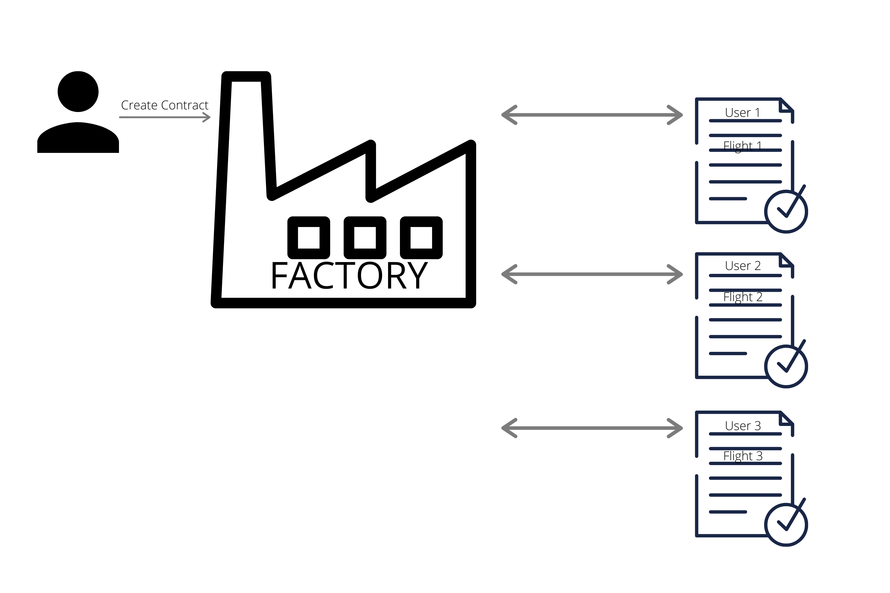
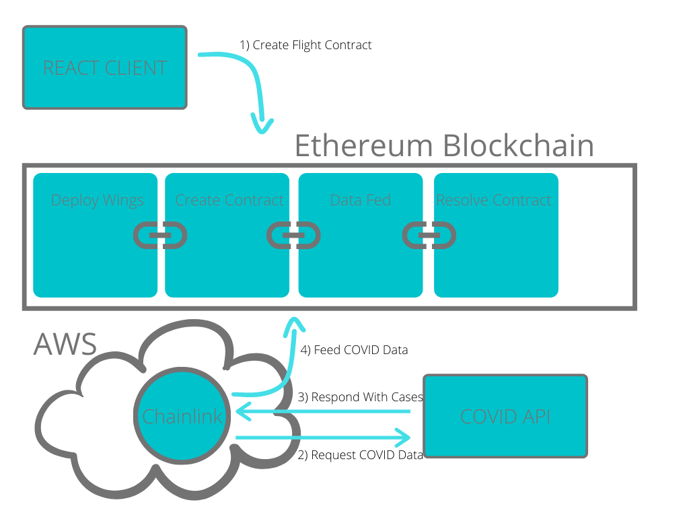

Last week wrapped up the first virtual hackathon I ever attended, hosted by [Chainlink](https://hack.chain.link/)!

A motivation I had in untethering from traditional employment was to be ready for opportunities like this. I previously had no experience developing cryptocurrency related technologies. This seemed like the perfect opportunity to teach myself a domain that was gaining a lot of traction. 

Before going into our hackathon strategy, I first want to explain what Chainlink is.

## Explain Chainlink Like I'm Five
To understand Chainlink, we first need to understand blockchain technologies, specifically Ethereum. What makes Ethereum's future so promising is the innovation known as smart contracts.

Think about contracts that we sign in our every day life, ranging from employee-employer paycheck agreements to insurance policies. In a standard contract, one party promises to provide a service in exchange for money. There are usually one of three ways to accomplish this:

- Party A provides the service to party B, trusting that party B will pay afterward. 
    - Problem: What if we can't trust party B and they keep the money?
- Party B pays party A up front, trusting that party A will provide the service once they're paid. 
    - Problem: What if we can't trust party A and they just run away with the money?
- Party A and party B both give their ends of the deal to a party C, trusting that party C will perform the exchange at the same time. 
    - Problem: What if we can't trust party C and they run away with both?

This is the problem that smart contracts solve on Ethereum. They take the third approach, but instead of being a single entity as party C, it's actually a giant network of multiple entities called nodes. This network of nodes implement a protocol guaranteeing the accuracy of a chain of events, known as the blockchain. The nodes can perform the exchange at the same time once the conditions of the contract are met by both parties. In order to be a malicious actor like the concern in the third approach above, you would need control of more than half of the nodes making up party C.

So what's Chainlink's role here? In order for a blockchain to be implemented, it needs to be deterministic. All the nodes in the network need to come to the same exact answer, given the same transaction. Querying real world data, like weather or stock prices, is non-deterministic. Different nodes could look up that data at _slightly_ different times and come up with different answers. 

Chainlink solves this problem by providing a way to build a network of nodes _outside_ of the blockchain to query real world data. Once queried, the Chainlink nodes feed the data onto the blockchain itself. The data is fed onto the chain just like any other transaction, allowing the nodes to deterministically agree on the value of the data fed.

This is extremely important for blockchain to ever grow outside of its niche use cases into real world applications. The real world is by definition non-deterministic, and blockchains need to handle that non-determinism to gain wider adoption. Chainlink's protocol will be a key part of blockchain's future. This could be seen with our hackathon project, Wings.

## Introducing Wings
When my nomad companions and I were planning our first stay, we booked travel arrangements to Florida about two months in advance. Then Coronavirus cases started to spike. We wanted to change to another location, but it was too late and couldn't trust that we would be refunded in time. This experience helped inspire our hackathon idea. We created [Wings](https://wings.davidvargas.me), the platform offering smart contracts between consumers and airlines to allow for more flexible travelling.

The platform displays flights from different airlines. When booking a flight, a consumer could additionally add conditions to the flight contract that specify the conditions under which they'd like to cancel and be fully refunded. Each of these conditions increase the overall cost of the contract to offset the risk that the airlines themselves take on. 

The basic use case we implemented was based on Coronavirus. Imagine that you wanted to book a flight to Florida, but are concerned about the number of cases there. On the platform, you could book your flight by creating a Flight Contract and specify a threshold for the number of Coronavirus cases you're comfortable with. If the actual number surpasses that amount anytime up to a week before the flight, you will get automatically refunded. The benefit here is unlike traditional flight insurance where you have to trust the airline to follow through on their policy, the contract is executed automatically using the block chain as the third party arbiter.

## How It Works
A user logs in to Wings by connecting their cryptocurrency wallet to the site. This acts like the physical wallet in your pocket, except instead of dollar bills it holds cryptocurrency amounts. There are several solutions out there, but the one I landed on using and have enjoyed so far is [MetaMask](https://metamask.io/). 

The wallet connects to the Wings frontend which is built using React. Once the wallet is connected, the user could click on one of the flights displayed on the home page to navigate to that flight's specific page. On the flight page, the user will specify the threshold of Coronavirus cases they'll tolerate before they'd like a refund. In the future, you could imagine a wider variety of conditions that a user would like to build into their flight contract. Clicking submit creates a flight contract on the blockchain.

We built the flight contracts using the [Solidity](https://solidity.readthedocs.io/en/v0.7.2/) programming language. We used a factory pattern, which basically means we had one parent contract acting as a factory managing several child contracts. Each of these child contracts is one that is generated from the consumer. We also used [Truffle](https://www.trufflesuite.com/) to help manage building and deploying these contracts to the blockchain.

How do these contracts ever resolve? This is where Chainlink comes in. We stood up our own Chainlink node on AWS with the task of querying a [COVID API](https://covidtracking.com/) and feeding the results on to the blockchain. While there are several hosted Chainlink nodes, we chose to stand up our own to get a deeper understanding of how the service works and how it fits into the overall architecture.

Each time the data is fed, the contracts created by the consumer would be listening for the data fed on to the chain. If the contract reaches a week before the flight date and the contract conditions haven't been met, then the airline is paid and the consumer is confirmed to be on the flight. If the conditions are met any time before that, then the consumer is automatically refunded the full amount they paid.

There are all sorts of different directions the project could go from here. How do airlines ensure seats are filled? What other conditions should be made available? The prototype that we put together in three weeks shows the promise of not only flight insurance built on the blockchain, but the promise of smart contracts in general.

The future of backend architecture is in blockchain. Some other cool projects we saw throughout the hackathon include secure betting platforms, real time currency exchanges, and crowdfunding events using Twitter. Decentralizing the management of data increases the reliability, security, and accessibility of data. I highly recommend anyone who is interested in learning more about blockchain technologies to check out Chainlink. Start diving in to how you can stand up your own decentralized app today!
