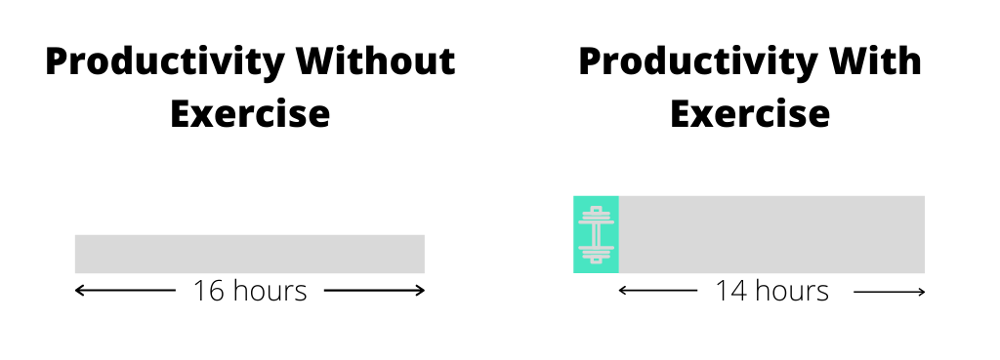

Every minute is meticulously planned to set myself up for a kickass day.

Over the last three months I've landed on a routine that I really love. I wake up excited to execute on it. Combined with 8 hours of sleep the night before, it has completely eliminated the need for coffee. By 10 AM, I'm ready to go.

Many people have asked about my routine and why I spend so much time on it. This article will go through each segment, discussing the details of what I do and why I do it.

## Wake Up: 6 - 6:20 AM
When I was in college, it was far more likely that I would go to bed at 6am than wake up at that time. This resulted in me waking up in the middle of the day, zombie walking to my third class after sleeping through the first two.  It was a perpetuating cycle. Waking up late led to sleeping late which led to waking up late and on it went. All while I was missing out on valuable sunshine and morning events. I was able to shift this after graduating.

When I first started working full-time, I was waking up about half an hour before work started. Then I started to recognize the value in getting stuff done _before_ work. The work day often left me drained by the time I got home. This made it far less likely that I did anything besides watching Netflix. Prepending the work day instead capitalized on the time period when I had the most energy.
 
It's also hard to overstate the importance of ensuring 8 hours of sleep. I've noticed that the most common factor between days where I perform poorly or have a poor mood are when I get less than 8 hours. It bewilders me how I ever got through college. Now, it's one of my top priorities.

The 20 minutes I spend here start with a couple minutes collecting myself from the night's sleep. Then I do some light cleanup which involve brushing teeth and putting on contacts. Finally, I fill up my water bottle, pick the podcast of the day, and head to the next segment.

## Workout: 6:20 - 7:40 AM
There was a three year period where I stopped working out. My mindset used to be that I wasn't optimizing my time effectively. I argued that I was losing two hours each day that I could be spending elsewhere to be more productive. What I didn't realize was that this mentality actually made me less productive overall.

Working out has had far more mental benefits than physical ones. Going on a run allows the mind to wander, spurring up ideas of how to overcome the various challenges that it expects to face throughout the day. Physical movement helps the mind escape the state of slog that people usually face in their mornings. This sets me up to accomplish more in the day in less hours.

I used to save working out for the end of the day when I first reintroduced the habit. This had the effect of being an obligation that hung over me throughout the work day. It was as if I had this deadline I had to finish all of my work by. And my reward for when I did? More "work". But now in the physical sense.

Moving the habit to the beginning of the day relieved me of this burden. Stress testing the body also gave me the day's first win. It catalyzes the jolt of energy in me that no cup of coffee could ever induce.

## Meditate: 7:40 - 7:50 AM
Each day is full of distractions. People are constantly pinging us for our attention. All of these external triggers have a way of manipulating how we're feeling. It has gotten so attention consuming that mindfulness is a practice that is gaining in popularity.

Meditation is the best tool in the mindfulness toolbox.

Naval Ravikant once described it as the art of getting to "inbox zero". Most professionals clear their email inbox as the first thing they do when they get into work every morning. Meditation accomplishes the same thing, but instead of emails we address our thoughts inbox. Process each one and consistently focus on how we are feeling today as descriptively as possible. 

I like doing this after working out as it helps calm my breadth. It's when I'm most in sync with how my body is feeling.

## Cleanup: 7:50 - 8:15 AM

Cleanup involves a variety of tasks that help take me from the point A of hoodie, T-shirt, and shorts, to the point B of dressed and ready to take on the day.

When I was in college, I didn't give a shit about how I looked. hoodie, T-shirt, and shorts was my uniform. I enjoyed bumming out everyday and prioritized this level of comfort.

My fashion sense still has a ton of room for improvement. But, I realized that looking my best everyday goes a long way towards helping me feel my best. Simply by trying, it will have a positive impact on my mood. Over time, I’m confident that my fashion sense will improve.

When COVID first hit, many took advantage of the work from home shift by never changing out of their pajamas. I didn't change. I made sure that the way I cleaned up in the morning was the same regardless of whether or not I was going into an office. By practicing on days where I don't need to look my best, I am well prepared for days when I do. Changing out of bum clothing also helps put me into the mindset of getting things done.

Cleaning up each morning starts with showering, helping me feel refreshed from the workout. I then shave every day because I hate how facial hair looks. Finally, I always style my hair with wax, as I try to find the style that I most resonate with.

All throughout this period, I'm blasting what I call a hype playlist on Spotify. I recommend everyone create some sort of hype playlist with music that generates excitement to take on the day. For me, it's almost entirely filled with Eminem music, which was one of the most influential artists for me growing up.

## Breakfast: 8:15 - 8:30 AM

The breakfast I prepare is almost always leftovers from the night before. I keep a very tight schedule, and don't want to lose minutes in the morning to cooking. I also don't subscribe to the methodology that some food is "breakfast food" and some isn't. Calories are calories.

If there are no leftovers from the night before, then I try to find some other low preparation food to sustain me until lunch. Historically, this has been either eggs, [Magic Spoon](https://magicspoon.com/) cereal, or protein pancakes. 

Alongside whatever my breakfast is, I prepare a protein shake. This is simply a combination of water and [Whey Protein](https://www.gnc.com/gnc-amp/386565.html?cgid=gnc-amp#mrkgadid=3288432692&mrkgcl=1098&mrkgen=gtext&mrkgbflag=1&mrkgcat=brand&acctid=21700000001526007&dskeywordid=43700036709472643&lid=43700036709472643&ds_s_kwgid=58700004372761651&device=c&network=g&matchtype=b&locationid=%7Bloc_phyiscal_ms%7D&creative=440407086938&targetid=aud-1088765024832%3Akwd-322689364223&campaignid=1397994152&adgroupid=54052756246&gclid=CjwKCAjwiOv7BRBREiwAXHbv3JWzy7MB2gihZ6zkVlbiygiGref-2nHiJQlJU8R41g-kJ0WCG0j_hxoCX9MQAvD_BwE&gclsrc=aw.ds&start=1) from GNC. I'm trying to do a high protein diet to maintain being in good shape. Since I've started consuming this shake with the rest of my diet, I've lost almost 30 pounds while maintaining almost as much muscle mass.

## Writing: 8:30 - 10:00 AM
I cap off my morning with a daily writing session with my accountability group. The 90 minutes is usually divided into a 10 minute hello, 75 minutes of focused writing, and a 5 minute recap of what we were able to get done. I have found the feedback from the group to always be valuable in helping me drill down to the core message of each piece of writing. They help me clarify what I want to share.

I find it essential to set aside time in the morning for focused writing. It is when we are at our creative peaks. It is also the best time of day to focus away from my surrounding distractions. When I come out of a morning writing session with my accountability group, I am armed with a new insight or approach into how to take on the rest of my day.

While this routine has been working really well for me, it's still evolving. I am constantly looking for ways to save a few minutes here and spend a few more fulfilling minutes there. Writing about it has forced me to concretize the routine, validating which segments are worth keeping.

What about you? What's your morning routine?
