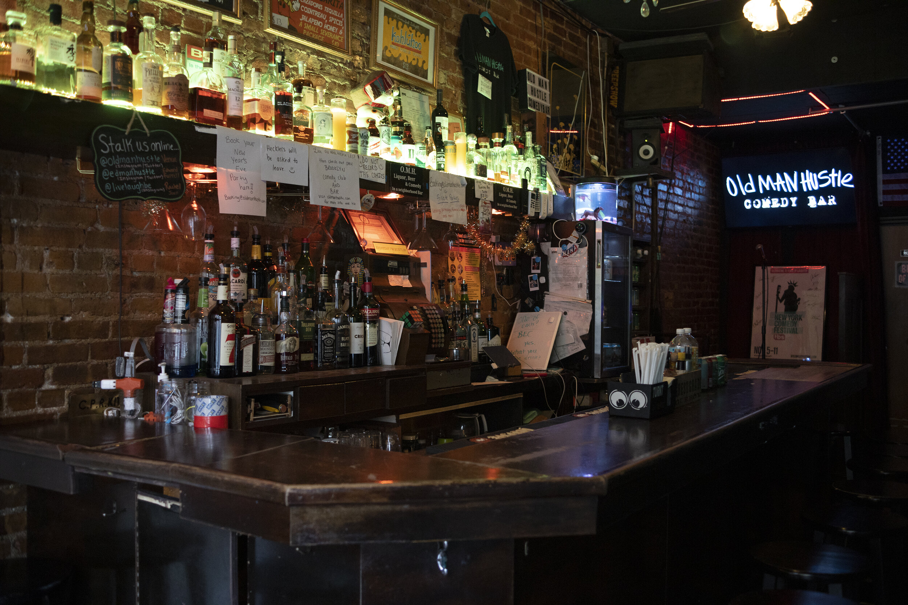

I looked around the bar. There were only 10 of us left. 9 have already performed. I was literally the only person left who hadn't signed up to perform and was left in the bar. I took the last huge gulp of my beer, clenched my phone tightly in my left hand, and sheepishly raised my right. A girl next to me called the MC's attention to point out I wanted to go. He invited me up. I stood from my stool.

I had spent all night researching different open mic bars. But it's New York City. How am I supposed to know which one to go to? I ended up just picking the one closest to my apartment.

I slowly approached [Old Man Hustle](http://www.oldmanhustle.com/about-les), my heart clawing out of my chest. Why was I so nervous? I wasn't going to perform tonight. The goal was to watch how other up and comers perform at an open mic to get a gauge on whether I could do this. Pick up some tips and tricks along the way. 

The bar was tiny. My childhood bedroom definitely had more square footage. Standing at the door, there were a few seats near the entrance. A narrow hallway followed with the bar on the left and stools on the right, ending with the microphone stand straight ahead. I went straight for the bar. "One Corona please".

The night started with the MC cracking some jokes. He was okay, definitely nowhere near the caliber of the comics I'm inspired by on Netflix. He pulled out his clipboard and announced the first three names. I let out a sigh of relief. "Thank God" I thought to myself. "Since I didn't sign up beforehand, they definitely won't call on me." I could sit back, drink away my fears, and enjoy the performances.

The 20 or so of us in the bar started clapping as the first comic went up to the stand. He introduced himself, then jumped right into his clearly rehearsed material. It wasn't good. But, the audience was really encouraging. There were people laughing here and there at the comic's intentional pauses for laughter. I even found myself laughing at a few of his jokes. Not necessarily because any one of them were that funny, but because I was just in awe of this person having the courage to go up and put himself out there.

Each comic had 5 minutes to do their set. The bar fluctuated in size the entire night but stayed at around 10-15 people for any given person's show. The intimate nature inspired an aura of trust. There was a common understanding that this was a very difficult skill to cultivate and we were all there to support each other's journey through their set.

Most comics were not very good. There were two or three standouts, who I shared my appreciation with in between sets. I started to build some confidence during each one. I could do this. I could be funnier than _that_. Unfortunately, each set also ended with another beer in my hand, aiding my delusional confidence.

An hour into the night, I pulled up a google doc on my phone. It was titled "First Set". The past couple of weeks, I’d been jotting down notes during my rides to work on the subway. These notes were random observations and memories I found funny. I thought about the comics on Netflix, and how they were all great storytellers. My notes were an attempt to recreate their punchlines. I skimmed them over and over again in between sets.

_Am I out of my fucking mind? How could I possibly consider performing?_

The devil on my right shoulder was making fun of all the other comics, saying I could do a better job. The angel on my left was calming my nerves, saying that I won't have the chance to go up anyway.

The chatter between the two consumed my mind so much that I didn't even hear the last two sets. After the last comic finished up, the MC went to the stand. Realizing that his sheet of paper was all crossed out, he spoke into the microphone "Well, that was everyone who signed up. Would anyone else like to go?"

This is when I realized I was the only one left. It was when the MC invited me up and I stood from my stool.

A bright light shined in my face as I neared the mic. I suppose this is to make you standout and dim the audience a bit. I started speaking, introducing myself into the microphone. God my voice is horrifically unpleasant.

I attempted to riff from my notes but without looking at my phone, as if that would be some badge of honor for me. They had some semblance of transition from one joke to the next, so I thought I could tell them all from memory. The alcohol did a great job of mixing the order into an unintelligible soup.

My first bit was a set of jokes about how I probably got into MIT due to affirmative action. Swing and a miss.

The second bit went into my fraternity experience and some of the ridiculous stories I lived through there. Strike two.

The third bit explored my presidential candidacy and how I once ridiculously bought vargas2048.com. Strike three, I'm out.

With two minutes still left in my stint and more notes in my phone that I hadn't explored yet, I concluded that I had made a sufficient fool of myself. I thanked everyone for being there as my first ever audience. The sympathy round of applause rained on me as I handed the mic back to the MC. One person came up to me to ask if I was familiar with the Koch Institute since her older sister used to research there. Despite obviously knowing where that was, my mind was still in so much shock with what I just did that I just responded "I don't know". Now that person is definitely convinced I didn't go to MIT.

The bar closed shortly after I went. Everyone shuffled out and I started walking home. I completely bombed. Somehow after all the mediocre comics I saw tonight, I was far worse than all of them. And yet, my heart didn't stop racing.

I had the biggest stupid smile on my face on my walk home. I was practically skipping. I can't believe I just did that. The fact that I completely bombed didn't even phase me. This was a crazy experience I wanted to try and I just fucking did it. The energy I had from the experience kept me up for another 4 hours that night before falling asleep.

I learned a ton about stand up comedy just from that one performance. 

First, never perform again with alcohol in my system. My thoughts were running together and I mumbled too much of my set.

Second, I need to write the material in a way that's relatable to others. We laugh when we recognize the irony in what the other person is saying. Too many of my "jokes" were solely focused on me and were hard for others to relate.

Third, I need better delivery. Nerves steered my performance into a non interrupted stream of thoughts. It was unclear what parts of my stories were _supposed_ to be jokes and which were setup.

Finally, as with all skills, there are only three ways to improve: practice, practice, practice.

Unfortunately, it took months for me to try to implement that last lesson. But come March, I finally signed up for standup classes! Then, the week we were supposed to start our first class, New York City started cancelling all of the things due to COVID. The class I signed up for attempted to continue over Zoom, but I opted out since I wanted my money to go towards an in person experience. Seeing stand up comics trying to do virtual shows today, this was the right call.

So for now, comedy will be an interest that will sit on my back burner. I would love to attempt it once again. But, with the rest of the world still trying to recover from COVID, and with me trying to prioritize getting a self employed career off the ground, I'm comfortable with not pursuing it for now.

My final take away from the experience is to always try shit that both excites you and makes you nervous. Don't be afraid of failure. Instead, accept that failure _must_ happen. Only after trying the new experience will you ever know if it was one worth doing.
