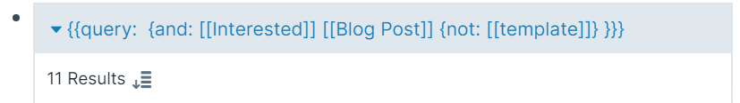
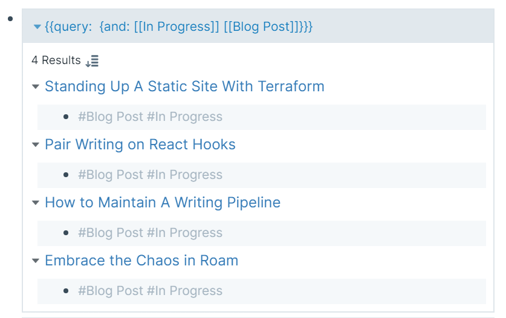

I started writing online in the beginning of July. Since then, my work has introduced me to all sorts of serendipitous opportunities. It has become essential for my own learning and growth. 

Many writers get stuck in an endless rabbit hole of trying to optimize a single article. This is counterproductive. Without receiving feedback from readers and without diversifying to more topics to write about, your skill as a writer will stagnate. Because of this, publishing consistently has been my highest priority. 

Since I've started, I've been able to publish two articles a week. None of them are perfect. But they don't need to be perfect in order to help me improve over time. 

When I started this schedule, I ran into the initial problem of a rushed writing cycle. Each article only had three days to go from draft to publishing. I did not give my peers enough time to give feedback or to myself to respond to it. This has led to my current system for writing: a writing pipeline.

I share what this pipeline entails in this article. 

## The Backlog

I use [Roam](http://roamresearch.com/) to manage my full writing pipeline, from ideation to publication. Ideation starts by building up a backlog.

I never sit down to dedicate time towards brainstorming article ideas. Instead, I use the serendipity of everyday interactions to note ideas down. I have a section in each of day's notes titled "Stream of Consciousness" to note them when they happen:

On the page I created, I add a "Blog Post" and "Interested" tags at the top. This allows me to create a view of all of the blog posts I'm interested in writing in the future:

As of the writing of this draft, I currently have 11 ideas in my backlog that I'm interested in writing at some point. There are a couple of things I look for when deciding to add a blog post idea to the backlog.  

First, I need to have some personal story or experience that underpins the takeaway of the article. When I first started writing, I had a ton of ideas in my backlog that were simply my opinions of patterns I noticed in the world. I had topics that range from my thoughts on taxation to my opinions on what an effective healthcare system could look like. I started to realize that my writing in these topics were just a repackaging of other content I've consumed. It was much harder to provide a unique perspective. So I gutted all of the topics in my backlog that did not fit this criteria to focus on more personal writing. This led to me archiving over 30 ideas!

Second, I write down questions that people ask me throughout the day. I then ask myself, "Do I have an article on my site that answers this question?" If the answer is no, I find a way to turn my answer to that question into a blog post. This approach recognizes the idea that people I knew wanted to come to me for an answer instead of Google. The same will also be true for other potential readers.

With a backlog of blog post ideas ready to go, I begin to transition some to the next stage of the pipeline.

## In Progress

At any given time, I aim to have four blog post articles in progress.

I mark these articles with an "In Progress" tag. I consider an article to be in progress when I have started to write the first draft. Any research or outlining for the article has already been noted on the top of the page itself before it enters the "In Progress" stage.

Each morning, I spend 75 minutes on a morning writing session with an awesome accountability group of friends. I usually split this 75 minutes among my four in progress articles into one 30 and three 15 minute sections. This allows me to make 250-500 word progress on each of them each morning. It pushes me to switch articles before I hit a point of diminishing returns with the one I'm currently on, outweighing any associated switching cost.

This variability is one of a couple benefits I get from keeping multiple articles in progress. The other is lifecycle. In order to maintain a publishing cadence of two articles per week, I used to only have three days to work on any given article. This was a very short lifecycle - the time from when I start to finish an article. Now that I chip away at four articles at a time, maintaining a two article per week publishing cadence means each article has a two week long lifecycle. This gives each post time for the ideas to breathe in my head. More importantly, this gives my peers more time to respond to requests for feedback. Now my anxiety for publishing consistently is no longer being subconsciously pushed on to my peers. 

I write all of my drafts in pages in Roam. By being in Roam, I could easily drag and drop notes from other resources I've consumed. The output is also in markdown, making it very easy to copy and paste it to my site where I publish them. 

There are a few writing groups that I rely on for feedback. With four concurrent drafts, I try to cycle through them so that I'm not overbearing any given one. When it comes time for feedback, I copy and paste the content to a Google Doc so that my peers could leave in line comments. One undesirable side effect of this is that I now have to keep two copies in sync when making revisions. My copy in Roam remains the source of truth and will prioritize making edits there.

Once an article has lived through two weeks of iterative drafting and responding to peer feedback, it will move to the final stage.

## Time To Ship It
In an ideal week, I'm publishing on Tuesday and Friday. Life events will steer this schedule plus or minus a day. But having this baseline has ensured that there have been two articles to share on each weekly newsletter.

When a publishing day hits, I'll skim through the four articles I have in progress. I then choose whichever article is closest to being ready. This frequently lines up with whichever article was started exactly two weeks ago. Timing and feedback I've received will sometimes reorder the timing of articles. For example, I published my article on [performing stand up for the first time](https://davidvargas.me/blog/that-time-i-tried-stand-up-comedy/) about three days earlier than usual because I got very reaffirming feedback that the piece was ready to ship after the initial draft.

After I publish one article, another will enter the pipeline. I comb my backlog of blog post ideas that I've built over time in the first stage. I try to choose a topic that will be most relevant over the next two weeks, since that's when the article's lifecycle will dictate it's time to publish. I also sometimes use what my other three in progress articles are about to see how the fourth could balance it. If my in progress articles are very technical, I'll try to choose a more personal topic. 

Four has been a very comfortable number of articles to keep in progress. [Tiago Forte](https://fortelabs.co/blog/para/) claims that there is research supporting 4 being a magical number in terms of the cognitive load we could handle. It also has struck a great balance where each article is not in progress for too long or have too short of a lifecycle in two weeks.

There are a couple of key benefits that prioritizing a publishing schedule affords me. 

The first is that it embodies one of my favorite quotes, "the opposite of perfection is progress." No single article I ship will ever be perfect. I could theoretically spend months on each of them, endlessly receiving feedback from others and tweaking every word. But my overall goal is not to improve my articles. It's to improve my __writing__. My writing improves most over a series of articles instead of obsessing over a single one.

The second is that publishing keeps me motivated to write more. In any creative endeavor, the longer a single piece of creative work exists in progress the more it demotivates the overall endeavor. This is usually because we are always our harshest critics. So when we are the only ones with visibility towards what we're working on, we eventually begin convincing ourselves that what we've created is not valuable and therefore not worth sharing. A consistent publishing schedule pushes past those mental roadblocks. It causes us to share our work with others, motivating us to move to the next piece to share.

After a couple of months with this new writing pipeline, I've come to really enjoy the process. Each morning I get to write about multiple topics and my output is constantly churning week to week. Now that I'm publishing this article, time to comb my backlog to see what's next!
