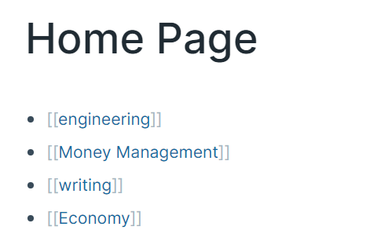
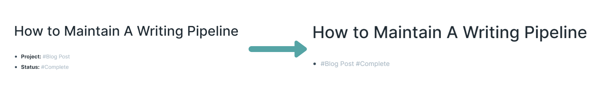
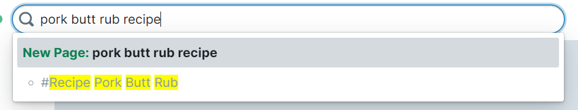

Stop trying to organize your thoughts.

Our mind is a complicated network of neurons firing twenty four hours a day. We come across breakthroughs as constantly as we forget them five seconds later. In an effort to capture some of this value before the thoughts fleet away into the abyss, note taking apps are catching fire. But despite the popularity, there is a fundamental mistake users keep making. We keep trying to organize our notes within these apps.

This is what makes Roam so valuable. It doesn't ask you to organize your notes. It allows them to just _exist_. Instead, the product focuses on its search and query functionality to allow you to find the information you're looking for as quickly as possible once it enters your second brain.

Even in Roam, there are users stuck in the old fallacies of note organization. I was one of them. I'll first explain the problems with organizing notes before then showing some ways to break out of this mindset.

## What's the Problem?

How many times have you had to migrate all of your notes from one folder or application to another? How many times have you deleted a bunch of folders to combine into one or vice versa?

Organization models that make sense today grow stale over time. This is because we can't predict what our future notes will be. If we could, we wouldn't be writing down these notes in the first place!

Our organization systems usually reflect ease of storing information. Because our folder reshuffling is a storage process, we are motivated to make that process easier over time. But, the power of note taking come from the ease of _retrieving_, not storing. Who cares where the notes are stored, we just want to find our answers as quickly as possible. Otherwise, why use your note taking system to answer questions over Google?

The result of focusing on storage is spending too much time on organization. This is counterproductive. The reason why we should take notes is not to have a location for thoughts, but instead to move us towards **taking the right action** as soon as possible. If we spend all of our time chasing the dopamine hit of a new organization structure for notes, we never move towards actually getting stuff done.

While Roam helps users move away from the traps of organizing notes, I still see many users on Twitter committing these common mistakes. Roam is meant to be chaotic because our thoughts are chaotic. To effectively use these notes to move us towards action, we need to embrace the chaos more.

## How Do I Embrace It?

The features in Roam are designed with chaos in mind. We should embrace this fact, and I've found four strategies that help us do so. I have learned all of these strategies from my own mistakes using the product. 

### Stop Making Folders

When I started using Roam, I created a `[[Home Page]]` and added 10 or so top level links there. Then in each of those pages, I added some more links for sub categories. I continued this until I had leaf node pages with the actual note content. I had basically recreated a file directory in Roam and at the time, could not understand why the product was useful.

Inevitably, you find an idea that could arguably fit in a couple of folders. You spend nights reorganizing the folder structure to match what the current perception of what makes sense. Only for it to grow stale by next week.

Stop creating folders. Instead, just create pages. Let those pages exist in your database free of any hierarchy, tagging relevant nouns as you find yourself writing them. Over time, you'll see a natural organization structure emerge that more closely matches your mental mapping instead of an artificially hierarchical one that you try to impose on your notes. Then use queries to generate views of related data that updates automatically, instead of folders which require manually moving pages to an appropriate destination.

### No System Will Be Perfect 
There's a tempting thrill associated with taking something chaotic and trying to impose order onto it. We find patterns appealing and are therefore drawn to making more of them. However, we should avoid searching for the perfect pattern.

When I was setting up my goal system in Roam, I spent two hours just staring at my page just trying to answer a question on references. Should my monthly goals have a link to my yearly goals or vice versa? Two hours I sat there going back and forth trying to decide which will be better in the long term.

The reality was that neither is perfect. Both systems will have tradeoffs. Moreover, it's really difficult to predict the tradeoffs of these systems. The costs associated with these tradeoffs won't be realized until we spend time living with them.

Instead of spending two hours trying to answer this question, I should have recognized that I had imperfect information. I should have just decided on one system, and lived with the consequences of the decision long enough to know what the tradeoffs actually are. Only with experience will I gain enough insight to know whether to change systems. 

When you do change systems, make sure you don't fall into the next trap.

### Don't Backfill Notes
Another drawback of perfectionism is that we feel compelled to have the rest of our history fit in this new box we constructed. Even for notes we've recorded in the past but will never use again.

When I first learned about Attributes in Roam, I thought "wow, what a great way to organize metadata!" I then realized that neither queries nor attribute tables used those attributes in a way that fit my use case. So in order to "show me my 'in progress' blog post articles", I had to put those tags in the same block instead of attributes. I then spent another several hours changing all of my blog post ideas to fit this new system, despite deciding to archive half of them a month later.

Only backfill notes to your new system when you need to. Very often, you could fall victim to spending lots of time migrating a bunch of data that won't ever be used. The daunting task of migrating could even prevent you from adopting a new system in the first place. Recognize that there's always an arbitrary starting point in time when a new system starts. There's always legacy data, so don't stress too much about some of it not fitting the new mold.

The idea of only migrating what you need leads to my final strategy.

### Listen To Your Searches
I previously mentioned that the true power of note taking comes from retrieving information, not storing information. To be able to find the answer to a burning question in far less time than it took you to find that answer the first time. 

The other night I was looking for a new pork butt rub recipe, in preparation to cook dinner for a house of 13 of us. My google search was "pork butt rub recipe". I had to click through 3 links and scroll past half a dozen or so disruptive ads. But finally, I landed on a recipe that I used that night and the rest of the house loved. 

The positive feedback told me that I will want to use this rub again. But next time, getting the answer to my question should only take 1 click, not the several clicks, skims, and ads it took the first time. So, I made sure to add the recipe to Roam and tag it in a way that ensures it appears as a result when I type that same search.

This concept applies more broadly to research, guides, tasks, etc. It takes a lot of cognitive effort to search the answer to an unresolved question the first time. Don't duplicate that work. Take note of not just the answer, but the way you **instinctually** first searched for the answer. Make sure that the answer appears when you replicate that search.

This begins to shift the emphasis of your note taking to prioritize the reader in _future_ you, instead of the writer in _present_ you. So don't worry about how disorganized your notes are. Embrace it. _Roam_ through them. They don't need to be organized to provide future you the value he/she will be searching for.
