There are hundreds of different ways to quickly stand up a static site. From the low-code solutions like Squarespace to literally serving static HTML files from your laptop, there truly is no right or wrong way to do it. Each method comes with its own series of tradeoffs. The right approach often comes down to your personal preference.

I've landed on one that I really enjoy. It gives my just enough control over the resources I create, while also abstracting away the parts of web development I cannot stand.

In this article, I will go through how to quickly stand up a static site using [Next.js](https://nextjs.org/), [AWS](https://aws.amazon.com/), and [Terraform](https://www.terraform.io/docs/)!

## Create Next App
We'll want to install Next to get started with our site. Next is one of the two server side rendering frameworks recommended by React's [documentation](https://reactjs.org/docs/create-a-new-react-app.html#nextjs). I've personally preferred it over Gatsby due to it being lighter weight and needing less configuration to get going.

To create a new Next app in your git repository, run the following command:

```shell
npx create-next-app --example with-typescript --use-npm static-site-demo
```

This will set up all the client code you need to have a basic Next app in Typescript. If you prefer to dig through type errors after compilation and are against TypeScript, then you could run the same command above but without the `example` argument. If you prefer using `yarn` over `npm`, then just remove the `use-npm` argument. Replace the final argument `static-site-demo` with whatever you want the git repository to be called.

Once the script is done, you will be able to run the app locally to checkout the demo app. After `cd`ing into your project's directory, simply run `npm run dev` and go to `localhost:3000` in your browser. You should see this demo!

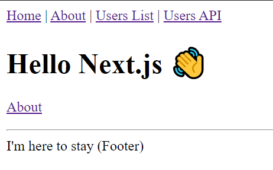

Create a repository to store the code for your static site and push to main. I've created a demo repository to go along with this article at [https://github.com/dvargas92495/static-site-demo](https://github.com/dvargas92495/static-site-demo).

Once you're on GitHub, we'll want to create a personal access token that we'll use in Terraform later. Go to [https://github.com/settings/tokens](https://github.com/settings/tokens) and click "generate new token". Enter a name for your token and give it public repo scope. Click "Generate Token", copy the value GitHub gives you, and store it somewhere safe for us to use later in this tutorial.

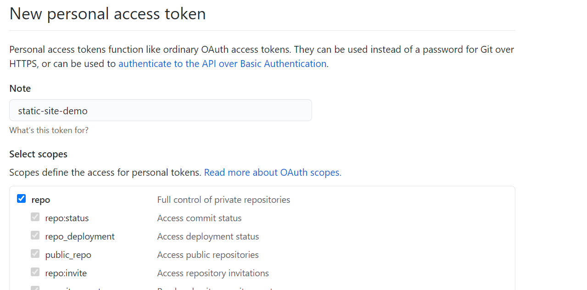

## Setting Up AWS
Now that we have a static site running locally, we want to be able to host it on the web so that others are able to reach it. We will be using AWS to host our site. Before logging on to AWS, we will want to make sure the AWS command line interface is installed. If you don't already, you could find how to do so [here](https://docs.aws.amazon.com/cli/latest/userguide/install-cliv1.html). To check whether or not it is installed, you should be able to run the following on the command line:

```shell
aws --version
```

After you register for an account, you'll be brought to the AWS console. First, we'll need to register for a domain name. To do this, search for and click on the Route53 service. Once on the dashboard, scroll down to "Register domain".

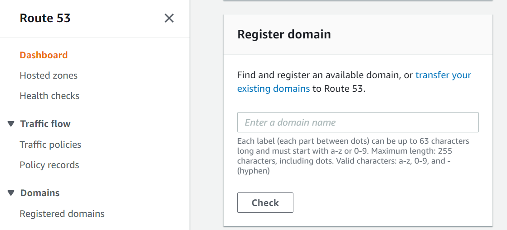

Enter a domain name of your choosing and buy your favorite one. Note that domains under `.com` are scarce, and you might have better luck searching for one available under another top level domain. 

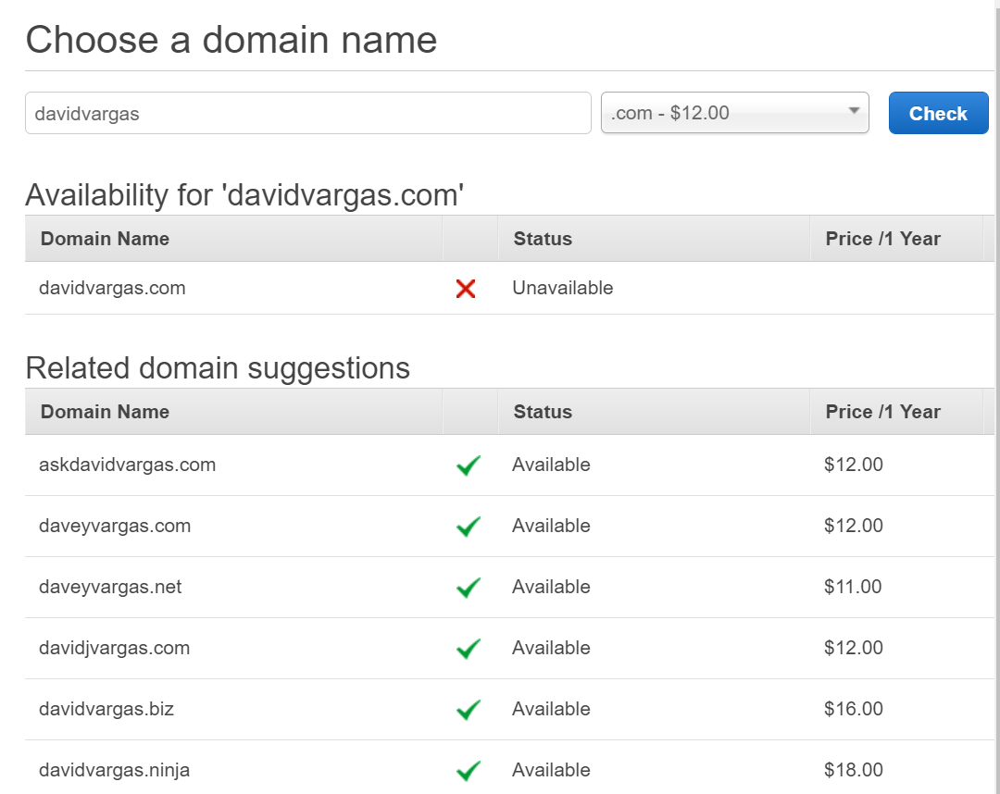

Once you have a domain, you'll want to create a new IAM user. This will be the user in charge of managing all the resources under this static site. Click the Services dropdown on the top left, and head to the IAM dashboard.

Under "Access Management", click on "Add User" and give the User a name related to this static site. Under "Access Type", give the user Programmatic Access and **not** console access. This ensures that the user could only manage resources through the command line.

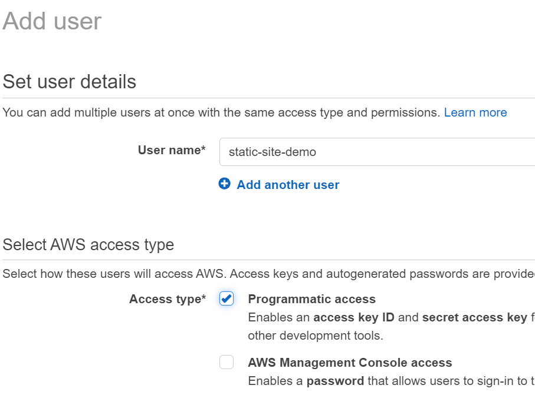

On the Permissions Page, go over to "Attach existing policies directly" and add the following policies to your user:

- `AmazonS3FullAccess`
- `AmazonRoute53FullAccess`
- `CloudfrontFullAccess`
- `AWSCertificateManagerFullAccess`
- `IAMFullAccess`

This will give this new IAM user all the permissions it needs to set up the required resources for your site. 

The next page is optional. I like to add an `Application` tag to group all resources related to the same site.

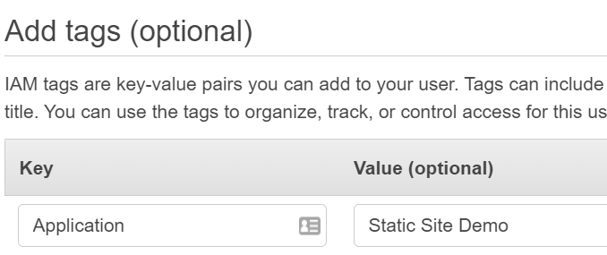

Finally hit create! The user will be created with an access key and a secret key. To store this locally, go to your command line and enter:

```shell
aws configure --profile static-site-demo
```

Replace the last value with whatever profile name you'd like to remember your site by. The command line will ask you for the access key and secret key of your user which you will enter here to keep them secure. Now that we have AWS all set up, it's time to create the resources we need using Terraform!

## Setting Up Terraform
I've previously written about [why I think Terraform is so useful](https://davidvargas.me/blog/terraform-best-thing-since-git/). In short, it allows us to use the paradigm known as _Infrastructure as Code_. This is a practice that manages all of the hardware resources in your app in the same way you manage your software resources - using Git.

First, you'll want to create an account at [https://app.terraform.io/session](https://app.terraform.io/session). Once you're on your dashboard, click create a new organization. Enter a name for the org and put your email address. I put all of my sites under a "VargasArts" organization. 

On the organization dashboard, click "New Workspace" on the top right. Choose "Version Control Workflow" so that every time you push to master, your infrastructure will update automatically. Now we'll have to connect your Terraform account to GitHub. You will only have to do this once; all future workspaces will have a connection to GitHub going forward:

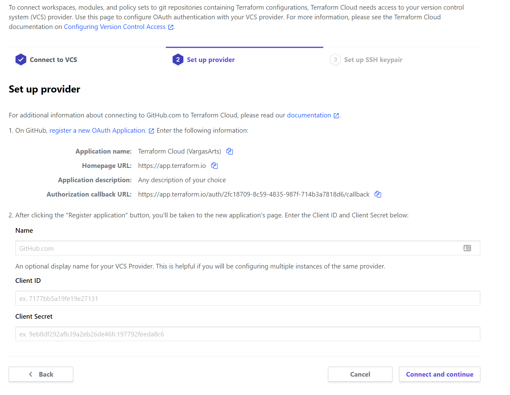 

After GitHub and Terraform are linked up, choose the repository for your static site. Finish up the workspace by giving it a name and click create. I usually just give the workspace the same name as my GitHub repo:

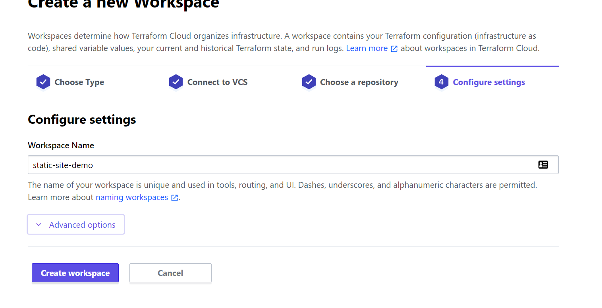

There's a few settings we'll want to configure. First go to "Configure Variables" and scroll down to Environment Variables. We'll want to add three variables here that we've generated throughout this tutorial so far:

- `GITHUB_TOKEN` - The personal access token that we generated earlier in this tutorial. **Check Sensitive**
- `AWS_ACCESS_KEY_ID` - The AWS key we generated for our IAM user. You could retrieve it by entering `aws configure --profile static-site-demo get aws_access_key_id` in the terminal. No need to check sensitive since this is a public key.
- `AWS_SECRET_ACCESS_KEY` - The AWS secret we generated for our IAM user. You could retrieve it by entering `aws configure --profile static-site-demo get aws_secret_access_key` in the terminal. **Check Sensitive**

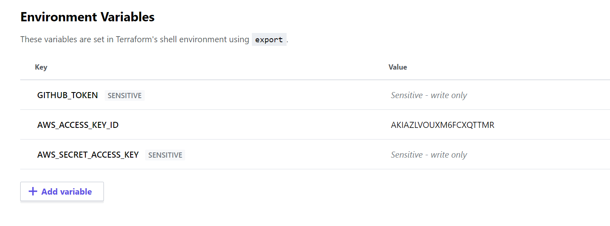

Finally, go to General Settings for your workspace and check off "Auto Apply". Saving this setting will make it so that every time Terraform makes a plan, it will apply the resource changes from those plans automatically.

## Deploy Your Site
Ok our tools are configured, let's deploy the site! In the root of the repo, create a file called `aws.tf`. This will be the terraform file we use to define the resources for our site. In the file, add the following configuration:

```hcl
terraform {
    backend "remote" {
        hostname = "app.terraform.io"
        organization = "VargasArts"
        workspaces {
            prefix = "static-site-demo"
        }
    }
}

provider "aws" {
    region = "us-east-1"
}

module "aws_static_site" {
    source  = "dvargas92495/static-site/aws"
    version = "1.2.0"

    domain = "static-site-demo.davidvargas.me"
    secret = "secret-key"
    tags = {
        Application = "static-site-demo"
    }
}

provider "github" {
    owner = "dvargas92495"
}

resource "github_actions_secret" "deploy_aws_access_key" {
  repository       = "static-site-demo"
  secret_name      = "DEPLOY_AWS_ACCESS_KEY_ID"
  plaintext_value  = module.aws_static_site.deploy-id     
}

resource "github_actions_secret" "deploy_aws_access_secret" {
  repository       = "static-site-demo"
  secret_name      = "DEPLOY_AWS_SECRET_ACCESS_KEY"       
  plaintext_value  = module.aws_static_site.deploy-secret 
}
```

Let's break down what's happening. In each section, I will specify the parts you will need to change to apply to your use case.

```hcl
terraform {
    backend "remote" {
        hostname = "app.terraform.io"
        organization = "VargasArts"
        workspaces {
            prefix = "static-site-demo"
        }
    }
}
```

This specifies that we will be running our Terraform changes remotely, at `app.terraform.io`. You will want to change `organization` to match the name of your organization and `prefix` to match the name of the workspace you created.

```hcl
provider "aws" {
    region = "us-east-1"
}

module "aws_static_site" {
    source  = "dvargas92495/static-site/aws"
    version = "1.2.0"

    domain = "static-site-demo.davidvargas.me"
    secret = "secret-key"
    tags = {
        Application = "static-site-demo"
    }
}
```

This defines all the AWS resources we will be creating. Just like in `npm`, terraform allows developers to publish and use modules that package together commonly used resources. This static site module is one that I published that includes all the AWS resources needed to stand up a public static site. You could find the source code for the module [here](https://github.com/dvargas92495/terraform-aws-static-site). You will want to change `domain` to be the actual domain of your static site and change `secret` to be a value you know. Adding `tags` are optional, but I like to add one so that all of my AWS resources could be grouped together. Do **not** change the `source` as that's referencing the open source module you'll be using.

```hcl
provider "github" {
    owner = "dvargas92495"
}

resource "github_actions_secret" "deploy_aws_access_key" {
  repository       = "static-site-demo"
  secret_name      = "DEPLOY_AWS_ACCESS_KEY_ID"
  plaintext_value  = module.aws_static_site.deploy-id     
}

resource "github_actions_secret" "deploy_aws_access_secret" {
  repository       = "static-site-demo"
  secret_name      = "DEPLOY_AWS_SECRET_ACCESS_KEY"       
  plaintext_value  = module.aws_static_site.deploy-secret 
}
```

This defines the GitHub secrets we need to deploy code to our site. Terraform allows almost any service provider to be managed. This means there's really no limit to how much of our infrastructure could be managed as code. Here, we're taking the credentials generated by the static site Terraform module and storing them as GitHub secrets in our repository. You will want to change the two `repository` lines to match the name of your GitHub repo.

Commit this file to git and push it to main. Once it's pushed, you should see a yellow in progress dot next to the commit that you've pushed in GitHub.

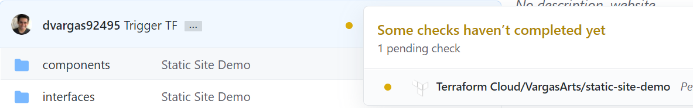

If you don't see this right away, kick one off manually in `app.terraform.io` by going to your workspace and clicking "Queue Plan". Sometimes Terraform needs the first one kicked off manually for subsequent changes to apply automatically. After about 15 minutes, you should have all the resources set up and be greeted with this reaffirming green check mark:


Now that our resources are set up, it's time to deploy the actual code! We could use GitHub Actions to automatically deploy our site every time we merge changes to master. To start, first create a file from the root of the repo called `.github/workflows/master.yaml`. Copy and paste in the following:

```yaml
name: Deploy to Production from Master
on:
  push:
    branches: master

env:
  AWS_ACCESS_KEY_ID: ${{ secrets.DEPLOY_AWS_ACCESS_KEY_ID }}        
  AWS_SECRET_ACCESS_KEY: ${{ secrets.DEPLOY_AWS_SECRET_ACCESS_KEY }}
  AWS_DEFAULT_REGION: us-east-1

jobs:
  deploy:
    runs-on: ubuntu-20.04
    steps:
      - uses: actions/checkout@v2
      - name: Use Node.js 12.16.1
        uses: actions/setup-node@v1
        with:
          node-version: 12.16.1
      - name: install
        run: npm install
      - name: Build
        run: npm run build
      - name: Export
        run: npm run export
      - name: Upload
        run: aws s3 sync out s3://static-site-demo.davidvargas.me --delete
      - name: Invalidate Cache
        run: |
          CLOUDFRONT_ID=$(aws cloudfront list-distributions --query "DistributionList.Items[*].{Alias:Aliases.Items[0],Id:Id}[?Alias=='static-site-demo.davidvargas.me'].Id" --output text)
          aws cloudfront create-invalidation --distribution-id $CLOUDFRONT_ID --paths "/*"
```

Let's break down what's going on here.

```yaml
name: Deploy to Production from Master
on:
  push:
    branches: master
```

Here, we're telling GitHub to run this action every time we push changes to master. You could additionally specify `paths` here to denote which file changes will actually trigger the action.

```yaml
env:
  AWS_ACCESS_KEY_ID: ${{ secrets.DEPLOY_AWS_ACCESS_KEY_ID }}        
  AWS_SECRET_ACCESS_KEY: ${{ secrets.DEPLOY_AWS_SECRET_ACCESS_KEY }}
  AWS_DEFAULT_REGION: us-east-1
```

This sets up our environment. It uses the secrets we configured from Terraform before and makes the credentials available to the GitHub agent so that it could be authorized to deploy changes to AWS.

```yaml
jobs:
  deploy:
    runs-on: ubuntu-20.04
    steps:
      - uses: actions/checkout@v2
      - name: Use Node.js 12.16.1
        uses: actions/setup-node@v1
        with:
          node-version: 12.16.1
      - name: install
        run: npm install
      - name: Build
        run: npm run build
      - name: Export
        run: npm run export
      - name: Upload
        run: aws s3 sync out s3://static-site-demo.davidvargas.me --delete
      - name: Invalidate Cache
        run: |
          CLOUDFRONT_ID=$(aws cloudfront list-distributions --query "DistributionList.Items[*].{Alias:Aliases.Items[0],Id:Id}[?Alias=='static-site-demo.davidvargas.me'].Id" --output text)
          aws cloudfront create-invalidation --distribution-id $CLOUDFRONT_ID --paths "/*"
```

This defines the steps we want to run on an `ubuntu` machine managed by GitHub. The steps we run in order are:

1. Checkout the GitHub repo
2. Install node.js
3. Install project dependencies
4. Build our code
5. Export our code to static HTML files. 
6. Upload those files to S3. You will want to replace `static-site-demo.davidvargas.me` to your domain.
7. Invalidate cache so that our changes are visible right away. Again, replace `static-site-demo.davidvargas.me` to your domain

Finally, in our `package.json` add the following line to our `scripts` object which is not included by default with our project setup:

```javascript
"export": "next export",
```

We are ready to commit our changes to git! Push them up to master, and we should see the following additional process running on our commit:

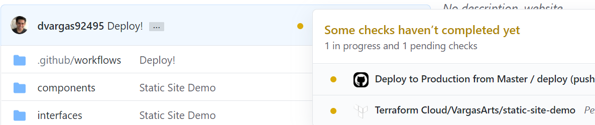

That top entry is our GitHub action building and deploying our changes to AWS. Once you see the green check mark, navigate to your domain. You will see that your brand new site is now live!

## Going Forward

Now that your site is all set up, you could continue developing with the benefits of continuous delivery. The `npm run dev` command will allow you to test changes locally on the fly. Then, once you're ready you could push them to master and in just a couple of minutes the changes will already be live on your domain. These changes could include both software changes and infrastructure ones as they apply automatically through GitHub actions and Terraform respectively.

Stuck on any part of this guide? Have questions or feedback? Feel free to reach out to me on [Twitter](https://twitter.com/dvargas92495)!
