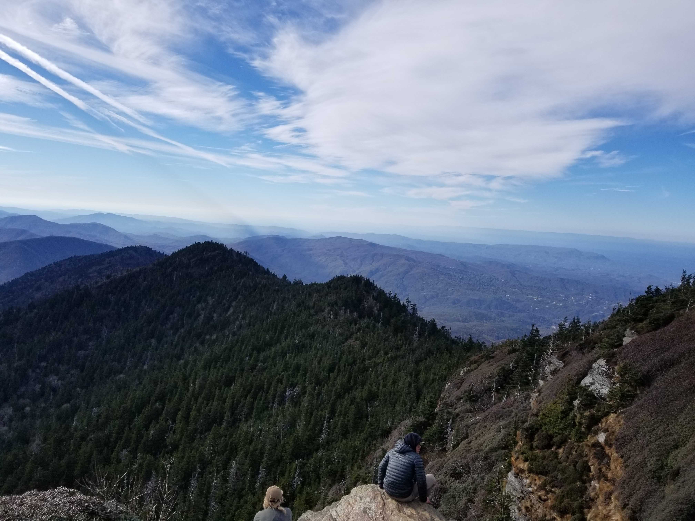
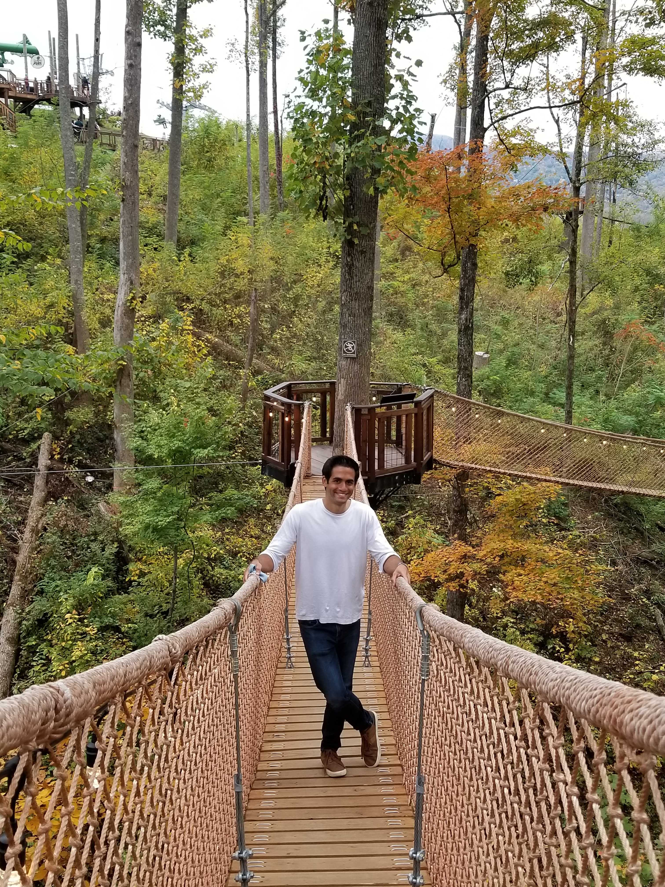
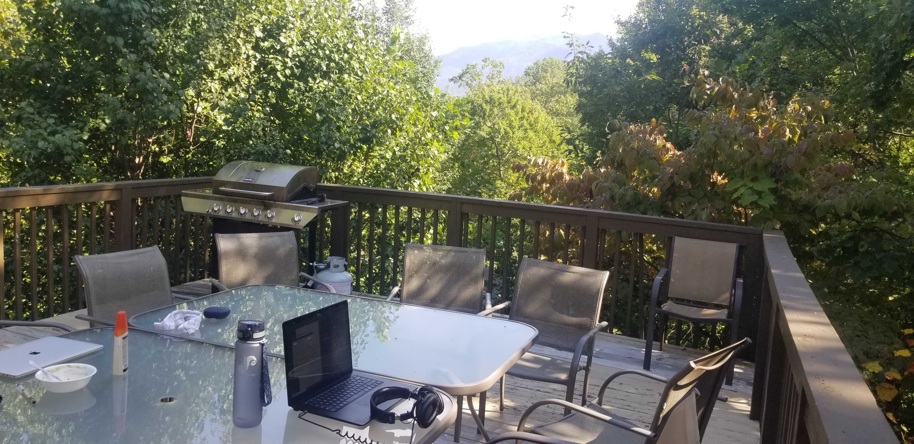

I had never heard of Gatlinburg. 

With a recorded population of just over 4,000, I thought we were headed towards the middle of nowhere. My expectations were low. I balanced these low expectations with my excitement from staying in a cabin with 11-13 other people. At least we could make the most of it by hanging out with each other.

The stay surpassed all of my expectations. Gatlinburg was proof that there exist numerous cities in the world that I've never heard of and could consider home. Traveling with a community of friends also continues to bring with it plenty of joys and challenges. 

To explain what made the trip so significant, I need to first talk about Gatlinburg itself.

## Gatlinburg, Tennessee
Gatlinburg is near the Smoky Mountains. Our cabin was 15 minutes from downtown in the mountainous woods, where many of my friends claim to have seen (and been chased!) by bears.

The Smoky Mountains are known for some beautiful hikes. I went on two throughout the stay, including a 10 mile round trip to the top of Mt. LeConte, the third tallest peak in the range.

I was blown away by Downtown Gatlinburg. The sparsely inhabited city really came alive at night with people all over the streets and lights incredibly vibrant. It was filled with family-related attractions that included mini-golf courses, rope courses, and even a Ripley's Believe It Or Not Museum. The neighboring town to Gatlinburg was called Pigeon Forge, which was also filled with various arcades, amusement attractions, and activities for kids to do. The traffic driving through either made the streets of New York City feel like a highway. 

One really cool feature of Gatlinburg is this mini village called Anakeesta. You need to take a ski lift up to the top of a mountain to get to this outdoor family theme park featuring a solo coaster, zip-lining, and treehouse playground. We spent our day there mostly walking around the rope bridges and eating at a barbeque restaurant.

I would love to come back to Gatlinburg when I have a family of my own. The town is very geared towards families, especially when the kids are still young. I am highly recommending a weekend trip here for any young families looking for a getaway vacation.

## Community Coliving
The cabin we rented from Airbnb was big but definitely not big enough for the number of people we had staying there. The living room was cozy, some people were left without bedrooms, and my closet ended up taking the edge of one of the walls. We did however have a beautiful deck that made working during the day absolutely refreshing.

Early on we had trouble with the WIFI. It was impossible to have multiple concurrent video calls and the mobile signal wasn't strong enough for consistent hotspot connection. It's becoming increasingly clear that the "Digital" in digital nomading is a first-order concern - the lack of connection led to frustration throughout the house. We bought a [Google Nest](https://store.google.com/product/nest_wifi), which miraculously resolved the issue and was able to give us consistent connection throughout our stay. It seems worthwhile now to carry one everywhere we go to not rely on the WIFI of our hosts. Moreover, this restored my faith in the idea that no matter where we stay, we should be able to find ways to adapt to our new environment.

I really enjoy getting to know what everyone else is working on during each trip. I'm reliving my college days. I walk around the cabin and see most people in their defined spot every day, hacking away at whatever's providing them a living. A couple of us gave presentations to the rest of the group after family dinners that spanned topics from selling underwear to poker strategy. If my dream state is a creator house where everyone is doing and sharing what they love, then I should push for more presentations.

On a more somber note, I continue to be a non-proactive member of the community. This is becoming unsustainable. I'm realizing that either my schedule needs to start aligning with the rest of the group's or I need to break away entirely to travel on my own.

I contemplated doing the latter for some time before deciding I would regret not making the most of the opportunity COVID has provided by bringing us all together. So I'm now going to start aligning my schedule more with the rest of the group's. This means intentionally working during traditional work hours and intentionally not during off-hours. The approach will be more sustainable than say coding while watching a movie and being completely ineffective at both.

## Outlook on Nomading
During the first weekend of our stay, we visited our friend's parents' place for his mom's birthday. Their house was on the water and was beautiful. We spent the weekend taking their boat out, jet skiing, and eating so much that I almost threw up.

The weekend gave me a glimpse of where I want this lifestyle to look like in a couple of years. Initially, I was discouraged that I wouldn't have a place this nice if I'm traveling all the time. But I then realized a goal during nomading could be to incrementally increase the standard of living of the AirBnbs we stay at. Why settle on one luxurious home when I could try out a different one in a different city every month?

Staying here for 6 weeks did solidify my personal preference towards 4-week stays. By the end of week 4, I was itching for a change of pace and ready to try something new. Not because any part of our stay felt redundant, but because I in general feel a resurgence of energy when it's time to travel to a new destination.

I would like to at some point try traveling on my own for a few months. I've heard of many other friends and guests on podcasts try a similar experience. They unanimously report back that it was a healthy period to discover what they truly want and value. I'm still incredibly young with much to learn about myself, so the opportunity to do something similar is enticing.

But, as I mentioned, I still want to enjoy my travels with some of my closest friends while I still can. So for now, on to Raleigh!
