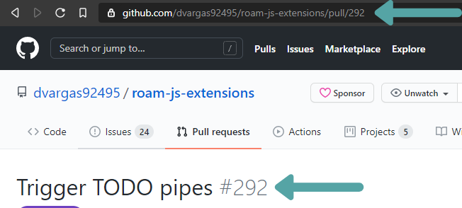
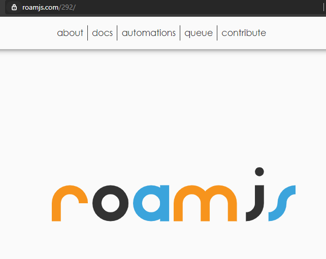
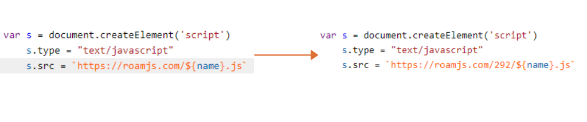

I am obsessed with continuous delivery.

Continuous Delivery is the practice of pushing a new version of your application multiple times a day. It has many benefits that I value immensely, some of which include:
- Constant user feedback
- Rapid response time to bugs
- Maximize time spent on software design

This made me immediately drawn to GitHub actions. The feature has empowered the same service that is version controlling my source code to also version control the product my end users interact with. In this article, I will deep dive into how I'm using GitHub actions to version control my RoamJS project. 

## Hosting Setup
RoamJS is a static site that is hosted on an AWS S3 bucket. All static content is stored in the bucket's root so that when you access https://roamjs.com it fetches the `index.html` file that's stored at the top-level directory. Additionally, all RoamJS extensions are also stored at the bucket's root so that they could be easily fetched from `https://roamjs.com/[name of extension].js`.

I typically create a separate branch when developing a new version of an extension. As per the usual developer workflow on GitHub, I push the branch and create a pull request when I'm ready to test it. GitHub then detects these changes and uses an action I defined to automatically deploy a separate bundle of assets to the _same_ S3 bucket but in a new subpath. 

First, I take the GitHub pull request number which you could find in the URL or the title.



Then, I create a separate directory in S3 using the PR number and upload a copy of all the static assets generated by the branch to that subdirectory.


When the GitHub action succeeds, all the assets will be uploaded and the cache will be invalidated. This will make them available under the pull request number's path of the site. So for this example, I would go to https://roamjs.com/292 to test this new version of the site.



Additionally, all of the RoamJS extensions with the new changes are uploaded to the `/292` path of the site. So to install them into my Roam test graph, I simply have to switch the URL in the Roam code block to now include the testing path.



This allows me to iterate on changes I want to make in a branched version without affecting the assets that users are currently downloading. It gives me the freedom to push as liberally as possible without fear of regression. I could then gain confidence in my changes from the branched version before merging into master. Once the changes are merged, there is another GitHub action triggered to delete the path from S3.

One concern could be how my testing versions are publicly accessible. This is mitigated by the paths not being accessible from the main site, so most users will be oblivious to them even after publishing this article. If users do find testing versions, then it feeds into my goal of building in public and they should navigate at their own risk.

Now, time to dive deeper into the GitHub actions themselves that make all the magic happen.

## Workflow Files
Let's first look at the `master.yaml` file. This action runs anytime a change to an extension is merged to master. The key steps are

```yaml
- name: install
  run: npm install
- name: Build
  run: npm run build
- name: Upload
  run: aws s3 sync build s3://roamjs.com
- name: Invalidate Cache
  run: |
    CLOUDFRONT_ID=$(aws cloudfront list-distributions --query "DistributionList.Items[*].{Alias:Aliases.Items[0],Id:Id}[?Alias=='roamjs.com'].Id" --output text)
    aws cloudfront create-invalidation --distribution-id $CLOUDFRONT_ID --paths "/*"
```

We first build and install the dependencies. Then, we sync the local `build` directory with the root of the S3 bucket, uploading all extension `.js` files to the bucket. Finally, we invalidate the cache so that when users fetch extensions Cloudfront delivers the latest version of the extension.

The next workflow file is `PR.yaml`. This one works very similarly to `master.yaml`, except we are uploading a development version to an S3 sub-path. 

```yaml
- name: install
  run: npm install
- name: Build
  run: npm run build:pr
- name: Upload
  run: aws s3 sync build s3://roamjs.com/${{github.event.number}}
```

Just as in master, we build and install the dependencies. The build command here is slightly different, using `npm run build:pr` to build our extensions using a development version. I try to keep the development and production versions as similar as possible, with the only notable difference being that development includes source maps for easier debugging. 

Then, we upload the local `build` directory to S3, but now to `roamjs.com/${{github.event.number}}`. The `{{github.event.number}}` grabs the pull request's number from the screenshot above and interpolates it into this S3 URL. This means that there are now development versions of the extensions in the S3 sub-path denoted by the PR number. I could now fetch these extensions in my test Roam graphs to ensure that they are demonstrating the behavior I expect users to experience.

One final workflow file I'd like to highlight is `PR_close.yaml`. This workflow file runs every time a pull request closes, whether that be through explicitly closing the pull request or by merging. This action only runs one step.

```yaml
- name: Delete S3 Branch
  run: aws s3 rm "s3://roamjs.com/${{ github.event.pull_request.number }}" --recursive
```

After a pull request is merged, I do not need those assets anymore. This command deletes all the assets within the S3 sub-path denoted by the closed pull request's number. This action acts as a garbage collector, freeing up space in the S3 bucket.

These are just the actions related to deploying the RoamJS extensions. You could find all the workflow files that I use for the project [here](https://github.com/dvargas92495/roam-js-extensions/tree/master/.github/workflows).

## Improvements To Make

As I continue to refine how these workflow files suit this use case, I expect to reuse them for future static websites. I'd like to create my own GitHub action that I could simply run in place of all the individual steps.

Right now, a change to _any_ extension triggers a build and deploy to _all_ the extensions. I'd like this to be more modular. Ideally, changes to a given extension will only trigger a build and deploy of that specific extension to S3. This will become especially important as the library continues to grow.

These actions have allowed me to iterate quickly and confidently on the various RoamJS extensions the site currently supports. Have any questions? Feel free to reach out to me on [Twitter](https://twitter.com/dvargas92495)!
