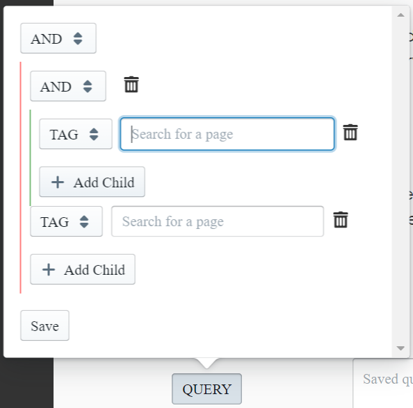

Most developers are familiar with using React within the context of a full application. Facebook's [Create React App](https://github.com/facebook/create-react-app) project makes it super easy to get one started with just one command. 

But what about building on top of an existing React application?

The extensions I develop on [RoamJS](https://roamjs.com) are meant to be injected and run Roam - an existing React application. I started developing them using plain JavaScript and DOM manipulation. As expected, this approach began to scale poorly when the types of extensions I wanted to build became more ambitious. Which had me asking, "Could I build Roam extensions _using_ React?"

Turns out, the answer was a resounding yes! The first extension I released with React was this [Query Builder](https://roamjs.com/docs/extensions/query-builder).



In this article, I will go through both how to build on top of React and how to build extensions using React.

## Building on Top Of React 

There are a couple of gotchas to consider when writing any extension of a React application.

### State Management
React components manage their own state and re-render new DOM elements based on that state. This means you cannot edit state like input values without them getting overridden by the app's state management under the hood.

For example, let's say there's a text area that you want to write a new value to. You might be tempted to do something like the following:

```javascript
const textarea = document.getElementById('textarea1');
console.log(textarea.value); // "Old Value"
textarea.value = 'New Value';
```

The problem is the next time you interact with that text area, it will just override 'New Value' with whatever value React is managing under the hood, which most of the time is "Old Value".
 
To solve this, you need to simulate user interactions on the DOM elements. An interesting library I used to do this is [Testing Library's User Event](https://github.com/testing-library/user-event), which provides a bunch of helpers around common user interactions. It's primarily meant for testing, but it could also be used for simulating user actions in general.

It's also possible to simulate these events manually too. For writing data, you often want to dispatch a `keydown` event, followed by a `keyup` event:
```javascript
const downEvent = new KeyboardEvent('keydown', {
  bubbles: true,
  cancelable: true,
  keyCode: 65, // a
});
const upEvent = new KeyboardEvent('keydown', {
  bubbles: true,
  cancelable: true,
  keyCode: 65, // a
});
const textarea = document.activeElement;
textarea.dispatchEvent(downEvent);
textarea.dispatchEvent(upEvent);
```

Clicking and focusing on an element is easier, as the HTML DOM elements support these operations.
```javascript
const button = document.getElementById('button1');
button.focus();
button.click();
```

### Unmounting
When React re-renders a sub-tree in the DOM, it essentially replaces all of the DOM nodes in that part of the tree with new DOM nodes. This means updates to a DOM element with the same id could lose all attributes, children, or listeners that you attached to it. 
Let's say you have an icon that you want to display as a child of some element with id `parent`. You might be tempted to run this on load and call it a day:
```javascript
const icon = document.createElement('span');
icon.innerText = '😃';
const parent = document.getElementById('parent');
parent.appendChild(icon);
```

The problem is if that element's props or state changes for any reason, React will unmount the old version and replace it with a new element. This new one will no longer have your smiley icon.

To solve this, use [Mutation Observers](https://developer.mozilla.org/en-US/docs/Web/API/MutationObserver) to detect whenever elements that you are interested are added to the DOM. You could then render your new behavior as a callback to those events.

From the example above, we want to detect whenever an added node is or contains the element we're looking for.
```javascript
const parentId = 'parent';
const icon = document.createElement('span');
icon.innerText = '😃';
const observer = new MutationObserver((mutationList) => {
  mutationList.forEach((mutationRecord) => {
    mutationRecord.addedNodes.forEach((node) => {
      if (node.id === parentId) {
        node.appendChild(icon);
      } else if (node.querySelector(`#${parentId}`)) {
        node
          .querySelector(`#${parentId}`)
          .appendChild(icon);
      }
    })
  })
});

// The first argument is a target. 
// Try to scope it down as much as possible
observer.observe(
    document.body, 
    { childList: true, subtree: true }
);
```

Now, no matter what funny business React is doing under the hood, we are always watching it ready to make the DOM changes we need.

### Event Listeners
React attaches all event listeners to the document's root (as of React 17, they are now attached to the React tree root). This means if you add event listeners to elements directly, you could guarantee their invocation before they propagate up to the app's React components.

If you want some custom listener to override whatever your host application is doing, be sure to end the event propagation at the end of your callback.

```javascript
const button = document.getElementById('button1');
button.addEventListener('click', (mouseEvent) => {
  // do stuff
  mouseEvent.stopPropagation();
  mouseEvent.preventDefault();
})
```

This comes with the caveat from the previous section. Beware of the possibility that your event listener could be unmounted at any point and be ready to attach accordingly. An alternative for those who don't mind their host's default event behavior is to attach from the document level.

```javascript
document.addEventListener('click', (mouseEvent) => {
  if (mouseEvent.target.id === 'button1') {
    // do stuff
  }
})
```

These are all things to keep in mind when building on top of an existing React app. They are relevant regardless of what framework you choose to build with. Now let's talk about some things to keep in mind when building extensions _in_ React.

## Extensions in React
Since modern React tooling solve most of the "Hello, World" type problems, you have to duplicate some of those steps to build an extension in React. Here are the primary steps.
### 1. Install dependencies
There are a few common dependencies you will need which are similar to most standard React apps.
```shell
npm install --save react react-dom
```
```shell
npm install --save-dev @babel/core @babel/preset-env @babel/preset-react @types/react @types/react-dom babel-loader ts-loader typescript webpack webpack-cli
```
### 2. Configuration
First, I have a simple `.babelrc` file at the root.
```javascript
{
  "presets": ["@babel/preset-env", "@babel/preset-react"]
}
```

Then, I have the following Webpack config.

```javascript
module.exports = {
  entry: './src/index.ts',
  resolve: {
    modules: ["node_modules"],
    extensions: [".ts", ".js", ".tsx"],
  },
  output: {
    path: path.join(__dirname, "build"),
    filename: "[name].js",
  },
  module: {
    rules: [
      {
        test: /\.tsx?$/,
        use: [
          {
            loader: "babel-loader",
            options: {
              cacheDirectory: true,
              cacheCompression: false,
            },
          },
          {
            loader: "ts-loader",
            options: {
              compilerOptions: {
                noEmit: false,
              },
            },
          },
        ],
        exclude: /node_modules/,
      },
    ],
  },
};
```

If you prefer to work in just plain JavaScript, simply remove the `ts-loader` and add `.jsx` to `extensions`. If you are bundling multiple extensions, then you want to change `entry` to be a map of script name to the source file. For simplicity, I keep all of my extension entry points in the same directory so that I could build this mapping dynamically in the Webpack config file.

```javascript
const extensions = fs.readdirSync("./src/entries/");
const entry = Object.fromEntries(
  extensions.map((e) => [
      e.substring(0, e.length - 3), 
      `./src/entries/${e}`
  ])
);
/*
entry: {
    foo: './src/entries/foo.ts',
    bar: './src/entries/bar.ts',
}
*/
```

### 3. ReactDOM.render
Now that we have our build dependencies and configuration ready, we could jump into source code.

React does not need to have control of the entire DOM. It only controls what is within its given sub-tree, based on a specified root element. Their [documentation](https://reactjs.org/docs/integrating-with-other-libraries.html) has a great explanation of how powerful this approach is in migrating from older libraries to React.

One approach is taking over an existing node. Note this means that your React sub-tree will overwrite whatever the app is doing, unmounting the existing nodes. This is useful for when you just want to replace the host's component with your own. 

```javascript
import ReactDOM from 'react-dom';
import React from 'react';
import NewComponent from './NewComponent';

const parent = document.getElementById('parent');
ReactDOM.render(<NewComponent />, parent); 
// Everything that used to be children 
// of parent is now gone
```
 
The second approach is to add a new element to act as your React root. This is useful for when you simply want to overlay new functionality without disrupting whatever the host is currently rendering.

```javascript
import ReactDOM from 'react-dom';
import React from 'react';
import NewComponent from './NewComponent';

const parent = document.getElementById('parent');
const root = document.createElement('div');
parent.appendChild(root);
ReactDOM.render(<NewComponent />, root); 
// Everything that used to be children 
// of parent is still mounted
```

With both approaches, you still have to keep in mind that at any point, the parent's props or internal state could change causing a re-render. This will unmount your component for good, requiring you to observe for changes to keep it mounted on the DOM.

## Improvements To Make
I was thrilled to find out that React is extensible enough to be easy to use on top of existing apps. There are still ways I think these workflows could be made easier.

Host applications could provide hooks into their internal React state to modify desired components safely instead of relying on simulating user events, which could be very prone to error. 

Host applications could also emit common event types that extensions could listen in on so that scripts are not degrading application performance with Mutation Observers.

Finally, if both the extension and the host are written in React, there should be a way to expose React within the context of the script being run. This would allow extension developers to be able to build and share new functionality without having to bundle both React and ReactDOM, which take up a considerable amount of space. 

For more on how I solve extension-related problems, be sure to check out the [RoamJS repo on GitHub](https://github.com/dvargas92495/roam-js-extensions). For anything else, feel free to DM me on [Twitter](https://twitter.com/dvargas92495)!

