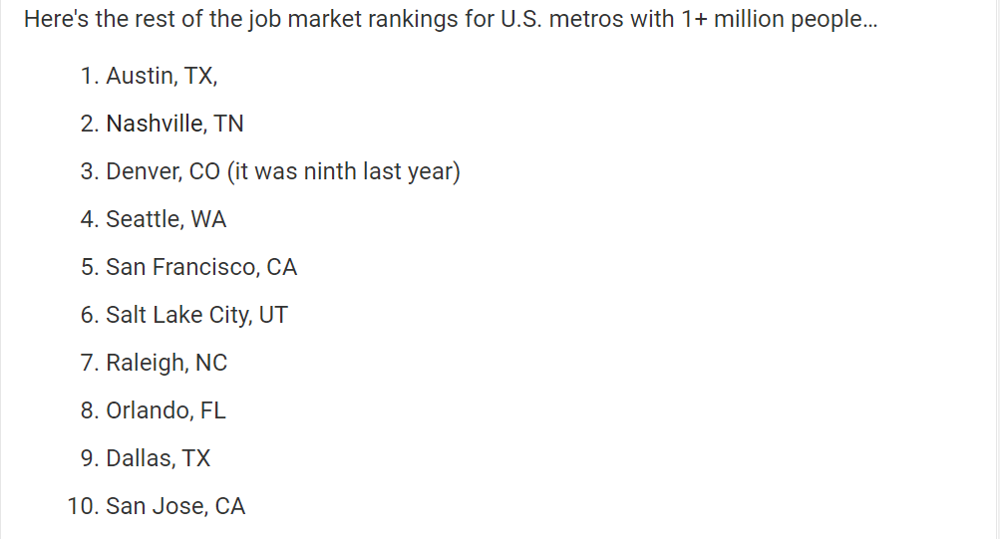
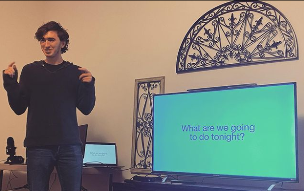

I just got back to my hometown in Long Island for the first time in five months. Our final stay involved only four of us staying in Raleigh, North Carolina, for two weeks. The last nomad stop was shorter because most of the Covilla crew went back home for Thanksgiving early.

I'll first talk about my experience in Raleigh. Then I'll expand on how this stay has changed my thoughts on community and the nomad lifestyle.
 
## Raleigh, North Carolina
In February, I was surprised to find out that Raleigh was one of the fastest-growing cities in the U.S. based on growth in their respective job markets. Combined with some endorsements from a friend and a former employee, it rose near the top of the list of cities I want to visit.

Unfortunately, Raleigh appeared to have been hit pretty hard economically by COVID. We saw buildings still boarded up and deserted walking around downtown. There weren't many young people walking around the streets, presumably because they've all gone back home with their families. We met someone who explained that Raleigh is a city that loves to congregate in group settings, all of which are shut down now because of COVID.

We were still able to experience some of the notable parts of Raleigh. The most popular place in the city was this mile-long strip called Glenwood South. The street was lined with different restaurants and outdoor bars. Each weekend night we went, it was crowded enough to make the area lively but not enough to be uncomfortable. The Raleigh Beer Garden was my favorite stop on the strip. The two-story brewery had its walls lined with greenery, making it feel like a treehouse on the ground level. 

We went on a couple of hikes at Umstead State Park. The hikes were flat and easy to do but had some pleasant rivers to walk along. We also went to Pullen Park, a public park with various closed attractions, like boating. We still enjoyed our day there playing spikeball on the lawn and making use of the tennis courts.

The thing to do in Raleigh is to visit the breweries. Even as someone who doesn't drink, I enjoyed the ambiance and food each brewery provided. My favorite one that we hung out at was [Lynwood Brewing Concern](https://www.lynnwoodgrill.com/lynnwood-brewing-concern/).

## Community Coliving
This was our smallest Covilla at only four of us. 

This made some of the usual delegations of responsibility much easier to manage. The Airbnb we stayed at was more comfortable than the previous one since everyone was guaranteed a bedroom spot. 

In previous Covillas, most days involved each of us spending the day time working on each of our respective jobs until about 6 PM. Then, we tried to make a group decision on how to spend the rest of the night. In our second week in Raleigh, we tried a new approach to choosing night-time activities. Each night, a different person had full authority over how the night would be spent.

I think this led to more unexpected and fun ways to spend an evening. With group decision making, often what gets chosen is the least common denominator between everyone's desires. With the new approach, we got exposed to doing things we probably wouldn't have done otherwise. My favorite of these nights was creating a ridiculous video on [Twitter's worst feature](https://www.youtube.com/watch?v=S4pLicTnhKM).

I want to push more for what I'm now calling "Hyper-Cyclical Authoritarianism." The idea is that taking turns giving someone different full control over a decision is preferable to making group decisions. It's predicated on my belief that I'd prefer to do something that someone else is 100% excited about rather than something that we both compromised to be 70% excited about. One area I think we could apply this approach is choosing Airbnb locations. 

## Outlook on Nomading
This trip made it evident that cities will still be adversely affected by COVID in the near term, more than I wanted to believe. As a result, I need to lower the stay's location as a primary factor in choosing how to spend the coming months.

I tried a new approach to my work-life balance this stay that I want to implement for at least the next two Covillas. Every weekday at 6 PM, I went laptop off for the rest of the night. On the weekends, I tried to turn it off by 1 PM. 

There were two goals. The first was to be intentional about spending time with the community versus spending time on me. The second was by limiting the time spent working, I could be more focused on the few action items that are important, cutting away some fluff. 

This has been successful so far. I felt less guilt related to my involvement in the community. I was also more open to experiencing the city I was visiting, which is the reason for traveling. 

I look back on the feeling of wanting to separate myself from the community to travel alone last month with some guilt. It was silly to think that the approach to reaching success is to spend every waking hour on the projects I'm working on. I'm beyond fortunate to have this opportunity to travel with a group of friends. My definition of success should include some level of both financial and relational success.

This week, I'm visiting family on Long Island for Thanksgiving. After that, it will be on to San Diego!
