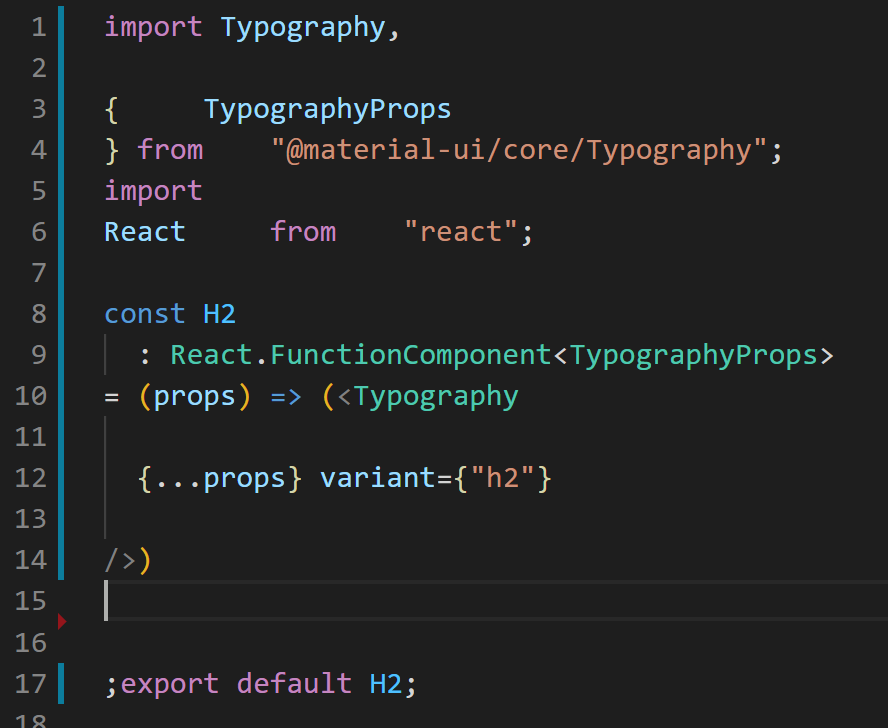
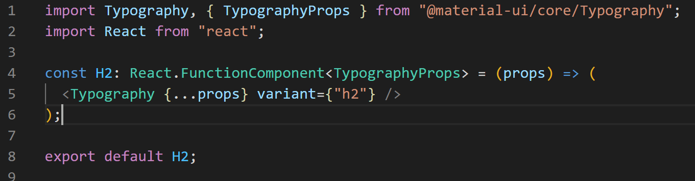
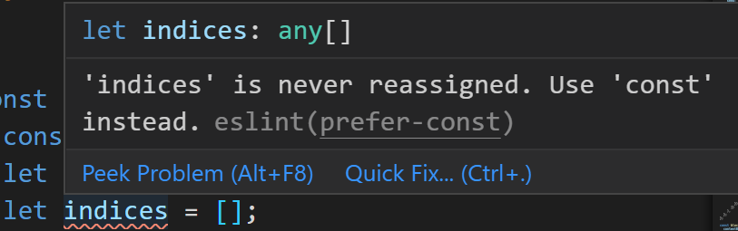
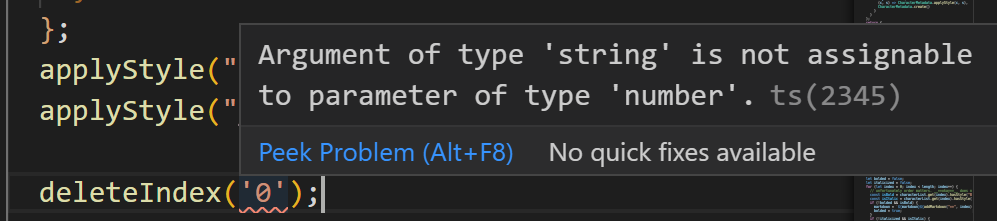
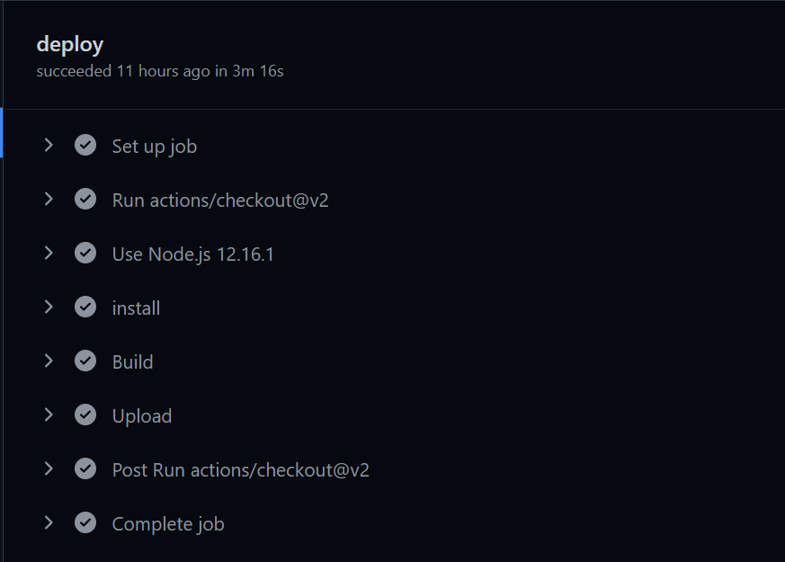

There's an engineering philosophy that I've developed over the last few years. One that I have finally worked up the confidence to internalize and express.

I'm a bad coder. 

The idea acknowledges that I'm human and am prone to making mistakes. This acknowledgment is magnified further in coding because it is an activity that is unnatural for humans. Instead of building solutions in three-dimensional space with our hands, we have to map our thoughts onto a two-dimensional file. Then we pray that everything we wrote compiles correctly.

By embracing the mentality that I’m poor at coding, I pursue tools that compensate for my faults. These faults include but are not limited to typos, logical mistakes, and forgetting steps in repeated workflows.

Here are some examples of tools that have helped me create software in the face of being a bad coder.

## Formatting with Prettier
Coding is a communication medium. Building software is challenging because it requires us to use this communication medium to make the product's desired behaviors clear. Intentions need to be clear to authors, their teammates, and the computer that will inevitably run it. This requires numerous standards so that code is readable to our future selves and teammates while still compiling into a format readable to machines. 

It sucks to spend time thinking about these standards. It takes up too much of my time to ensure code is correctly spaced so that people who aren't me could read it. In the ideal world, I could just chicken scratch my thoughts onto an editor as fast as possible and worry about making them readable later. 

Enter [Prettier](https://prettier.io/). Prettier provides developers the freedom to write software in whatever way they want that still works. They have integrations with most development environments such that when you hit save, all of your changes will automatically format to an agreed-upon standard! With just one click of `Control+S`, you could turn a file that looks like this:

into this:

This allows me to make as many formatting mistakes as my human mind wants to make while ensuring that the version shared with others meets a higher standard of quality. 

## Catching Bugs with ESLint
I write so many bugs. Left to my own devices, it would take me hours to finally get to a working feature without falling victim to a crash or null pointer exception.

This first resulted in me spending more time in the tedious feedback loop of building code, running code, and _then_ debugging what went wrong. In an ideal world, mistakes are highlighted _before_ running the code to clearly inform what should be fixed.

Enter compilation tools like [ESLint](https://eslint.org/). ESLint scans the source code at build time for common patterns that usually result in bugs being thrown. This gives developers the forewarning they need to fix these issues ahead of time instead of manually discovering them later while running the code. When combined with [TypeScript](https://www.typescriptlang.org/), the two could act as a spell checker in any of the popular IDEs to catch mistakes _as you write code_. 

Here's ESLint prompting me to use `const`s, which are generally more error-proof:

Here's TypeScript warning me that I'm about to pass in an unexpected type into a function:

Using mutable `let`s and passing unexpected types into functions have both burned me in the past. They have led to errors that required hours of me crawling through breakpoints before finding the source of the bug. With these tools, these hours spent get shortened to a couple of seconds.

While these examples are pretty straightforward, each of these tools supports hundreds of rules and patterns that they are continually checking for. They make sure that I don't fall victim to my poor coding ability pushing those mistakes to users.

## Automations with GitHub Actions
Pushing new updates to users usually comprises of the following steps:

1. Installing dependencies
2. Building the code
3. Sending the build to AWS

Missing a step in this process could result in a half-baked product in users' hands or confusion surrounding why users are on an older version.

These steps represent a minimal use case. Many companies have deployment processes that could take weeks or even months. Retrospectives are often written after each detailing what steps were forgotten and how they could improve going forward.

Enter [GitHub Actions](https://docs.github.com/en/free-pro-team@latest/actions). GitHub actions are automated workflows that run as soon as some event is triggered on GitHub. Instead of humans running all of the steps above, actions allow us to instruct the robots to do it.

The automation removes the responsibility of running these steps from the bad coder in me. It also performs them much faster, allowing me to run more extensive and complex workflows.

## Collaborating with Others
Each of these tools has helped me embrace the fact that I'm a bad coder. But, more importantly, they've shaped how I view working with other engineers.

I cringe whenever I hear someone inquire about whether someone else is a skilled coder. The perspective is short-sighted. What's far more important than whether someone is good at coding is whether they are good at implementing systems that compensate for their shortcomings.

This is the approach I've come to enjoy most when working with others. I appreciate those who are honest but impatient with the flaws they have as a coder. Instead of solutions of the form, "people just need to be better," I seek solutions of the form, "what could we build given this behavior about us?"

So I don't want to be a good coder. I don't care if those I work with are good coders. I want to find and build systems that could scale up what we could achieve faster than improve ourselves.
