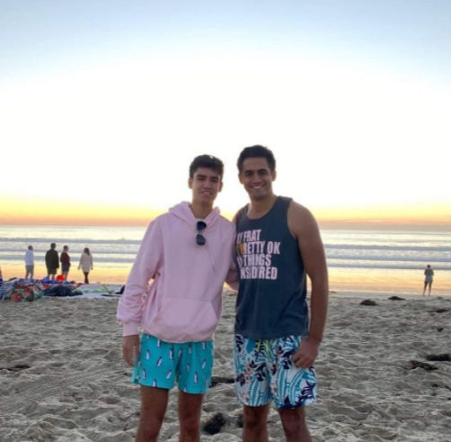
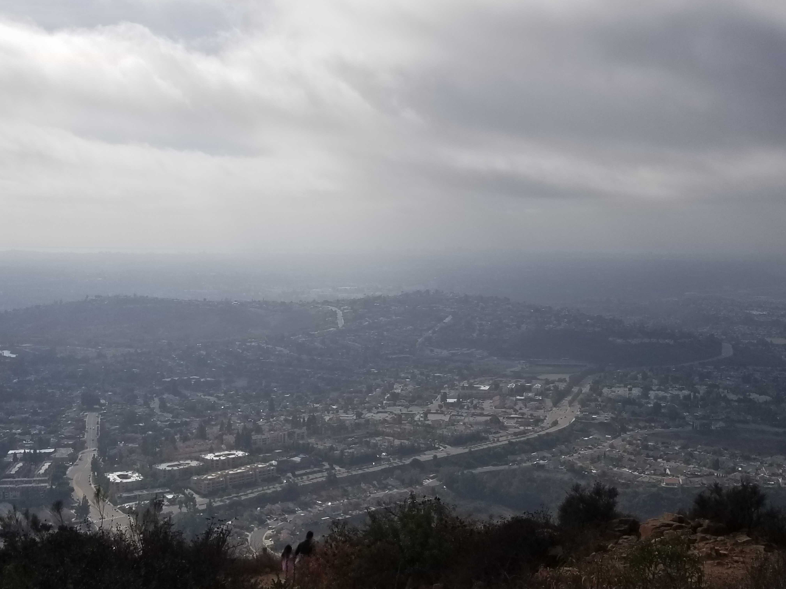
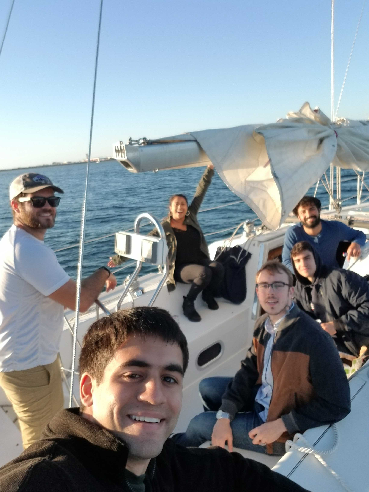

I'm not sure if I'll ever have an address again. The possibility of having one will always exist, though because I hear living in one location is ideal for raising a family. One goal of hopping around to different cities every month was to get a sense of where I would want to settle down if I ever choose to do so. I wanted to start curating a list of potential final destinations.

San Diego was the first city I've visited so far that has made it to the potential final destinations list.

I spent the month there with a more unique [Covilla](https://covilla.life/) crew than usual. We stayed for three weeks due to the constraints of leaving after Thanksgiving and returning to our families for Christmas. When it was time to go, the city had me wanting to do at least another week there.

I first will talk about why I loved San Diego before going into how this trip shaped how I view living in a community and nomading in general.

## San Diego, California

San Diego's perfect weather is its most defining feature. Almost every day was 70 degrees and sunny, not a single degree more or less. The first week I was convinced that clouds were impossible.

San Diego is a county made up of a bunch of different areas, not just a city. There's downtown San Diego, but other notable regions make up the county, including La Jolla, Pacific Beach, and South Park. Our Airbnb was sort of in the San Diego's armpit: east of downtown and south of South Park. Luckily we had a car to visit each of these areas, which I highly recommend traveling around San Diego.

Coronavirus continues to plague the U.S., and as a result, we didn't get to experience any indoor attractions or restaurants. However, there were several outdoor spots that I would recommend checking out. 

The beaches at La Jolla, Pacific Beach, and Coronado were beautiful, with the last one being my favorite. The water was still too cold to swim in, but the beaches weren't too busy, and we spent most of our weekends hanging out at one.

There were two peaks we visited that I'd recommend checking out. First was Mount Soledad in La Jolla, which gives you a spectacular view of the rest of the city. The second was the tallest point in San Diego city, Cowles Mountain, which provides you with a 360 view of the county.

My favorite outing had to be taking out a sailboat in San Diego Bay. We watched the sunset over the city skyline while hanging out in the open water.

San Diego was a beautiful city to visit. Those who live there joke and tell visitors to see Los Angeles instead of San Diego to maintain California's best-kept secret. My short stint gave me the first insight into the type of environment I'd like to live in the long term.

## Community Coliving
The group I traveled with this month had an incredible characteristic: nobody knew the entire group before going to San Diego. This fact meant that all of us were meeting somebody new. 

This arrangement ended up working out exceptionally well. Within a week, we were all able to gel with one another and spend several nights competitively playing games. I saw a commingling of three types of networks from my life come together: family, high school friends, and college friends.  

It's an interaction I want to experience more of as I continue to travel. I love seeing people from different parts of my life intersecting in one place. I've also enjoyed meeting friends of friends that I didn't know before spending these months traveling. Living together in a new city accelerates the time it takes for these new parties to become friends and comfortable with each other too.

As Coronavirus fades over the next year, my friends will be required to go back to the office. As this happens, I predict it will be easier to replicate the interactions from this month. Fewer people available for any given month leads to us reaching out to more of our respective networks leading to more serendipitous combinations of people coming together. 

## Outlook on Nomading
San Diego reaffirmed to me how vital weather and the environment are to where I live. I want to check out other Southern cities in the U.S. even more now. I also have an increased interest in visiting different countries in Central and South America, which will hopefully be more accessible towards the end of 2021.

I was motivated by seeing the houses in La Jolla. It's an affluent area with the median price clocking in at [$3.7 million](https://www.coldwellbanker.com/for-sale-homes/La-Jolla-CA-4689c/view_local-market-trends). One trade-off I'm making by committing to a nomadic lifestyle for the indefinite future is not investing in a single property that could start building equity. I'm hoping the house I rent each month increases quality to feel that same sense of progress one feels when building equity in a single location.

As 2020 comes to a close, it will be five months since deciding to live this lifestyle. I could see at least five more years of it. It sometimes feels childish, like when I fill out my mom's apartment address as my own on some bureaucratic form. It is also challenging in that I have to try to establish a new normal in every place I go.

Establishing the new normal in San Diego was challenging as it was the first time I "lived" on the West Coast. By the time I woke up, my inbox was already flooded with East Coast notifications, stealing my attention away from my morning writing habit. I imagine more of these types of challenges as I travel to more unfamiliar places. It will continuously ask what aspects of my life do I value and which are no longer relevant.

Next up, Stanleytown Virgnia!
