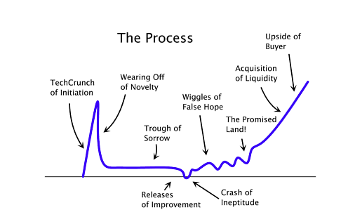

Over the last two years, I've written an annual review as a journal that my friends had access to in earlier iterations of [Longwave](https://longwave.app). I enjoy looking back on my ones from previous years as a form of time travel. I get to compare "the state of Vargas" then to the one now, gaining a greater appreciation of any progress made. Sharing with friends also forced me to be more concrete with my thoughts, which benefits my future self.

2020 will be the first year where I publish my review publicly. I will be reusing the same format I did last year, where I give a "state of Vargas" for several categories.

## Career
Holy Shit.

This time last year, I was over the moon excited about switching teams at Mark43 to have an internal tools role. The motivation for this excitement had to do with seeing my work have an impact directly within the company instead of with a user base unfamiliar to me.

Once I moved to the role, it was hard to connect what I was doing to a real-world impact. In my [decision to leave Mark43](https://davidvargas.me/blog/taking-a-gap-year-on-life/), I noted my frustration from not seeing progress despite my coworkers telling me otherwise. My perception was partially due to not seeing product improvement or end-user (police officers) satisfaction due to my actions. I felt this progress while working on the product team that I completely lost when moving to internal tools. I also viewed the new users I was serving (engineers in my company) needing less help than our actual end-users.

In a desperate attempt to increase my end-user interaction, I've been working on my own for the last four months. I've loved it. I love interacting directly with users. I love that they come to me with issues or bugs that I later try to resolve for them. Most importantly, I love feeling the slow and steady growth each month instead of being stuck at a fixed salary as I was when employed. 

I'm still grappling with several challenges. Most of them are related to time and stress management since I've never been in full control of my schedule until now. I am fully aware of the growth curve most startups experience. Using this curve, I am solidly in the middle of the trough of sorrow:

But this also means I know I will grow out of it. I'm confident in my ability to create tools that are valuable for others. I know that if I keep at it, I will reach the metrics holding me accountable. I have to keep my spirits up and keep going forward.

## Romance
2020 was the first year I spent single since 2011. It was a conscious decision, and one I want to make again for at least another two years.

In my annual review last year, I mentioned that I'd experienced many changes in my life since my last break up. 2020 was no different. Over the last year, I quit traditional employment, started traveling to a new city each month, and started writing online. 

When dating, I spend a significant portion of my thoughts on someone else. So while each of these life changes was probably possible while I was dating, the extra time I got back spent on myself accelerated their implementation.

This pattern is somewhat concerning to future Vargas. I often express to my friends how excited I am to one day have kids. Will my actions line up with what I'm saying? When I one day commit myself to someone and starting a family, I will have to allocate time in my day for them consistently. If I'm unwilling to do that now, will I be able to grow out of this mindset in a few years?

For now, I feel comfortable putting off dating in 2021 and 2022. There is still much I need to learn about myself. I still need time to develop what I want to build. Hopefully, by 2023, I will be in a stable enough position to start thinking beyond myself.

## Social
At the end of 2019, I wrote that I felt pretty satisfied with the state of my relationships with friends. This satisfaction has degraded over the last year.

Back in 2019, I was far more spontaneous. Despite having full control over my time now, I am less spontaneous as I try to maintain some level of accountability over myself in rebuilding my income from scratch. This behavior is not just at odds with that of my friends - it leads to me prioritizing my laptop over things I could be doing to improve the environment around me. These things range from keeping the space clean to proactively contributing new ideas.

Just as in the previous section, this is a conscious trade-off I'm making. One takeaway I've gotten from therapy early on is that when making conscious trade-offs not to beat myself up about them - I knew what was coming, so I should stand by my decisions. I still can't help but wonder how much of an asshole this makes me. It often feels like I'm taking my friends for granted on a bet that they'll still be there after I shore up the less secure part of my life right now, which is my career.

One piece of advice I've gotten from my friend Nikhil is to start over-communicating my expectations. I need to be explicit about which times I am available and which I'm not. This change has helped me so far in the last two months manage balance, but it still doesn't solve my initiative problem. The latter I'm hoping to address more in the second half of 2021 when I expect to have a stable recurring income.

## Hobbies
I was hoping to start getting into doing stand-up comedy in 2020. In March, I had finally purchased classes and was all set to start dedicating a few hours a week to begin practicing. And then COVID hit. Classes were canceled, and I moved to Long Island to live with my mom for three months.

Now that I'm without a sustainable income, I don't foresee myself picking that or any other hobby for the foreseeable future. I have a pretty obsessive mentality such that if I pick something up, I want to go all in. I don't have the availability to go all-in as I try to focus my energy on the Career and Social buckets from above.

I quit following the NFL and playing video games independently this year, both of which I don't miss. Sometimes the game on in the background with my brothers. Sometimes I get some rounds of [Jackbox](https://jackbox.tv/) in with friends. But neither are activities that I enjoy on my own anymore.

I would love to explore making music at some point. I've written in the past about possibly getting a guitar, but this interest has waned. I discovered [Algorave](https://en.wikipedia.org/wiki/Algorave) recently and think it could be something I get into in the future. It exhibits three things I love: mashups, basic music, and coding.

## Outlook
Here were my goals for 2020 with their associated outcomes:

- Get Users On Moonlight - ❌ Started to instead work on [RoamJS](https://roamjs.com)
- Finish Kindle Wishlist - ✅ Finished my reading list, then stopped reading the second half of the year. 
- Share a First Draft of Unleash University - ✅ An idea I had for an online education + college campus blend, but I do not have the capital to pursue right now. I did share the draft, though.
- Save Twice as Much as 2019 - ❌ I was on pace to do so until I quit my job.
- Get Laughs At An Open Mic - ❌ Signed up for stand-up classes that got canceled because of COVID-19. It's still something I'm vaguely interested in, but not enough right now.
- Stop Paying For Cetacea - ✅ Has been offloaded to its successor, [Longwave](https://longwae.app).
- Reach 10% Body Fat - ❌ Got to around 15% before skyrocketing back to 20%. Dieting is much harder than anticipated.

My outlook has changed radically in the last year. My 2020 goal outcomes reflect this shift by only having some achieved, and the ones I did hit having some associated caveat. But I come into 2021 more focused than last year.

My indefinite future now looks like this:

- In 1 year, make a sustainable career through open-source Roam development.
- In 5 years, help others make a sustainable career through any type of open-source development.
- In 25 years, help others make a sustainable career through any type of open public problem-solving.

That last broad goal is born out of a frustration that the types of problems that affect the general public aren't financially secure enough to give people the incentive to solve. Problems like not everyone having [safe drinking water](https://www.charitywater.org/) or that [homelessness](https://newstorycharity.org/) still exists. So how do we incentivize the most talented people coming out of college to tackle these types of problems instead of getting scooped up by big tech and hedge funds?

These come across to me as "Tragedy of the Commons" type problems. The tragedy of the commons problem that I could most easily become familiar with is open-source software. This familiarity leads to my five year goal of building the platform that empowers software engineers to work on open source full time instead of as a side hobby to their corporate jobs. I take inspiration from other creator enabling platforms like [Teachable](https://teachable.com/) or [Gumroad](https://gumroad.com/). How could I replicate their success but target open-source engineers?

I have a few ideas. I'm testing a subset of them with my one-year goal. I want to prove that a business model could work for me before using it to enable others. So I need to make a sustainable career through open source myself, which I'm attempting to do through RoamJS. With that, here are my goals for 2021:

- Reach $10K MRR - This will replace my full-time employment salary
- Release 3 Web Apps under Vargas Arts LLC - Starting with RoamJS
- Grow Userbase to 10K - I currently estimate this number to be a few hundred.
- Reach and Maintain 15% Body Fat - Lowering the target from last year to hopefully maintain for longer
- Visit 15 New Cities - This pace is faster than 1/month, which will hopefully encourage some week or weekend trips
- Publish 60 Articles - Have moved from 2/week last year to 5/month this year
- Take more initiative with Friends & Family - I don't like how I'm treating them right now. Setting as a year goal will force me to reflect on it every month and hopefully lead to intentional changes

I'm excited for a kickass 2021. Happy New Year, everyone!
