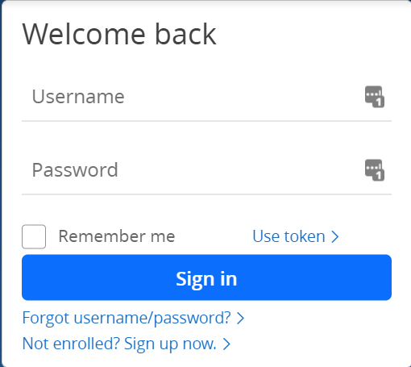

Imagine we're building the [Lastpass](https://chrome.google.com/webstore/detail/lastpass-free-password-ma/hdokiejnpimakedhajhdlcegeplioahd/related) Chrome extension. This extension overlays a mini icon over the right end of every username and password input rendered on your screen.



How would you go about building this? One naïve approach would be to frequently check the page manually to see if there are username and password inputs.

```javascript
setInterval(() => {
  const inputs = document.getElementsByTagName('input');
  inputs.forEach(input => {
    if (
        input.name === 'Username' || 
        input.name === 'Password'
    ) {
      input.appendChild(lastpassIcon);
    }
  });
}, 1000)
```

The above code is setting a function to be called every second. That function is grabbing every input on the page, checking if any is a username or password input, and appending the Lastpass Icon to those inputs. There are a few notable downsides to this approach:

- A user only spends the first minute or so on the login page. Now the rest of their experience on the site is needlessly running this function.
- It's easy to shoot yourself in the foot because we're running a mutable operation multiple times. The above code has the bug where it will keep appending the Lastpass Icon to the input because there's no check for it.

There's one final downside that is more philosophical than technical. This approach is saying, "**Keep checking** if there's a username or password input, and when there is one, append an icon." Intuitively we instead want to say, "**when** the username or password input appears, add icon."

Web browsers support an API that allows developers to express that exact intention through [Mutation Observer](https://developer.mozilla.org/en-US/docs/Web/API/MutationObserver).

## What is Mutation Observer?
Mutation Observer is an interface provided by all modern web browsers that allow you to respond to DOM changes. When the browser detects the change, it will trigger the callback you specified with the relevant metadata about said change. 

Let's continue our Lastpass example to see it in action:

```javascript
const observer = new MutationObserver((records) => {
  records
    .flatMap(r => r.addedNodes)
    .filter(n => 
        n.name === 'Username' || 
        n.name === 'Password'
    )
    .forEach(input => input.appendChild(lastpassIcon));
})

observer.observe(
  document.body, 
  {childList: true, subtree: true}
);
```

First, we are initializing an instance of the Mutation Observer with a callback that will look at all the nodes added to the DOM, filter for just the username and password inputs, and then add the Lastpass icon to each of them. Then, we call `observe`, which registers the observer to watch for changes.  In this example, we've targeted `document.body`  so that the callback fires for any changes to the document body.  We've set `childlist` to `true`, configuring our observer to fire precisely when child nodes are _added to_ or _removed from_ the document body. Finally, we've set `subtree` to `true`, which applies this watching behavior to all nodes within the document body subtree.

There are a few notable benefits that we gain with this approach: 

- The function only fires when the DOM changes, not every second in perpetuity.
- We ensure that the callback is only fired once for our desired inputs, exactly when added to the DOM.

We also gain the philosophical benefit of running our desired behavior "when we want it" instead of "always, in case we want it." 

## Tips for Using Mutation Observer
The ability to trigger logic based on some external change is powerful. But, it could also lead to severe performance degradation if not used appropriately. Here are some tips to consider as you start using Mutation Observer.

### Scope Down the Target
The `observe` method's first argument is called the `target`. It's the primary DOM node the observer watches for changes in the DOM. When combined with `subtree`, the observer callback will fire more frequently, the higher we define our target in the DOM tree.

In our Lastpass example above, the observer looks at _all_ the DOM nodes in body, firing whenever one adds a child. We could instead only look at the first form element if we know that element will delay loading its inputs:

```javascript
const target = document.getElementsByTagName('form')[0];
observer.observe(target, {childList: true, subtree: true});
```

Scoping down the target won't always be possible. It will depend on what nodes in the app persist across mutations and what behavior you're looking to trigger as a response. The benefit of scoping down is improving performance by only running the observer callback for the most relevant nodes.

### Limit Logic
Mutations that trigger observer callbacks are usually a result of a user action. We want these interactions to be as fast and responsive as possible; otherwise, users will move on to other solutions. Google recommends a First Input Delay [of at most 100ms](https://web.dev/fid/), that is the time it takes between a user first interacts with your site to the time the browser responds.

To achieve this, we want to limit the amount of logic that gets run in our observer callback as much as possible. In our example above, we are instantiating three functions every time a node gets added to the DOM. We could instead rewrite the logic to look like this:

```javascript
const mapper = r => r.addedNodes;
const inputFilter = n => 
  n.name === 'Username' || n.name === 'Password';
const inputAppend = input => 
  input.appendChild(lastpassIcon);

const observer = new MutationObserver((records) => {
  records
    .flatMap(mapper)
    .filter(inputFilter);
    .forEach(inputAppend);
})

observer.observe(
  document.body, 
  {childList: true, subtree: true}
);
```

Each callback invocation now calls three preexisting methods instead of generating new ones on every call. While seemingly trivial, these are the types of optimizations you will need to make, especially if you're working with a frequently mutating app. Front-load as much of the logic as possible, especially if you make asynchronous calls to an external API.

### Beware of Recursion
JavaScript is single-threaded, and browsers run your applications off of the main thread. A single uncaught while loop could crash the browser. 

This endless loop could also appear through recursion. Imagine if the Lastpass icon we referenced above had a `name` attribute with the value of `'Username'`. We would then fall victim to the following recursive cycle:

1. Input added to DOM
2. Trigger Mutation Callback
3. Icon added to DOM
4. Trigger Mutation Callback
5. Repeat steps 3&4 endlessly

This recursion makes for a frustrating developer experience, and your application becomes unusable.

To avoid this pitfall, always ensure to add strict filters when choosing which nodes to manipulate further. Maybe in that filter, we add another check that says `n.tagName === 'INPUT'`. A common strategy I like to implement are `data-` boolean attributes that I check before appending, then set immediately after checking:
```javascript
if (!node.hasAttribute("data-has-been-mutated")){
  node.setAttribute("data-has-been-mutated", "true");
  // rest of callback
}
```

In summary, Mutation Observer is a powerful API that browsers provide for developers to build on top of other applications. Use them with caution. There are different ways that the observers could degrade the browser performance, which could be avoided by restricting the target, the callback logic, and nodes to be further mutated. But when used effectively, they improve your app's responsiveness while making your application logic more intentional.
