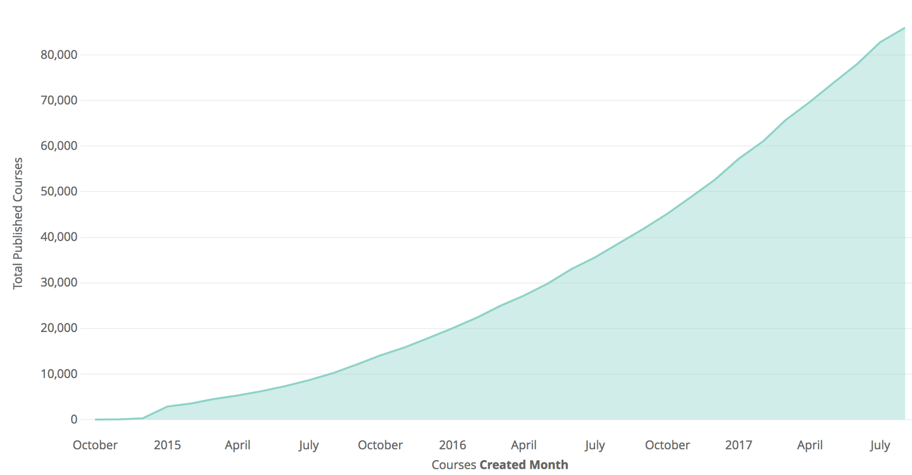

I've recently become fascinated by [Teachable](https://teachable.com/). I love their approach to education - empowering teachers to share their knowledge by helping them build businesses and reach their students directly. Their recent success is inspiring:

https://twitter.com/ankurnagpal/status/1345013603661967361?s=19

Teachers exhibit multiple characteristics commonly found in most types of online creators. They are traditionally undervalued, their end products have close to zero marginal cost, and they struggle to build a user base. Learning about how Teachable tackled this problem provides insight into building similar markets for other types of online creators.

## Teachable's Early Days
[Ankur Nagpal](https://twitter.com/ankurnagpal) was a course creator on Udemy teaching a mobile marketing course. Frustrated by the lack of interaction with students, he decided to start building his own product called Fedora.

His co-instructor [Conrad Wadowski](http://twitter.com/conradwa) became his first paying customer. Through consistent outreach, he was able to have tens of users active on the platform by Summer 2014. 

There were a few people working with him on the project when it started to show some problems scaling. They rebuilt the system from scratch to create a product that could belong to the whole team. That's when Fedora was rebranded to the Teachable we know today.

They launched the platform on Product Hunt in 2014. While only mildly successful initially, teachers started to launch _their_ courses on Product Hunt, which led traffic back to Teachable. They started to experience the network effects of other creators sharing their work from Teachable's platform. By Fall 2015, they had 5,000+ teachers on the platform with 12K+ courses launched. By July 2016, the number of courses grew to 80K+. 

Ankur attributes this growth to their commitment to teacher's success. One example he cites was the "decision to switch focus from transaction fees to recurring revenue" ([Source](https://medium.com/teachable/scaling-teachable-our-journey-to-500k-in-mrr-d4adce0cb648)) after several teachers had complained about the fee structure. By constantly focusing on their creators and resolving their biggest pain points, they saw their business grow exponentially each year.

Teachable was recently acquired by [Hotmart](https://www.hotmart.com/en), a Brazilian based company with a focus on helping creators to grow their businesses online. Teachable is looking to leverage their global reach to start empowering teachers internationally. They now have 25K+ teachers on the platform reaching 20+ million students.

## Teachable's Approach Today

The team operates today under three convictions.

**Their customers are teachers**. By prioritizing a specific user group instead of catering to both sides of the education market, they are able to iterate faster on how to improve the overall market.

**They are expanding the definition of being a teacher**. They operate under the assumption that we all have knowledge to share and can share it. We don't need a degree or teaching credentials, simply the motivation to share knowledge.

**The most successful teachers are entrepreneurs**. By treating their users as business owners, they help them build a sustainable practice that allows them to spend more time teaching. The teachers' success then funnels up to Teachable's success.

This approach will continue to drive success for a company who's aligned with  the success of its users.

## Applying Teachable's Approach
What can we learn from Ankur's side project turned education platform?

The first is to start small. The product was created simply to help Ankur turn what he was teaching into a sustainable business. By solving his own business problems, they gained greater insight into what could scale to more users. Growth exploded from there and continues to be exponential today.

The second is to focus on one side of the market. Most markets consist of at least two user groups. When platforms split their resources trying to appeal to both sides of the market, often they end up with a subpar product for either of them. By focusing on educators, Teachable was able to build a product that one side of the education market loved. As a consequence, they saw user growth from both sides.

The last is to build a product that increases access. By expanding who Teachable defines as a teacher, they are growing the education market, which in turn grows the number of potential customers on their platform. They built features that made it easier for people to educate and make money off of what they taught. The latter allows more teachers to teach for longer, making it their full time profession as opposed to just a side gig.

These takeaways could apply to any type of creator's market. Open source software is one of these markets that with a Teachable type product will empower engineers to work in open source full time instead of as a side project to their office jobs.

## Resources 
To read more about Teachable's story, I recommend checking out these articles which I used as the basis for this one:
- [_A Brief History of Teachable and Why We Think it’s Amazing_](https://reachable-agency.medium.com/a-brief-history-of-teachable-and-why-we-think-its-amazing-9d06ef95d2fa) - By Reachable, a client acquisition agency built on top of Teachable
- [_How We Acquired 26,447 Users and $207,152 in Sales on Product Hunt_](https://artplusmarketing.com/how-we-acquired-26-447-users-and-207-152-in-sales-on-product-hunt-211940650fcb)- By Ankur Nagpal
- [_Fedora is now Teachable_](https://medium.com/swlh/how-a-side-project-grew-up-to-become-a-company-66df8634c787) - By Ankur Nagpal
- [_Scaling Teachable: Our Journey to $500k+ in MRR_](https://medium.com/teachable/scaling-teachable-our-journey-to-500k-in-mrr-d4adce0cb648) - By Ankur Nagpal
