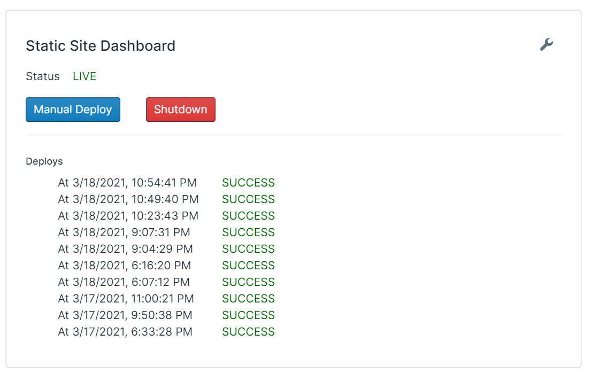
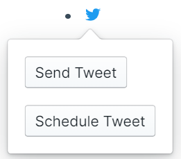
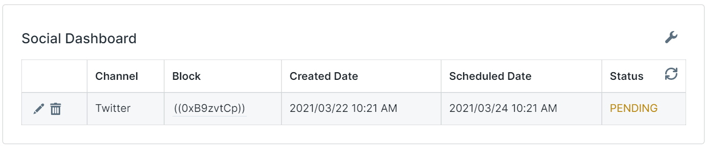

I am beyond excited to announce the launch of [RoamJS Services](https://roamjs.com/services)! This has been something I've been working on in the background for the last four months, and it's finally ready for others to use.

RoamJS Services are premium extensions. They give users access to RoamJS's back-end resources to better tap into their Roam graphs in different ways. You will need to sign up for an account at https://roamjs.com/signup to access them. Subscribing to a given service will issue you a service-specific token that you add to your graph along with the corresponding RoamJS extension. The extension will walk you through setting up the token and how to use the service, all within Roam! You can think of RoamJS Services as licensed extensions.

Today, I am releasing two services that the #roamcult could start using. In the coming months, there will be more services released, and users will have the flexibility to only subscribe to the ones that bring value to them. The two services launching today are Static Site and Social.

## Static Site
Roam is a powerful content management system. There's no great native solution for surfacing our growing knowledgebase to others, particularly to those without a Roam account. Initial load time is slow. The interface is foreign to most people. There's no granularity in what data to surface. SEO is non-existent since all the data is rendered client-side.

The RoamJS Static Site Service gives users the ability to generate their own static website based on their Roam Graphs' content! Users could launch the site, specify which pages to include, customize the HTML/CSS, and view their most recent deploys, all from within Roam.

You can have your own custom domain point to the static site or use a RoamJS subdomain. There will be more powerful customization options to come; subscribe to our [email digest](https://roamjs.com/subscribe) for updates!

I want to give two special shout-outs for helping bring this service to life. The first is to [Rodrigo Franco](https://rodrigofranco.com), who worked with me to create the [Generate Roam Site GitHub Action](https://github.com/dvargas92495/generate-roam-site-action) and whose early feedback on this service was invaluable. The second is [Vlad Sitalo](https://twitter.com/VladyslavSitalo), who is also building a Roam static site generator over at https://roam.garden and whose early feedback helped point out holes in the system early on.

## Social
There are hundreds of different social media clients for drafting posts. Unfortunately, these clients are often disconnected from the note-taking systems we use to connect ideas and produce outputs. 

RoamJS made its first move towards resolving this by supporting sending Tweets from Roam a couple of months ago as part of the [Twitter](https://roamjs.com/docs/extensions/twitter) extension. Now that we could publish content directly from our content manager in Roam, it would be great to specify _when_ to publish that content.

RoamJS Social integrates with other RoamJS extensions to allow users to schedule posts from directly within Roam! Instead of posting content directly, users could specify when it should post using the same workflow. This allows us to align our bursts of creativity with a consistent publishing cadence.

Currently, the RoamJS Social service only integrates with Twitter. Over time, it will begin to interface with other soon-to-be-built RoamJS extensions, such as Facebook, LinkedIn, and more!

I want to give a special shout-out to [Gene Kim](https://twitter.com/RealGeneKim) for helping me with early iterations of this extension, and to [Benjamin Taylor](https://twitter.com/antlerboy) who's initial interest led to the first version of this product.

## Future of RoamJS
While each of these individual offerings is exciting, I'm excited about the doors this launch opens for RoamJS's future.

There's a Daniel Vasallo tweet I saw early on when I started building RoamJS that has really stuck with me:

https://twitter.com/dvassallo/status/1258518741106618368?s=20

This has embodied my approach with RoamJS. My plan from the get-go was to build a wide library of various tools to empower the Roam community. By taking multiple shots at goal, I'll learn about what's valuable for people and iterate through towards better versions.

RoamJS Services are the next evolution of this idea. While we are only launching two services today, I plan to release more services in the future. I also plan to push improvements for live services while continuing to release free extensions that come in from the RoamJS [Queue](https://roamjs.com/queue).

There are other services I plan to build over the coming months. But, I won't be the only one. The simplicity of just assigning a token to an extension opens the doors for _others to host paid extensions on RoamJS_. I find this exciting and would love to work with other Roam engineers to see how I could enable them to do so. While not currently supported, I plan to open up this possibility as soon as the first interested Roam hacker reaches out.
 
Despite these services being paid extensions, **every line of code written is open source.** This is the heart of the thesis I wanted to test when I left my job. The value in software as a service is not the software; it's the service. It's constantly attending to support inquiries. It's innovating on the core product. It's building trust with your users. The software written to run the service is such a marginal component of the value proposition that you have little to gain and much to lose out on by keeping the source code private. In contrast, a fully transparent codebase allows users to trust what they're using, engineers to build on top of my work, and contributions to be added to my public portfolio that could lead to new opportunities.

This launch serves as a turning point in my 16-month experimental break from traditional jobs. They are the first recurring revenue services that I'm releasing and will enable me to keep going past December 2021. I one day want to start diversifying from Roam. My portfolio of small bets is starting with RoamJS but will hopefully expand to include other open source services that empower more everyday, non-technical users.
